# Disciplina de Requisitos

## Índice

1. [Encontrar Actores y Casos de Uso](#1-encontrar-actores-y-casos-de-uso)
   - 1.1 [Identificación de Actores](#11-identificación-de-actores)
   - 1.2 [Criterio de diseño del modelo](#12-criterio-de-diseño-del-modelo)
   - 1.3 [Lista de Casos de Uso](#13-lista-de-casos-de-uso)
   - 1.4 [Diagramas de Casos de Uso](#14-diagramas-de-casos-de-uso-por-actor)
2. [Priorizar Casos de Uso](#2-priorizar-casos-de-uso)
3. [Detallar Casos de Uso](#3-detallar-casos-de-uso)
4. [Prototipar Casos de Uso](#4-prototipar-casos-de-uso)
5. [Estructurar el Modelo de Casos de Uso](#5-estructurar-el-modelo-de-casos-de-uso)

---

## 1. Encontrar Actores y Casos de Uso

### 1.1 Identificación de Actores

| Actor | Descripción | Identificación en Odoo | Alcance de datos |
|---|---|---|---|
| **Director** | Máximo responsable de la organización. Acceso irrestricto a todo el sistema, incluido el módulo de rentabilidad financiera. | Nodo raíz del árbol jerárquico de empleados | Global — sin filtro |
| **Responsable** | Jefe de departamento o responsable de proyecto. Acceso filtrado a su ámbito organizativo calculado en el momento de la autenticación. | Gestiona al menos un departamento o proyecto | Filtrado por empleados, departamentos y proyectos bajo su responsabilidad |

> Los empleados rasos **no tienen acceso** al sistema y son redirigidos al login.
> El rol y el ámbito de cada usuario se determinan en el momento de la autenticación.

| Actor externo | Descripción | Conexión |
|---|---|---|
| **Sistema ERP (Odoo v16)** | Actor externo. Fuente única de datos operativos. El módulo de analítica solo lee de su base de datos. | Solo lectura — el sistema consulta al ERP, no al contrario |

#### Diagrama de relaciones entre actores y sistema
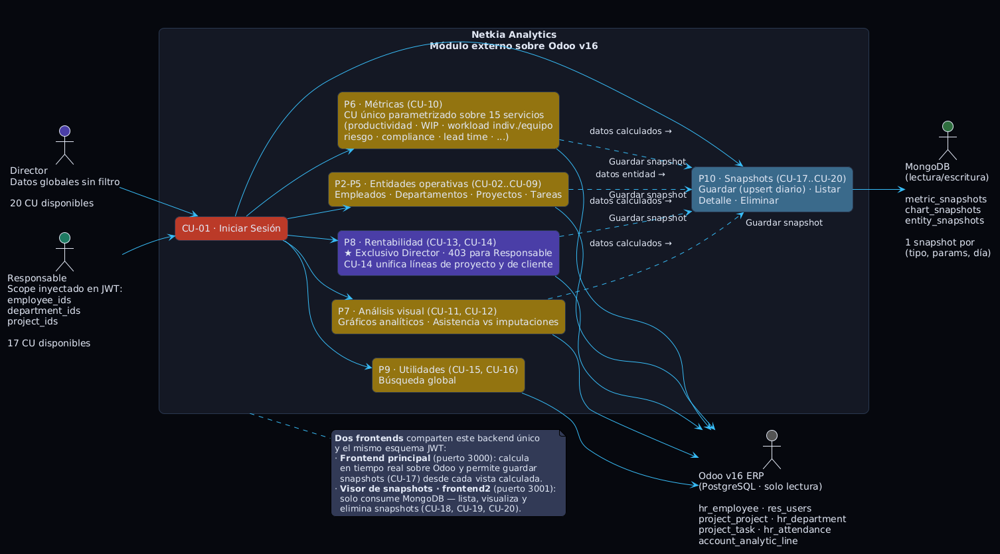

---

### 1.2 Criterio de diseño del modelo

El modelo se organiza alrededor de un principio de **simetría por entidad**: cada entidad principal del dominio expone exactamente dos casos de uso:

| Entidad | CU de listado/búsqueda | CU de resumen analítico |
|---|---|---|
| Empleado | CU-02 Listar Empleados | CU-03 Resumen de Empleado |
| Departamento | CU-04 Listar Departamentos | CU-05 Resumen de Departamento |
| Proyecto | CU-06 Listar Proyectos | CU-07 Resumen de Proyecto |
| Tarea | CU-08 Listar Tareas | CU-09 Detalle de Tarea |

Los CU de resumen son el panel analítico de cada entidad: agregan indicadores, métricas y accesos a recursos relacionados. Las métricas operativas (Paquete 6) se consumen tanto desde los resúmenes de entidad como desde la página de métricas.

---

### 1.3 Lista de casos de uso

El sistema se organiza en **9 paquetes funcionales** que agrupan los **21 casos de uso** identificados. Los CUs marcados con ★ son exclusivos del rol *Director*; el resto están disponibles para ambos actores (*Director* y *Responsable*) con el filtrado de ámbito que corresponda a cada uno.

| Paquete | CU | Nombre | Director | Responsable |
|---|---|---|---|---|
| **P1 · Autenticación** | CU-01 | Autenticarse en el sistema | ✅ | ✅ |
|                        | CU-16 | Cerrar sesión | ✅ | ✅ |
| **P2 · Empleados**     | CU-02 | Listar empleados | ✅ | ✅ [scope] |
|                        | CU-03 | Visualizar resumen de empleado | ✅ | ✅ [scope] |
| **P3 · Departamentos** | CU-04 | Listar departamentos | ✅ | ✅ [scope] |
|                        | CU-05 | Visualizar resumen de departamento | ✅ | ✅ [scope] |
| **P4 · Proyectos**     | CU-06 | Listar proyectos | ✅ | ✅ [scope] |
|                        | CU-07 | Visualizar resumen de proyecto | ✅ | ✅ [scope] |
| **P5 · Tareas**        | CU-08 | Listar tareas | ✅ | ✅ [scope] |
|                        | CU-09 | Consultar detalle de tarea | ✅ | ✅ [scope] |
| **P6 · Análisis**      | CU-10 | Consultar métrica operativa *(parametrizada)* | ✅ | ✅ [scope] |
|                        | CU-11 | Visualizar gráficos analíticos | ✅ | ✅ [scope] |
|                          | CU-12 | Consultar asistencia vs imputaciones | ✅ | ✅ [modo equipo] |
|                            | CU-21 | Consultar carga de trabajo del equipo | ✅ | ✅ [scope] |
| **P7 · Rentabilidad ★** | CU-13 | Analizar rentabilidad financiera ★ | ✅ | ❌ |
|                         | CU-14 | Listar líneas analíticas *(scope: proyecto &#124; cliente)* ★ | ✅ | ❌ |
| **P8 · Utilidades**    | CU-15 | Realizar búsqueda global | ✅ | ✅ [scope] |
| **P9 · Snapshots**    | CU-17 | Guardar snapshot *(upsert diario)* | ✅ | ✅ |
|                        | CU-18 | Listar snapshots | ✅ | ✅ |
|                        | CU-19 | Consultar detalle de snapshot | ✅ | ✅ |
|                        | CU-20 | Eliminar snapshot | ✅ | ❌ |

**Totales:** Director → 21 CU · Responsable → 18 CU (excluidos CU-13, CU-14 y CU-20).

#### Observaciones sobre la consolidación de CUs

Durante la identificación se han aplicado tres consolidaciones alineadas con los principios de RUP (mismo actor, misma precondición, misma postcondición, mismo flujo principal; solo difiere un parámetro):

- **CU-10 Consultar Métrica Operativa** es un caso de uso único que sirve a quince servicios de métrica (productividad, WIP, workload, riesgo, cumplimiento, lead time, exactitud de estimación, tareas canceladas, distribución por cliente, tiempo por estado, retrabajo, eficiencia de proyecto, etc.). La elección de la métrica se modela como parámetro del CU, no como CUs separados.
- **CU-14 Consultar Líneas Analíticas** unifica en un único CU el desglose por proyecto y por cliente que antes eran dos CUs separados. El ámbito (proyecto o cliente) se modela como parámetro.
- **Guardar/Actualizar Snapshot** se modela como un único CU-17 con semántica *upsert diario*. Dado que existe como máximo una snapshot por combinación de tipo, parámetros y día, volver a guardar el mismo día sobrescribe la anterior. No existe CU separado de "Actualizar Snapshot"; la actualización queda embebida como flujo alternativo FA-01 de CU-17.

---

### 1.4 Diagramas de Casos de Uso por Actor

|Director|Responsable|
|--------|-----------|
|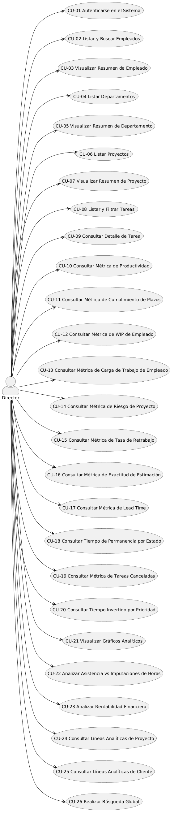|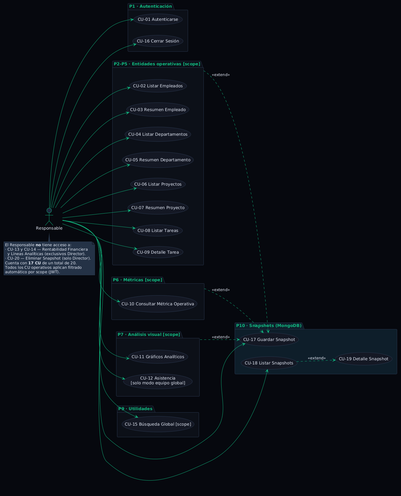|
|[Ver código](./diagramas/actorDirector.puml)|[Ver código](./diagramas/actorResponsable.puml)|

Ambos actores comparten la mayoría de los casos de uso. El Director tiene acceso exclusivo al módulo de rentabilidad financiera (CU-13, CU-14). El Responsable opera siempre con un filtro automático sobre su ámbito organizativo.

**Resumen rápido:**
- **Director:** Acceso a los 21 CU sin restricciones de ámbito.
- **Responsable:** Acceso a 18 CU con filtro de ámbito (excluidos CU-13, CU-14 y CU-20).

---

## 2. Priorizar Casos de Uso

### 2.1 Criterios

| Criterio | Descripción | Escala |
|---|---|---|
| **Criticidad** | ¿Bloquea la ejecución de otros CU? | 1–3 |
| **Valor de negocio** | ¿Apoya decisiones estratégicas o tácticas? | 1–3 |
| **Frecuencia de uso** | ¿Se ejecuta en cada sesión o esporádicamente? | 1–3 |
| **Riesgo técnico** | ¿Implica lógica compleja o integración crítica con el ERP? | 1–3 |

#### Prioridad Alta (A) — MVP imprescindible

| CU | Nombre | Criticidad | Valor de negocio | Frecuencia | Riesgo técnico | Justificación |
|---|---|:---:|:---:|:---:|:---:|---|
| CU-01 | Autenticarse | 3 | 3 | 3 | 2 | Sin autenticación no hay sistema. Puerta de entrada. |
| CU-02 | Listar empleados | 3 | 2 | 3 | 1 | Dato base para todos los paneles de empleado. |
| CU-03 | Resumen de empleado | 2 | 3 | 3 | 2 | Vista canónica de consulta operativa diaria. |
| CU-06 | Listar proyectos | 3 | 2 | 3 | 1 | Dato base para paneles de proyecto y rentabilidad. |
| CU-07 | Resumen de proyecto | 2 | 3 | 3 | 2 | Vista canónica sobre el estado de un proyecto. |
| CU-08 | Listar tareas | 2 | 3 | 3 | 2 | Consulta operativa de alta frecuencia. |
| CU-10 | Consultar métrica operativa | 2 | 3 | 3 | 3 | Indicadores que guían la decisión diaria. |
| CU-13 | Rentabilidad financiera ★ | 2 | 3 | 2 | 3 | Indicador económico global del Director. |
| CU-21 | Consultar carga de trabajo de equipo | 2 | 3 | 2 | 2 | Control de la carga de trabajo de los empleados. |
| CU-17 | Guardar snapshot | 1 | 3 | 2 | 2 | Permite persistir el estado para seguimiento histórico. |

#### Prioridad Media (M) — complementarios

| CU | Nombre | Criticidad | Valor de negocio | Frecuencia | Riesgo técnico | Justificación |
|---|---|:---:|:---:|:---:|:---:|---|
| CU-04 | Listar departamentos | 2 | 2 | 2 | 1 | Exploración por estructura organizativa. |
| CU-05 | Resumen de departamento | 2 | 2 | 2 | 2 | Soporte al análisis de carga agregada. |
| CU-09 | Detalle de tarea | 1 | 2 | 2 | 1 | Profundización puntual sobre una tarea. |
| CU-11 | Gráficos analíticos | 1 | 2 | 2 | 2 | Análisis visual complementario. |
| CU-12 | Asistencia vs imputaciones | 1 | 2 | 2 | 2 | Control de coherencia horaria. |
| CU-14 | Líneas analíticas ★ | 1 | 2 | 1 | 1 | Desglose contextual sobre rentabilidad. |
| CU-18 | Listar snapshots | 1 | 2 | 1 | 1 | Consumo del histórico persistido. |
| CU-19 | Detalle de snapshot | 1 | 2 | 1 | 1 | Reconstrucción de vistas guardadas. |

#### Prioridad Baja (B) — opcionales

| CU | Nombre | Criticidad | Valor de negocio | Frecuencia | Riesgo técnico | Justificación |
|---|---|:---:|:---:|:---:|:---:|---|
| CU-15 | Búsqueda global | 1 | 1 | 2 | 1 | Atajo de navegación; no imprescindible. |
| CU-16 | Cerrar sesión | 1 | 1 | 1 | 1 | Deseable pero no bloqueante. |
| CU-20 | Eliminar snapshot | 1 | 1 | 1 | 1 | Operación excepcional; uso puntual. |

---

## 3. Detallar Casos de Uso

Todos los casos de uso están documentados en detalle en: [Disciplina de Requisitos – Casos de Uso Detallados](./docs/CasosDeUsoDetallados.md)

### CU-01 – Autenticarse en el Sistema

| Campo | Valor |
|---|---|
| **Actores** | Director, Responsable |
| **Precondición** | El usuario dispone de credenciales válidas en el sistema ERP con un empleado activo vinculado. |
| **Postcondición** | El usuario tiene una sesión activa y accede al sistema con el rol y ámbito que le corresponden. |

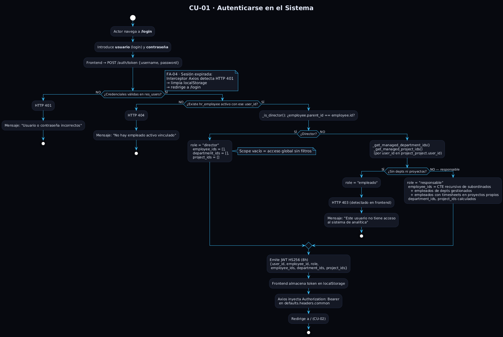

**Flujo principal:**
1. El actor accede a la pantalla de inicio de sesión e introduce sus credenciales.
2. El sistema valida las credenciales contra el ERP.
3. El sistema verifica que existe un empleado activo asociado al usuario.
4. El sistema determina el rol del usuario: Director (acceso global) o Responsable (acceso filtrado).
5. Para el Responsable, el sistema calcula el ámbito organizativo que le corresponde.
6. Se crea la sesión del usuario y se redirige a la pantalla principal.

**Flujos alternativos:**
- `FA-01`: Credenciales incorrectas → mensaje de error, permanece en el login.
- `FA-02`: Sin empleado activo vinculado → acceso denegado.
- `FA-03`: Usuario sin permisos de acceso al sistema → acceso denegado con mensaje informativo.
- `FA-04`: Sesión expirada → el sistema cierra la sesión y redirige al login.

**Relaciones:** CU-01 es precondición de todos los demás CU.

---

### CU-02 – Listar Empleados

| Campo | Valor |
|---|---|
| **Actores** | Director, Responsable |
| **Precondición** | CU-01 completado. |
| **Postcondición** | El actor localiza el empleado buscado y puede navegar a CU-03. |

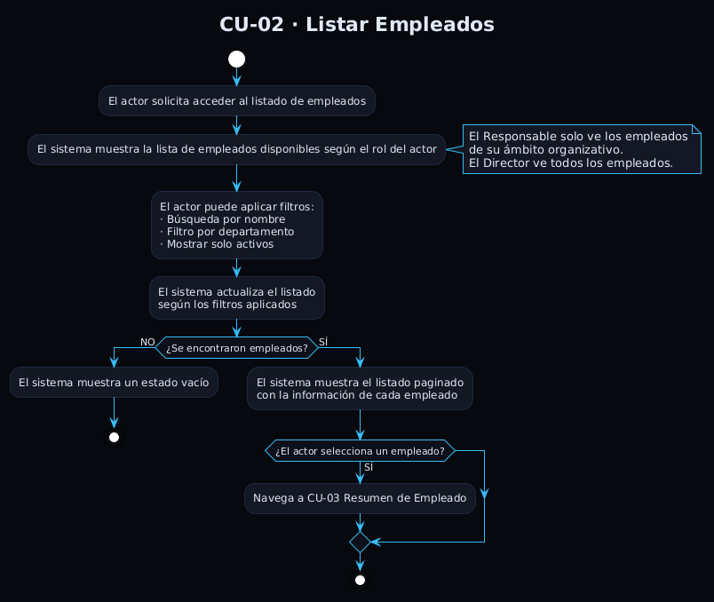

**Flujo principal:**
1. El actor accede al listado de empleados.
2. El sistema muestra los empleados disponibles según su rol y ámbito.
3. El actor puede filtrar por nombre, departamento o estado (activo/inactivo).
4. El sistema actualiza el listado paginado con los filtros aplicados.
5. El actor selecciona un empleado para consultar su resumen.

**Flujos alternativos:**
- `FA-01`: Sin resultados con los filtros aplicados → estado vacío con mensaje.

**Relaciones:** Navega a CU-03.

---

### CU-03 – Consultar Resumen de Empleado

| Campo | Valor |
|---|---|
| **Actores** | Director, Responsable |
| **Precondición** | CU-01 completado. El empleado pertenece al ámbito del actor. |
| **Postcondición** | El actor conoce el estado completo del empleado: carga, WIP, productividad y tareas. |

**Flujo principal:**
1. El actor selecciona un empleado desde CU-02 o CU-05.
2. El sistema verifica que el empleado pertenece al ámbito del actor.
3. El sistema muestra el perfil del empleado con sus indicadores de rendimiento.
4. El actor navega por las pestañas de tareas (pendientes, completadas, asignadas, como responsable).
5. El actor puede filtrar las tareas por rango de fechas.
6. El actor puede seleccionar una tarea para ver su detalle.

**Flujos alternativos:**
- `FA-01`: Empleado fuera del ámbito → acceso denegado.
- `FA-02`: Empleado sin usuario vinculado → indicadores a 0, tareas vacías.

**Relaciones:** `<<extend>>` por CU-08 (listados de tareas contextuales). Navega a CU-09. `<<extend>>` hacia CU-17 (guardar snapshot de la ficha).

---

### CU-04 – Listar Departamentos

| Campo | Valor |
|---|---|
| **Actores** | Director, Responsable |
| **Precondición** | CU-01 completado. |
| **Postcondición** | El actor localiza el departamento y puede navegar a CU-05. |

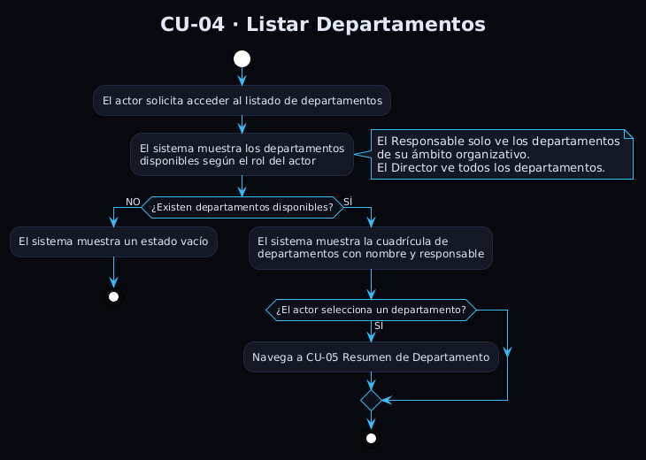

**Flujo principal:**
1. El actor accede al listado de departamentos.
2. El sistema muestra los departamentos activos disponibles según su ámbito.
3. El actor selecciona un departamento para consultar su resumen.

**Flujos alternativos:**
- `FA-01`: Sin departamentos en el ámbito → estado vacío.

**Relaciones:** Navega a CU-05.

---

### CU-05 – Consultar Resumen de Departamento

| Campo | Valor |
|---|---|
| **Actores** | Director, Responsable |
| **Precondición** | CU-01 completado. El departamento pertenece al ámbito del actor. |
| **Postcondición** | El actor conoce el estado de carga del departamento y puede navegar a sus empleados. |

**Flujo principal:**
1. El actor selecciona un departamento desde CU-04.
2. El sistema verifica que el departamento pertenece al ámbito del actor.
3. El sistema muestra el panel con nombre, responsable e indicadores de distribución de carga.
4. El sistema alerta visualmente si hay empleados sobrecargados.
5. El actor puede consultar la carga de trabajo o el listado de empleados mediante pestañas.
6. El actor puede seleccionar un empleado para acceder a su resumen.

**Flujos alternativos:**
- `FA-01`: Departamento fuera del ámbito → acceso denegado.
- `FA-02`: Departamento sin empleados → pestañas vacías.

**Relaciones:** Navega a CU-03. `<<extend>>` hacia CU-17.

---

### CU-06 – Listar Proyectos

| Campo | Valor |
|---|---|
| **Actores** | Director, Responsable |
| **Precondición** | CU-01 completado. |
| **Postcondición** | El actor localiza el proyecto y puede navegar a CU-07. |

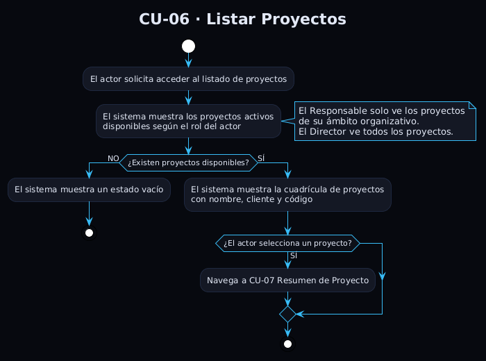

**Flujo principal:**
1. El actor accede al listado de proyectos.
2. El sistema muestra los proyectos activos disponibles según su ámbito.
3. El actor selecciona un proyecto para consultar su resumen.

**Flujos alternativos:**
- `FA-01`: Sin proyectos en el ámbito → estado vacío.

**Relaciones:** Navega a CU-07.

---

### CU-07 – Consultar Resumen de Proyecto

| Campo | Valor |
|---|---|
| **Actores** | Director, Responsable |
| **Precondición** | CU-01 completado. El proyecto pertenece al ámbito del actor. |
| **Postcondición** | El actor conoce el estado completo del proyecto: eficiencia, riesgo, rentabilidad, tareas y equipo. |

**Flujo principal:**
1. El actor selecciona un proyecto desde CU-06 o desde los resultados de CU-15.
2. El sistema verifica que el proyecto pertenece al ámbito del actor.
3. El sistema muestra el panel del proyecto con indicadores de eficiencia, riesgo y rentabilidad.
4. El actor puede consultar las tareas del proyecto o los miembros del equipo mediante pestañas.
5. El actor puede filtrar las tareas por estado o etapa.
6. El actor puede seleccionar una tarea o un empleado para ver su detalle.

**Flujos alternativos:**
- `FA-01`: Sin horas registradas → rentabilidad y eficiencia a 0.
- `FA-02`: Proyecto fuera del ámbito → acceso denegado.

**Relaciones:** Navega a CU-03 y CU-09. `<<extend>>` hacia CU-17.

---

### CU-08 – Listar Tareas

| Campo | Valor |
|---|---|
| **Actores** | Director, Responsable |
| **Precondición** | CU-01 completado. |
| **Postcondición** | El actor localiza las tareas buscadas o accede a su detalle (CU-09). |

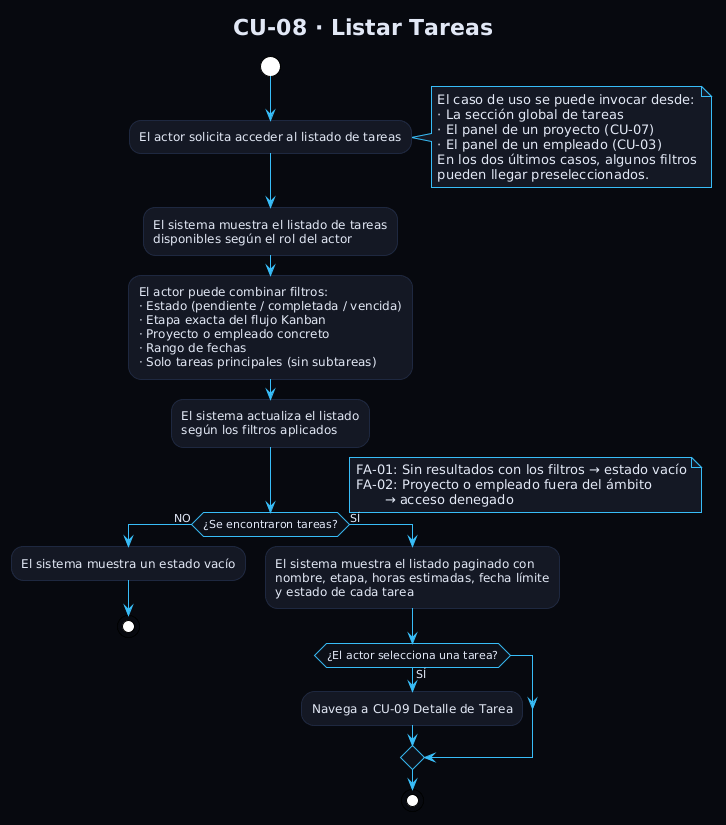

**Flujo principal:**
1. El actor accede al listado de tareas, bien desde la sección global, bien desde CU-07 o CU-03.
2. El sistema muestra las tareas disponibles según el ámbito del actor, con los filtros contextuales preseleccionados si los hubiera.
3. El actor puede combinar filtros: estado, etapa, proyecto, empleado, rango de fechas y tareas principales.
4. El sistema actualiza el listado paginado con los filtros aplicados.
5. El actor selecciona una tarea para ver su detalle.

**Flujos alternativos:**
- `FA-01`: Sin tareas con los filtros aplicados → estado vacío con mensaje.
- `FA-02`: Filtro por proyecto o empleado fuera del ámbito → acceso denegado.

**Relaciones:** Navega a CU-09.

---

### CU-09 – Consultar Detalle de Tarea

| Campo | Valor |
|---|---|
| **Actores** | Director, Responsable |
| **Precondición** | CU-01 completado. La tarea pertenece a un proyecto en el ámbito del actor. |
| **Postcondición** | El actor conoce todos los datos de la tarea. |

**Flujo principal:**
1. El actor selecciona una tarea desde CU-08, CU-03 o CU-07.
2. El sistema verifica que la tarea pertenece al ámbito del actor.
3. El sistema muestra la ficha completa: información general, personas responsables y asignadas, horas y subtareas.
4. El actor puede navegar al proyecto de la tarea, a los perfiles de los empleados implicados, a las subtareas o a la tarea padre si existe.

**Flujos alternativos:**
- `FA-01`: Tarea no encontrada → mensaje de error.
- `FA-02`: Tarea fuera del ámbito → acceso denegado.

**Relaciones:** Navega a CU-03, CU-07, CU-09 (recursivo en subtareas). `<<extend>>` hacia CU-17.

---

### CU-10 – Consultar Métrica Operativa

| Campo | Valor |
|---|---|
| **Actores** | Director, Responsable |
| **Precondición** | CU-01 completado. Los parámetros que requiera la métrica elegida están dentro del ámbito del actor. |
| **Postcondición** | El actor ha consultado el valor de una métrica con los filtros configurados. |

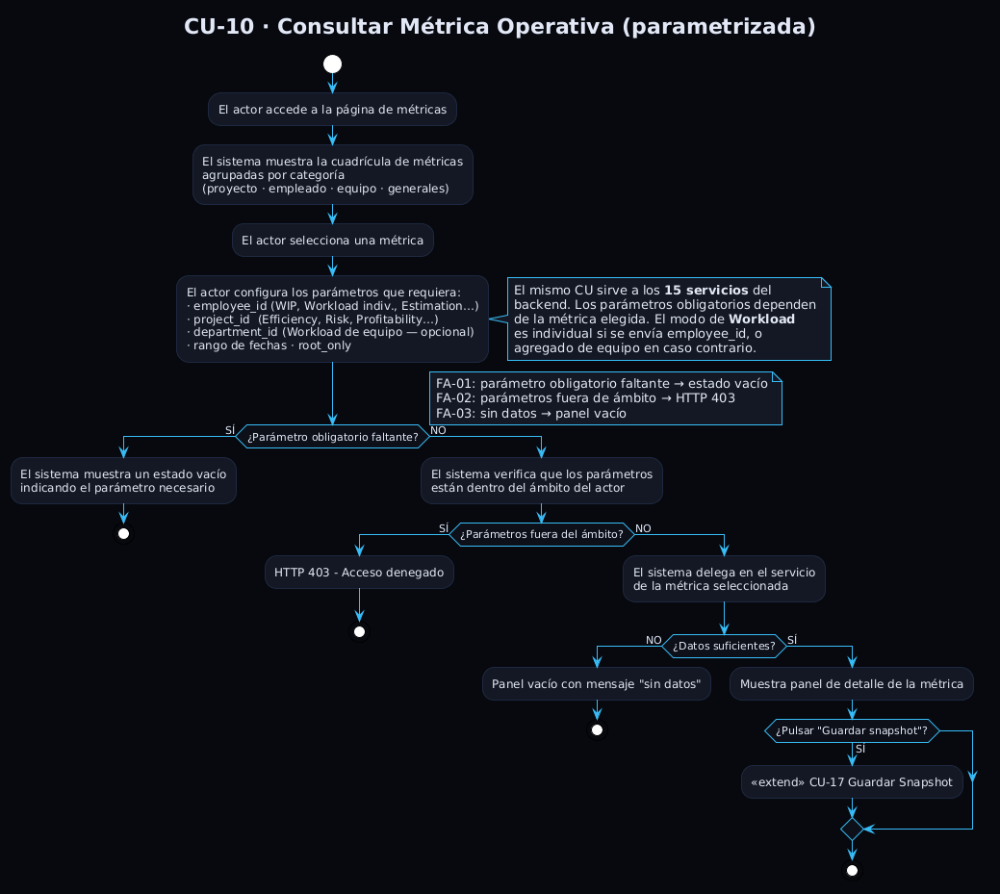

**Flujo principal:**
1. El actor accede a la página de métricas.
2. El sistema muestra las métricas disponibles agrupadas por categoría (proyecto, empleado, equipo y generales).
3. El actor selecciona una métrica.
4. El sistema muestra los parámetros que requiere esa métrica (empleado, proyecto, departamento, rango de fechas, etc.).
5. El actor configura los parámetros y confirma.
6. El sistema verifica que los parámetros están dentro del ámbito del actor.
7. El sistema calcula la métrica y muestra el panel de detalle con sus indicadores y gráficos específicos.

**Flujos alternativos:**
- `FA-01`: Parámetro obligatorio sin informar → el sistema muestra un estado vacío solicitando el parámetro.
- `FA-02`: Parámetros fuera del ámbito del actor → acceso denegado.
- `FA-03`: Sin datos para los filtros → el sistema muestra un panel vacío con mensaje informativo.

**Observación:** Caso de uso único parametrizado por el nombre de la métrica. Cada métrica concreta se modela como un **subcaso** de CU-10 que comparte actores, precondición esencial, postcondición y flujo principal con el padre, y solo añade los parámetros específicos, la fórmula de cálculo y los umbrales de interpretación. Los subcasos documentados son CU-10.1 a CU-10.11; el detalle de cada uno (con su diagrama de flujo) se recoge en el documento [Casos de Uso de Métricas](./docs/subCasosDeUso.md). La métrica de carga de trabajo admite además el modo agregado de equipo, que se activa cuando el actor no especifica un empleado concreto.

**Relaciones:** `<<extend>>` hacia CU-17 (guardar snapshot de la métrica calculada). Cada subcaso CU-10.x hereda esta misma relación.

---

### CU-11 – Visualizar Gráficos Analíticos

| Campo | Valor |
|---|---|
| **Actores** | Director, Responsable |
| **Precondición** | CU-01 completado. |
| **Postcondición** | El actor ha visualizado los gráficos filtrados por su ámbito y configuración. |

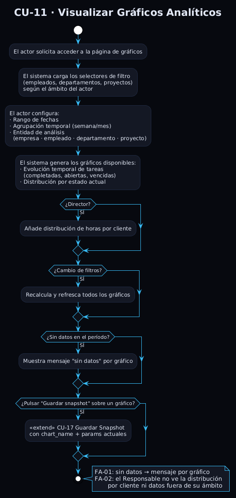

**Flujo principal:**
1. El actor accede a la página de gráficos.
2. El actor configura el rango de fechas, la agrupación temporal (semanal o mensual) y la entidad de análisis (empresa, empleado, departamento o proyecto).
3. El sistema genera los gráficos disponibles: evolución temporal de tareas y distribución por estado actual.
4. Si el actor es Director, el sistema añade la distribución de horas por cliente.

**Flujos alternativos:**
- `FA-01`: Sin datos en el período → mensaje informativo en cada gráfico.
- `FA-02`: Responsable → no visualiza la distribución por cliente.

**Relaciones:** `<<extend>>` hacia CU-17 (guardar snapshot del gráfico).

---

### CU-12 – Consultar Asistencia vs Imputaciones

| Campo | Valor |
|---|---|
| **Actores** | Director, Responsable (modo equipo global) |
| **Precondición** | CU-01 completado. |
| **Postcondición** | El actor conoce la cobertura horaria del período analizado. |

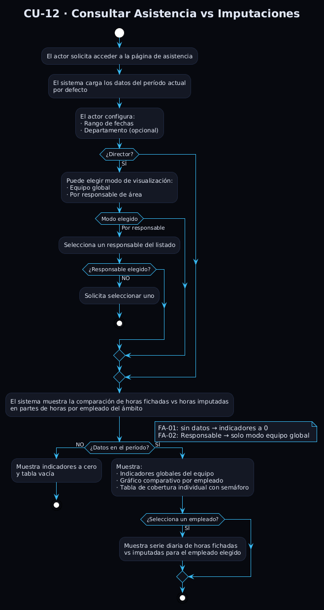

**Flujo principal:**
1. El actor accede a la página de asistencia.
2. El actor configura el rango de fechas y, opcionalmente, un departamento.
3. Si el actor es Director, puede elegir entre modo equipo global o modo por responsable.
4. El sistema compara las horas fichadas con las horas imputadas en partes de horas para cada empleado del ámbito.
5. El sistema muestra indicadores globales, gráfico comparativo y tabla con la cobertura individual y su semáforo.
6. Al seleccionar un empleado, el sistema muestra la serie diaria de horas fichadas e imputadas.

**Flujos alternativos:**
- `FA-01`: Sin datos en el período → indicadores a 0 y tabla vacía.
- `FA-02`: Responsable → solo puede usar el modo equipo global.

**Relaciones:** `<<extend>>` hacia CU-17 (guardar snapshot de la asistencia).

---

### CU-13 – Analizar Rentabilidad Financiera ★

| Campo | Valor |
|---|---|
| **Actores** | Director (exclusivo) |
| **Precondición** | CU-01 completado con rol Director. |
| **Postcondición** | El Director ha consultado ingresos, gastos y rentabilidad del período. |

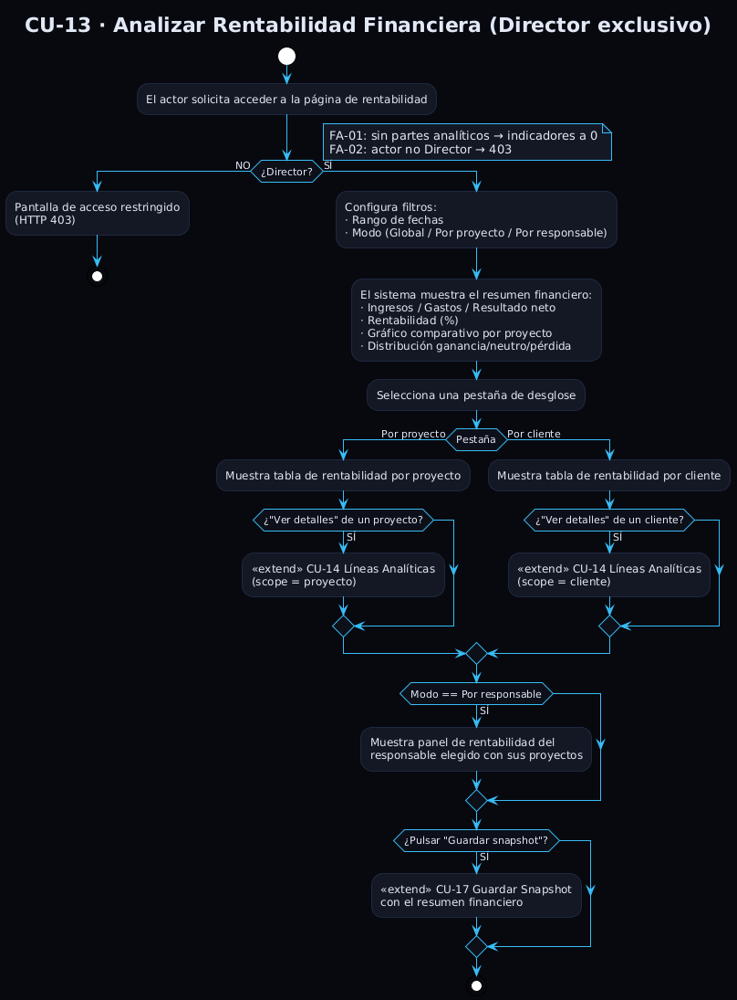

**Flujo principal:**
1. El Director accede a la página de rentabilidad financiera.
2. El sistema valida el rol; en caso contrario muestra pantalla de acceso restringido.
3. El Director configura el rango de fechas y el modo de análisis (global, por proyecto o por responsable).
4. El sistema muestra el resumen financiero: ingresos, gastos, resultado neto, rentabilidad en porcentaje y distribución de proyectos entre ganancia, neutro y pérdida.
5. El Director selecciona una pestaña de desglose (por proyecto o por cliente).

**Flujos alternativos:**
- `FA-01`: Sin partes analíticos en el período → indicadores a 0.
- `FA-02`: Actor sin rol Director → acceso denegado.

**Relaciones:** `<<extend>>` hacia CU-14 (ver detalles) y CU-17 (guardar snapshot).

---

### CU-14 – Consultar Líneas Analíticas ★

| Campo | Valor |
|---|---|
| **Actores** | Director (exclusivo) |
| **Precondición** | El Director está en CU-13 con un resultado de rentabilidad mostrado y pulsa "Ver detalles" sobre una fila. |
| **Postcondición** | El Director ha visto el desglose de ingresos y gastos del ámbito elegido (proyecto o cliente). |

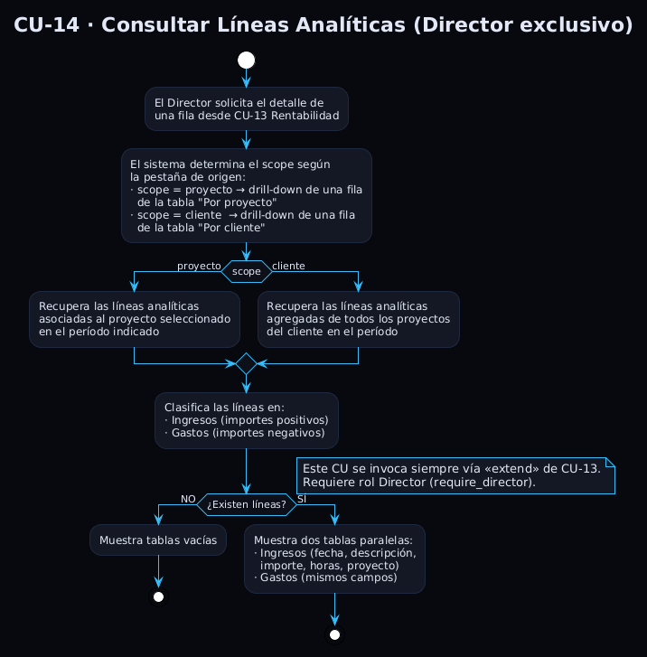

**Flujo principal:**
1. Desde CU-13, el Director solicita el detalle de una fila. El ámbito (proyecto o cliente) queda determinado por la pestaña de origen.
2. El sistema recupera las líneas analíticas del proyecto o del conjunto de proyectos del cliente en el período indicado.
3. El sistema clasifica las líneas en ingresos (importes positivos) y gastos (importes negativos).
4. El sistema muestra dos tablas paralelas con la fecha, descripción, importe, horas y, si corresponde, el proyecto de origen de cada línea.

**Flujos alternativos:**
- `FA-01`: Sin líneas en el período → tablas vacías con mensaje.

**Observación:** Caso de uso único parametrizado por el ámbito. No tiene ruta de entrada propia desde el menú principal.

**Relaciones:** Invocado siempre desde CU-13 vía `<<extend>>`.

---

### CU-15 – Realizar Búsqueda Global

| Campo | Valor |
|---|---|
| **Actores** | Director, Responsable |
| **Precondición** | CU-01 completado. |
| **Postcondición** | El actor ha encontrado una entidad y ha navegado a su detalle. |

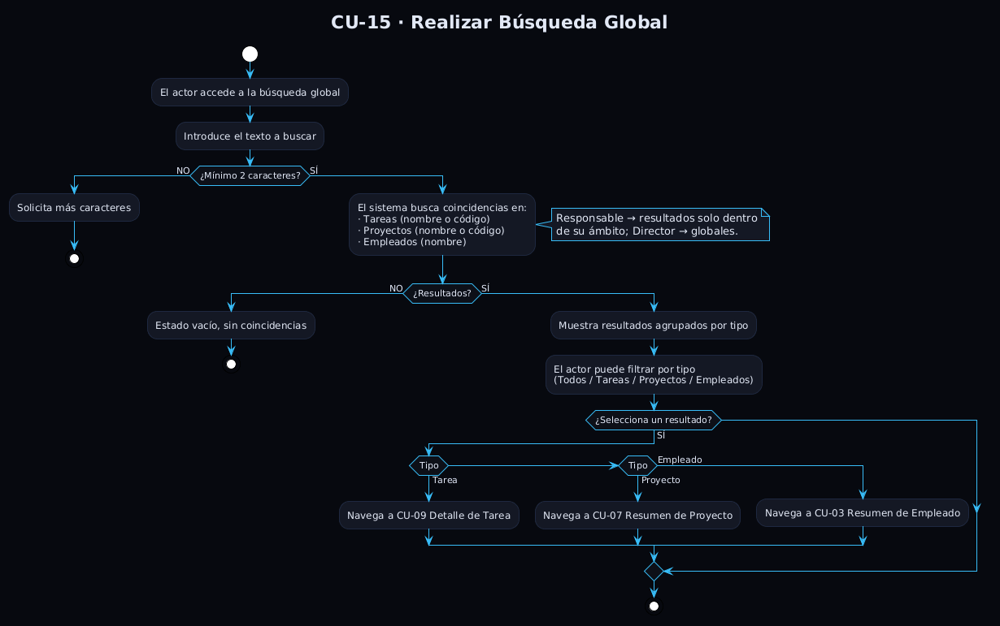

**Flujo principal:**
1. El actor abre la búsqueda global e introduce al menos dos caracteres.
2. El sistema busca coincidencias en tareas, proyectos y empleados, aplicando el ámbito del actor.
3. El sistema muestra los resultados agrupados por tipo. El actor puede filtrar por tipo.
4. Al seleccionar un resultado, el sistema navega a CU-03, CU-07 o CU-09 según corresponda.

**Flujos alternativos:**
- `FA-01`: Menos de dos caracteres → el sistema solicita más caracteres.
- `FA-02`: Sin resultados → estado vacío.

**Relaciones:** Navega a CU-03, CU-07 y CU-09.

---

### CU-16 – Cerrar Sesión

| Campo | Valor |
|---|---|
| **Actores** | Director, Responsable |
| **Precondición** | Existe una sesión activa. |
| **Postcondición** | La sesión queda invalidada y las credenciales locales eliminadas. |

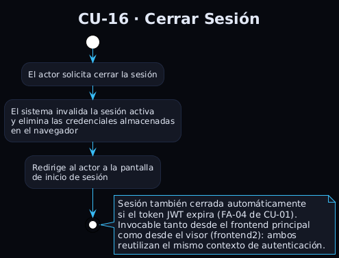

**Flujo principal:**
1. El actor pulsa "Cerrar sesión".
2. El sistema invalida la sesión y elimina los datos almacenados en el navegador.
3. El sistema redirige al actor a la pantalla de inicio de sesión.

**Observación:** Invocable tanto desde el frontend principal como desde el visor de snapshots. La sesión también puede cerrarse automáticamente por expiración (FA-04 de CU-01).

**Relaciones:** Ninguna.

---

### CU-17 – Guardar Snapshot

| Campo | Valor |
|---|---|
| **Actores** | Director, Responsable |
| **Precondición** | El actor está en una vista calculada del frontend principal con un resultado ya mostrado en pantalla (métrica, gráfico, rentabilidad o ficha de entidad). |
| **Postcondición** | Existe una snapshot asociada al actor y a la fecha actual con los datos calculados. |

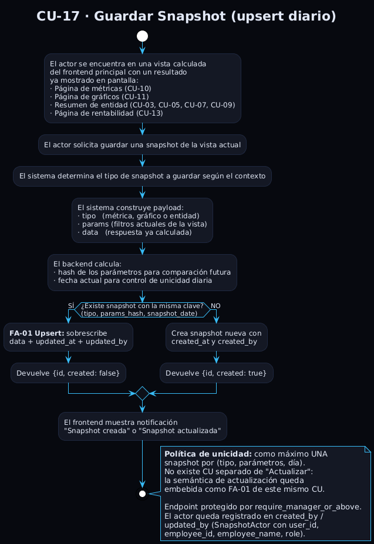

**Flujo principal:**
1. El actor pulsa "Guardar snapshot" desde la vista calculada actual.
2. El sistema determina el tipo de snapshot (métrica, gráfico o entidad) y toma los parámetros y datos ya mostrados en pantalla.
3. El sistema registra la fecha actual y el actor responsable.
4. Si ya existe una snapshot del mismo tipo con los mismos parámetros y fecha, el sistema la sobrescribe. Si no existe, la crea nueva.
5. El sistema muestra una notificación de confirmación indicando si la snapshot es nueva o se ha actualizado.

**Flujos alternativos:**
- `FA-01` (Upsert diario): si existe una snapshot previa del día con los mismos parámetros, se actualiza en lugar de crearse una nueva. Esta es la razón por la que no existe un caso de uso separado de "Actualizar snapshot".

**Restricciones:** Como máximo una snapshot por combinación de tipo, parámetros y día.

**Relaciones:** Invocado vía `<<extend>>` desde CU-03, CU-05, CU-07, CU-09, CU-10, CU-11 y CU-13.

---

### CU-18 – Listar Snapshots

| Campo | Valor |
|---|---|
| **Actores** | Director, Responsable |
| **Precondición** | CU-01 completado en el visor de snapshots. |
| **Postcondición** | El actor ha visto la tabla paginada de snapshots de la colección elegida. |

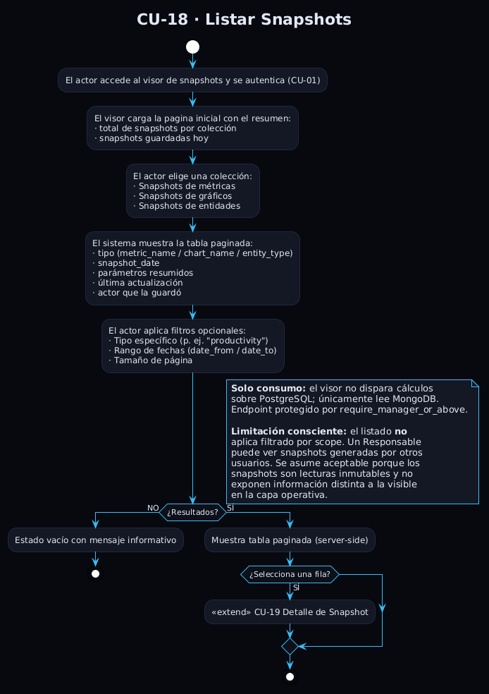

**Flujo principal:**
1. El actor accede al visor de snapshots.
2. El sistema muestra la home con el resumen global por colección (total guardadas y guardadas hoy).
3. El actor selecciona una colección (métricas, gráficos o entidades).
4. El sistema muestra la tabla paginada con tipo, fecha, parámetros, última actualización y actor responsable.
5. El actor puede aplicar filtros por tipo y rango de fechas, y navegar por las páginas.

**Flujos alternativos:**
- `FA-01`: Sin resultados → estado vacío con mensaje informativo.

**Observación:** El listado no aplica filtrado por ámbito: las snapshots son lecturas inmutables de momentos pasados y no exponen información distinta a la ya visible en la capa operativa.

**Relaciones:** `<<extend>>` hacia CU-19.

---

### CU-19 – Consultar Detalle de Snapshot

| Campo | Valor |
|---|---|
| **Actores** | Director, Responsable |
| **Precondición** | Existe una snapshot accesible desde CU-18. |
| **Postcondición** | El actor ha visualizado la ficha reconstruida de la snapshot. |

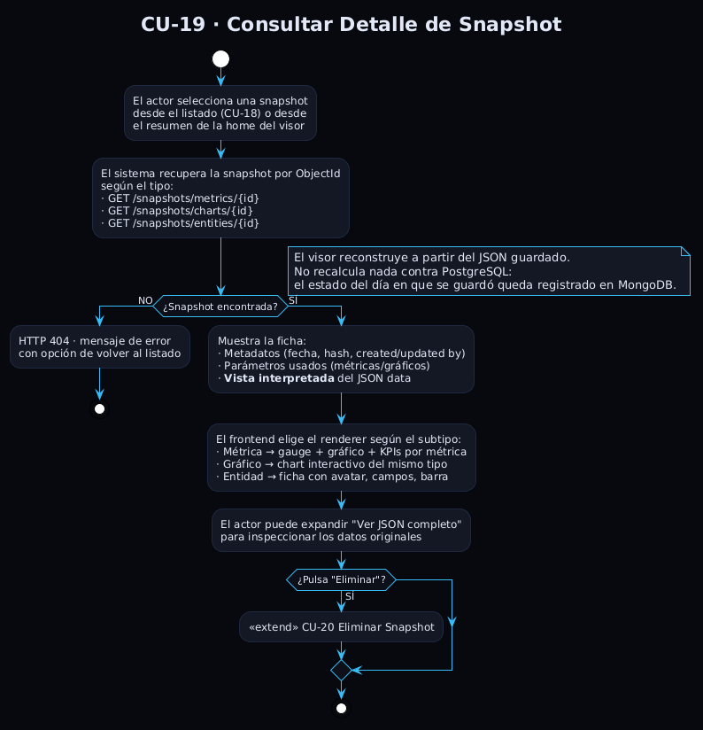

**Flujo principal:**
1. El actor selecciona una snapshot desde el listado (CU-18) o desde la home del visor.
2. El sistema recupera la snapshot.
3. El sistema reconstruye la visualización según el tipo:
   - Métrica → gauge, gráfico y indicadores propios de la métrica.
   - Gráfico → el mismo tipo de gráfico interactivo con que se guardó.
   - Entidad → ficha con avatar, campos y barra de progreso.
4. El actor puede expandir el contenido completo de la snapshot para inspeccionar los datos originales.

**Flujos alternativos:**
- `FA-01`: Snapshot no encontrada → mensaje de error con opción de volver al listado.

**Observación:** La visualización se reconstruye exactamente como se guardó el día de la captura. No se recalcula ningún dato contra el ERP.

**Relaciones:** `<<extend>>` hacia CU-20.

---

### CU-20 – Eliminar Snapshot

| Campo | Valor |
|---|---|
| **Actores** | Director |
| **Precondición** | Existe una snapshot seleccionada desde CU-18 o CU-19. |
| **Postcondición** | La snapshot ha sido eliminada de forma permanente. |

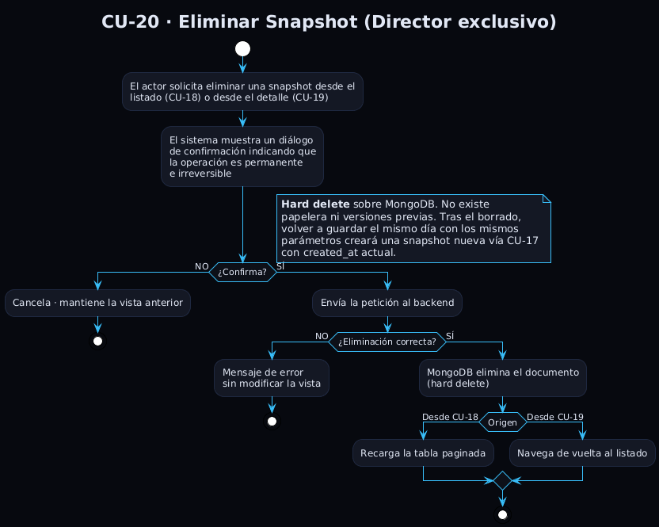

**Flujo principal:**
1. El actor pulsa "Eliminar".
2. El sistema muestra un diálogo de confirmación advirtiendo que la operación es permanente.
3. Tras confirmar, el sistema elimina la snapshot.
4. El sistema recarga la tabla (si el origen es CU-18) o navega al listado (si el origen es CU-19).

**Flujos alternativos:**
- `FA-01`: El actor cancela el diálogo → no ocurre ningún cambio.
- `FA-02`: Error en la operación → mensaje de error sin modificar la vista.

**Observación:** El borrado es definitivo, sin papelera ni versiones previas. Tras el borrado, volver a guardar el mismo día con los mismos parámetros crea una snapshot nueva a través de CU-17.

**Relaciones:** `<<include>>` hacia CU-18 y CU-19.

---

### CU-21 – Consultar Distribución de Carga del Equipo

| Campo | Valor |
|---|---|
| **Actores** | Director, Responsable |
| **Precondición** | CU-01 completado. |
| **Postcondición** | El actor conoce la distribución de carga de su equipo y puede navegar al perfil de cualquier empleado. |

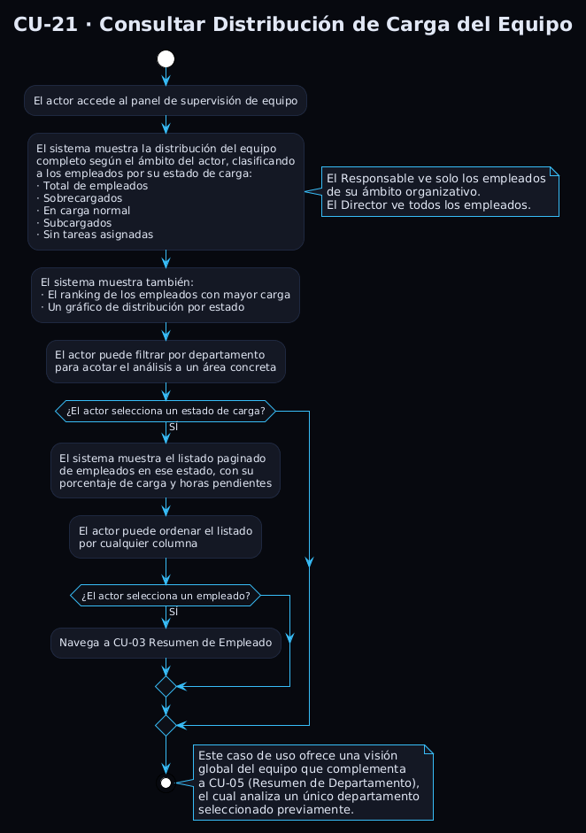

**Flujo principal:**
1. El actor accede al panel de gestión de equipo.
2. El sistema calcula la distribución del equipo según el ámbito del actor y clasifica a cada empleado en una de cuatro categorías: sobrecargado, normal, subcargado o sin tareas asignadas.
3. El sistema muestra cinco tarjetas numéricas clicables: total de empleados, sobrecargados, en carga normal, subcargados y sin tareas.
4. El sistema muestra el ranking de los cinco empleados con mayor porcentaje de carga y un gráfico de barras horizontal con la distribución por estado.
5. El actor puede filtrar por departamento para acotar el análisis a un área concreta.
6. El actor selecciona una tarjeta de estado y el sistema despliega el listado paginado de empleados en ese estado, con su porcentaje de carga, horas pendientes y número de tareas pendientes.
7. El actor puede ordenar el listado por cualquier columna y navegar por las páginas de resultados.
8. El actor selecciona un empleado del listado para acceder a su resumen detallado.

**Flujos alternativos:**
- `FA-01`: No existen empleados en el estado seleccionado → estado vacío con mensaje informativo.
- `FA-02`: Filtro de departamento activo → el sistema recalcula toda la distribución limitándola a los empleados del departamento elegido.

**Observación:** Este caso de uso tiene su propia página dedicada (`/manager`) y actúa como punto de entrada a la supervisión de equipo. Se diferencia de CU-10 (Consultar Métrica Operativa) en que no forma parte del catálogo de métricas parametrizadas, sino que ofrece una vista de gestión agregada y navegable del estado del equipo, con paginación server-side. El cálculo de carga que subyace es el mismo que CU-10.4 (Workload individual), pero aplicado sobre todos los empleados del ámbito simultáneamente.

**Relaciones:** Navega a CU-03 (al seleccionar un empleado del listado).

---
## 4. Prototipar Casos de Uso

Los prototipos de baja fidelidad presentados a continuación representan la disposición visual de cada pantalla del sistema. Cada prototipo ilustra la estructura de la interfaz, la organización de los datos y los puntos de interacción disponibles para el usuario, sirviendo como referencia para la implementación del frontend.

> Además de los prototipos asociados a casos de uso, el sistema incluye una pantalla de navegación y agregación que actúa como punto de entrada del sistema. No constituye un casos de uso en sí, sino que consolida información de múltiples casos de uso ya documentados.

---

### Pantalla de inicio — `/`

Panel de bienvenida que actúa como punto de entrada al sistema tras completar CU-01. Muestra un resumen ejecutivo con alertas activas, indicadores globales y accesos rápidos a las secciones principales.

---

### Prototipo CU-01 – Autenticarse
Formulario de inicio de sesión con campos de usuario y contraseña, indicación de acceso restringido y mensajes de error contextuales.

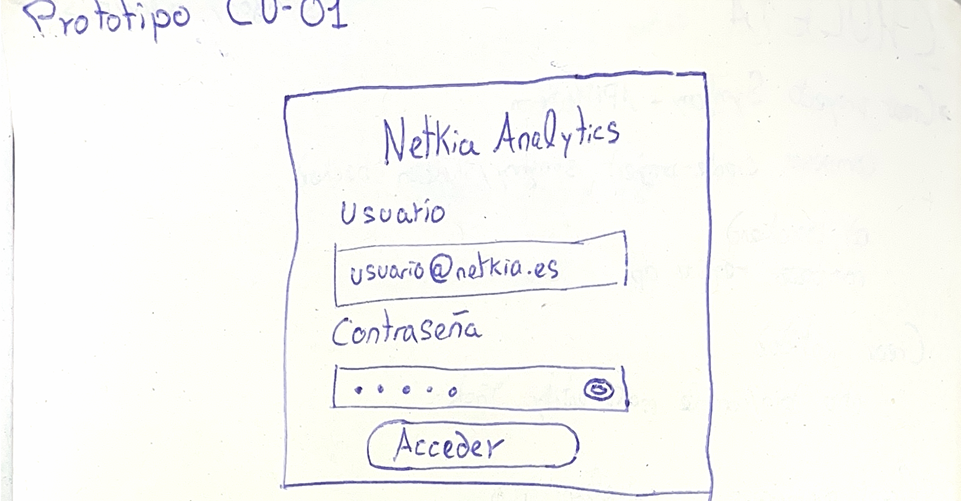

---

### Prototipo CU-02 – Listar Empleados
Tabla paginada con barra de búsqueda por nombre, selector de departamento y opción de mostrar solo activos. Cada fila es navegable al resumen del empleado.

---

### Prototipo CU-03 – Resumen de Empleado
Panel individual con cabecera de perfil, indicadores principales y pestañas de tareas con filtro de fechas.

---

### Prototipo CU-04 – Listar Departamentos
Cuadrícula de tarjetas con el nombre del departamento y el responsable asignado. Cada tarjeta navega al resumen del departamento.

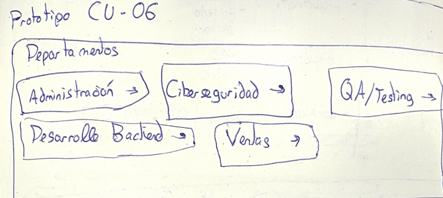

---

### Prototipo CU-05 – Resumen de Departamento
Panel de departamento con indicadores de distribución de carga, alerta para empleados sobrecargados y dos pestañas de visualización.

---

### Prototipo CU-06 – Listar Proyectos
Cuadrícula de tarjetas con nombre del proyecto, cliente asociado y código. Cada tarjeta navega al resumen del proyecto.

---

### Prototipo CU-07 – Resumen de Proyecto
Panel de proyecto con indicadores de eficiencia, riesgo y rentabilidad, gráfico comparativo de horas y pestañas de tareas y equipo.

---

### Prototipo CU-08 – Listar Tareas
Tabla paginada con barra de filtros combinables: estado, etapa, proyecto, rango de fechas y opción de mostrar solo tareas principales.

---

### Prototipo CU-09 – Detalle de Tarea
Ficha de tarea con secciones de información general, personas, horas con barra de progreso y lista de subtareas.

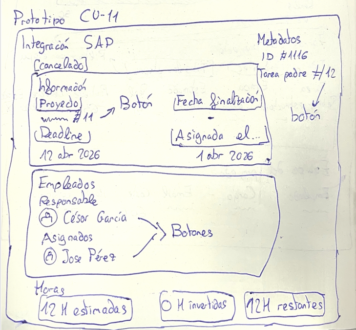

---

### Prototipo CU-10 – Consultar Métrica Operativa
Página de métricas con cuadrícula de tarjetas a la izquierda y panel de detalle de la métrica seleccionada a la derecha. Panel de filtros en la parte superior.

---

### Prototipo CU-11 – Gráficos Analíticos
Página de gráficos con barra de filtros y cuadrícula de visualizaciones: evolución temporal, distribución por estado y horas por cliente.

---

### Prototipo CU-12 – Asistencia vs Imputaciones
Página de asistencia con selector de modo de vista, filtros de fecha y departamento, indicadores globales, gráfico comparativo y tabla de empleados con semáforo de cobertura.

---

### Prototipo CU-13 – Rentabilidad Financiera
Página de rentabilidad con filtros de fecha y modo de análisis, indicadores financieros, gráfico comparativo y pestañas por proyecto y por cliente con opción de desglose detallado.

---

### Prototipo CU-14 – Líneas Analíticas
Panel de desglose accesible desde CU-13 con dos tablas paralelas de ingresos y gastos individuales, parametrizado por ámbito (proyecto o cliente).

---

### Prototipo CU-15 – Búsqueda Global
Página de búsqueda con campo prominente, botones de filtro por tipo de entidad y resultados en forma de tarjetas navegables.

---

### Prototipos del visor de snapshots (CU-18, CU-19, CU-20)

El visor de snapshots es una aplicación independiente del frontend principal que reutiliza el mismo esquema de autenticación y se dedica en exclusiva a consumir las capturas históricas.

- **Home del visor:** resumen global con contadores por colección (métricas, gráficos, entidades) y acceso rápido a las últimas snapshots guardadas.
- **Listado por colección (CU-18):** tabla paginada con filtros por tipo y rango de fechas.
- **Detalle de snapshot (CU-19):** ficha con metadatos, vista reconstruida por el renderizador correspondiente al subtipo y panel expandible con el contenido original.
- **Diálogo de eliminación (CU-20):** confirmación previa a un borrado permanente.

---

### Prototipo CU-21 - Carga de Trabajo del Equipo

Panel de supervisión global para responsables que presenta cinco tarjetas numéricas clicables (total, sobrecargado, normal, subcargado, sin tareas), gráfico de barras de distribución por estado, panel de empleados más cargados y — al hacer clic en una tarjeta — listado paginado de empleados filtrados con su porcentaje de carga y horas pendientes.

## 5. Estructurar el Modelo de Casos de Uso

### 5.1 Diagrama de Contexto – Director

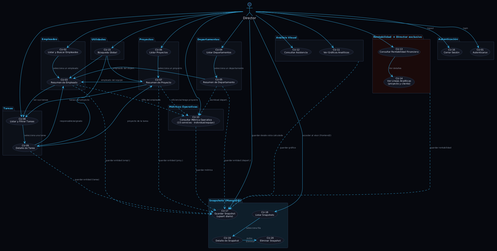

El Director tiene acceso a los 21 casos de uso sin restricciones de ámbito. Es el único actor con acceso al módulo de rentabilidad financiera (CU-13 y CU-14).

---

### 5.2 Diagrama de Contexto – Responsable

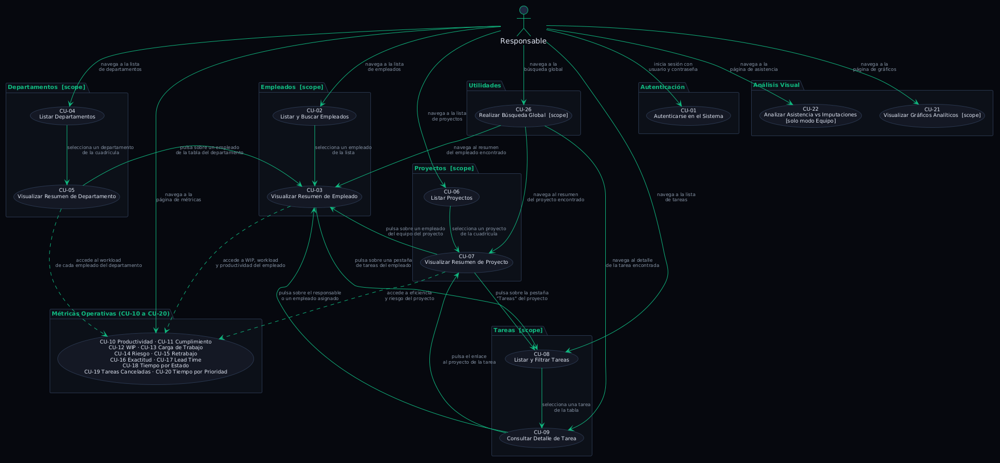

El Responsable tiene acceso a 18 casos de uso, pero con datos filtrados automáticamente a su ámbito organizativo (empleados, departamentos y proyectos bajo su responsabilidad).

### 5.3 Diagramas de navegación

#### 5.3.1 Diagrama de navegación del director
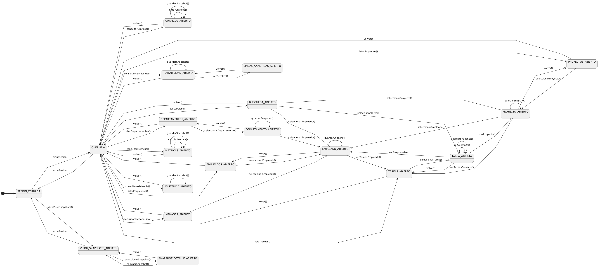

#### 5.3.2 Diagrama de navegación del responsable
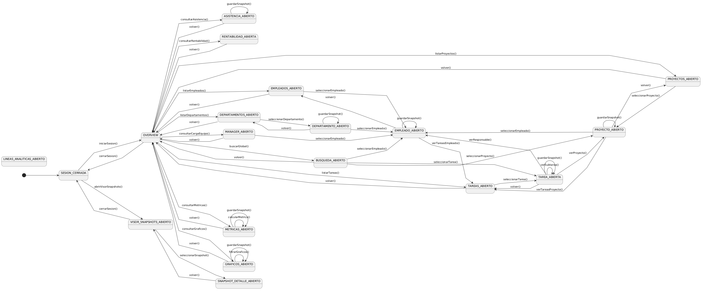

---

### 5.4 Relaciones include / extend

#### 1. Relaciones de Inclusión `<<include>>`

Todos los casos de uso del sistema (excepto CU-01 Autenticarse) requieren sesión autenticada activa. La relación `<<include>>` hacia CU-01 se considera implícita en toda la arquitectura y **no se representa individualmente** en los diagramas para evitar sobrecarga visual.

| Inclusión                             | Desde → Hacia               | Descripción                                                       |
| ------------------------------------- | --------------------------- | ----------------------------------------------------------------- |
| Eliminación de snapshot desde listado | CU-18 → CU-20               | El actor puede eliminar una snapshot directamente desde la tabla. |
| Eliminación de snapshot desde detalle | CU-19 → CU-20               | El actor puede eliminar la snapshot desde la ficha abierta.       |

#### 2. Relaciones de Extensión `<<extend>>`

| Extensión | Desde → Hacia | Condición |
|---|---|---|
| Desglose de rentabilidad | CU-13 → CU-14 | Actor pulsa "Ver detalles" sobre una fila de la tabla por proyecto (ámbito=proyecto) o por cliente (ámbito=cliente). |
| Guardar snapshot de métrica | CU-10 → CU-17 | Actor pulsa "Guardar snapshot" desde una vista calculada de métrica. |
| Guardar snapshot de gráfico | CU-11 → CU-17 | Actor pulsa "Guardar snapshot" sobre un gráfico concreto. |
| Guardar snapshot de rentabilidad ★ | CU-13 → CU-17 | Director pulsa "Guardar snapshot" sobre el resumen financiero. |
| Guardar snapshot de entidad | CU-03, CU-05, CU-07, CU-09 → CU-17 | Actor pulsa "Guardar snapshot" desde la ficha de una entidad. |
| Detalle de snapshot listada | CU-18 → CU-19 | Actor selecciona una fila en la tabla del visor. |
| Eliminación de snapshot | CU-19 → CU-20 | Actor pulsa "Eliminar" sobre la ficha abierta. |

#### Notas

- **CU-14** es el único CU cuya activación ocurre **exclusivamente** a través de `<<extend>>` (desde CU-13). No tiene ruta de entrada propia desde el menú principal.
- **CU-17** actúa como punto de extensión universal para cualquier vista calculada. Su FA-01 (upsert) absorbe la semántica de actualización sin necesidad de un CU separado.
- La navegación lateral entre entidades (por ejemplo, CU-09 → CU-07) no es una relación `<<extend>>`: son transiciones de navegación declaradas en el diagrama de contexto, no dependencias funcionales entre CUs.