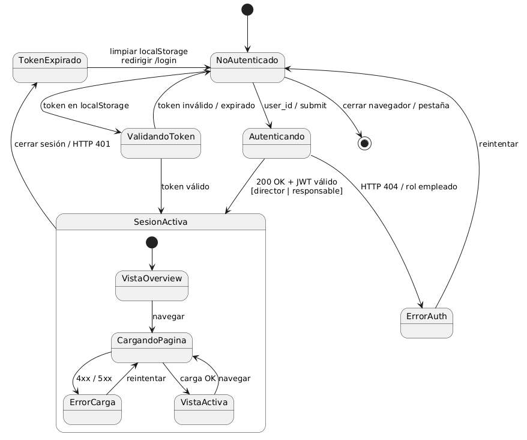

# Modelo del Dominio

El sistema se compone de una aplicación web analítica conectada a la base de datos del ERP en modo lectura, cuya función principal es consumir los datos del ERP Odoo, estructurarlos y transformarlos en información útil para la toma de decisiones. Por ello, el modelo del dominio no introduce nuevas entidades de negocio, sino que se apoya en las ya existentes en Odoo, garantizando coherencia con la base de datos corporativa y evitando inconsistencias.

En las siguientes secciones se presentan los diferentes diagramas que conforman el modelo del dominio: el diagrama de clases, el diagrama de objetos, el diagrama de estados y el glosario de términos, proporcionando una visión completa de la estructura conceptual del sistema.

## Diagrama de Clases

En el contexto de Netkia, el diagrama de clases está directamente alineado con la estructura de datos del ERP Odoo v16, lo que garantiza la consistencia entre la información almacenada en el sistema de gestión y los indicadores generados por el módulo analítico. Cada clase representa una entidad real del entorno organizativo, como clientes, proyectos, tareas, empleados o departamentos, y refleja los atributos necesarios para calcular métricas de productividad, carga de trabajo y rentabilidad.

Las relaciones entre las clases permiten entender la jerarquía y dependencia entre los elementos del sistema. Por ejemplo, un cliente puede tener múltiples proyectos, cada proyecto puede contener varias tareas, y cada tarea puede estar asociada a diferentes empleados y partes de horas. Esta estructura refleja el flujo natural del trabajo dentro de la empresa y facilita la obtención de indicadores agregados.

## Diagrama de Objetos

El diagrama de objetos complementa al diagrama de clases mostrando una instancia concreta del modelo del dominio en un escenario realista dentro de Netkia SL. Mientras que el diagrama de clases describe la estructura general del sistema, el diagrama de objetos permite observar cómo se materializan esas clases en situaciones reales de uso.

En este caso, se representa un proyecto real con sus correspondientes tareas, subtareas, empleados asignados y partes de horas registrados. Esta representación facilita la comprensión del funcionamiento del sistema, ya que muestra cómo los datos se relacionan en la práctica y cómo se organizan dentro del ERP.

El objetivo principal de este diagrama es ilustrar el flujo de información desde el cliente hasta las tareas y los registros de horas, permitiendo visualizar de forma clara la interacción entre los distintos elementos del dominio. De esta forma, se puede entender cómo el sistema es capaz de generar métricas a partir de los datos reales de trabajo, como la productividad, la carga de trabajo o la eficiencia de los proyectos.

## Diagrama de Estados

En este apartado se presentan dos diagramas de estados: el primero describe el comportamiento general del sistema de métricas y dashboards, mientras que el segundo representa el ciclo de vida de una tarea dentro del sistema de gestión de proyectos.

### Diagrama de estados del sistema

Este diagrama representa el comportamiento general del sistema desde el punto de vista de la sesión del usuario, describiendo cómo transita entre los estados de autenticación, navegación activa y cierre de sesión.

El sistema parte del estado **NoAutenticado**, que es el estado inicial siempre que no exista una sesión activa. Desde aquí se abren dos caminos: si el navegador detecta un token almacenado en `localStorage`, se pasa automáticamente al estado **ValidandoToken**, donde se comprueba si el JWT sigue siendo válido; si en cambio el usuario introduce sus credenciales y pulsa Acceder, se transita al estado **Autenticando**, donde el frontend realiza la llamada `POST /auth/token` al backend.

Si la autenticación falla —por credenciales incorrectas, usuario inexistente o rol `empleado` sin acceso— el sistema pasa al estado **ErrorAuth**, donde se muestra el mensaje de error en el formulario de login sin perder los datos introducidos, permitiendo al usuario reintentar directamente. Si la autenticación es correcta, o si el token almacenado se valida con éxito, el sistema transita a **SesionActiva**.

Dentro de **SesionActiva** se modelan los estados propios de la navegación en la aplicación. El subestado inicial es **VistaOverview**, correspondiente a la página `/overview`. Cuando el usuario navega a cualquier otra ruta, el sistema pasa a **CargandoPagina**, estado en el que el frontend realiza las peticiones a los endpoints del backend. Si alguna petición devuelve un error 4xx o 5xx, se transita a **ErrorCarga**, desde donde el usuario puede reintentar la carga. Si las peticiones se resuelven correctamente, el sistema pasa a **VistaActiva**, estado en el que el usuario puede interactuar con los datos. Desde cualquier vista activa, navegar a otra sección reinicia el ciclo de carga.

La sesión activa finaliza por cierre de sesión voluntario (botón "Cerrar sesión").

### Diagrama de estados de una tarea

Este diagrama refleja las transiciones más comunes dentro de su ciclo de vida, como la creación de la tarea, su asignación a un empleado, el inicio del trabajo, su finalización o su cancelación. Además, contempla la posibilidad de reapertura de tareas cerradas, lo que permite modelar situaciones de retrabajo o correcciones dentro del sistema.

Aunque el módulo de métricas no gestiona directamente la creación o modificación de tareas, las métricas y dashboards dependen del estado en el que se encuentran, por lo que es necesario comprender su evolución.
Este diagrama permite interpretar correctamente los datos obtenidos de la base de datos y entender cómo influyen en los indicadores mostrados en el sistema.

## Requisitos del Sistema

### Requisitos Funcionales

| ID | Descripción | Actor | Prioridad |
|---|---|---|---|
| RF-01 | El sistema debe autenticar a los usuarios mediante su `res_users.id` de Odoo, determinar su rol (director/responsable/empleado) y emitir un JWT HS256 de 8 horas con el scope calculado dinámicamente (`employee_ids`, `department_ids`, `project_ids`). | Director, Responsable | Alta |
| RF-02 | El sistema debe proporcionar un overview global con KPIs de proyectos activos, empleados activos, tareas abiertas, tareas vencidas y actividad de los últimos 14 días. Los datos deben estar filtrados por el scope del actor autenticado. | Director, Responsable | Alta |
| RF-03 | El sistema debe mostrar un panel manager con el estado de carga de todo el equipo, clasificando a los empleados como sobrecargado (>120%), normal (70–120%), subcargado (<70%) o sin tareas, con gráfico de distribución y ranking de los 5 más cargados. | Director, Responsable | Alta |
| RF-04 | El sistema debe listar empleados con paginación server-side (50/pág.), búsqueda por nombre con debounce de 300 ms, filtro por departamento y ordenación global por cualquier columna. | Director, Responsable | Alta |
| RF-05 | El sistema debe mostrar un resumen individual de empleado con KPIs de WIP, carga de trabajo, productividad (últimos 30 días) y tareas vencidas sin cerrar, junto con cuatro pestañas de tareas: pendientes, completadas, asignadas y como responsable. | Director, Responsable | Alta |
| RF-06 | El sistema debe listar departamentos activos en cuadrícula de tarjetas y mostrar un resumen de departamento con distribución de carga, tabla de empleados con workload y acceso directo a los perfiles individuales. | Director, Responsable | Media |
| RF-07 | El sistema debe listar proyectos activos y mostrar un resumen de proyecto con índice de eficiencia, índice de riesgo, rentabilidad por horas estimadas vs. reales, gráfico comparativo y listado de tareas del proyecto con su equipo asignado. | Director, Responsable | Alta |
| RF-08 | El sistema debe listar tareas con filtros combinables: estado (pendiente/completada/vencida), etapa exacta (con prioridad sobre estado), proyecto, empleado, rango de fechas de deadline, fecha de asignación y solo tareas padre (`root_only`). Paginación y ordenación server-side. | Director, Responsable | Alta |
| RF-09 | El sistema debe mostrar el detalle completo de una tarea incluyendo información general, personas (responsable con enlace y asignados con enlace), sección de horas con barra de progreso y productividad, y lista de subtareas navegables. | Director, Responsable | Alta |
| RF-10 | El sistema debe calcular y mostrar la métrica de **Productividad** (`(planificadas/reales)×100`) para tareas cerradas, con gauge visual, gráfico de barras con el top 8 de tareas y valor promedio. Filtrable por empleado, proyecto y rango de fechas. | Director, Responsable | Media |
| RF-11 | El sistema debe calcular y mostrar la métrica de **Cumplimiento de Plazos** (`date_end ≤ date_deadline`) con doughnut chart y semáforo (≥80% verde, ≥60% naranja, <60% rojo). | Director, Responsable | Media |
| RF-12 | El sistema debe calcular y mostrar la métrica de **Carga de Trabajo (Workload)** de un empleado como `(horas_pendientes/40h)×100`, con gauge, barra de progreso y estado sobrecargado/normal/subcargado. | Director, Responsable | Alta |
| RF-13 | El sistema debe calcular y mostrar la métrica de **WIP** (Work In Progress) de un empleado contando tareas abiertas asignadas, con umbral óptimo ≤3, aceptable ≤5 y sobrecargado >5, y mensaje de recomendación textual. | Director, Responsable | Media |
| RF-14 | El sistema debe calcular y mostrar el **Índice de Riesgo** de un proyecto como porcentaje de tareas abiertas vencidas o con ≥80% del plazo consumido. | Director, Responsable | Media |
| RF-15 | El sistema debe calcular y mostrar la **Eficiencia de Proyecto** como ratio de horas planificadas vs. reales, con índice porcentual, desviación en horas y porcentaje de desviación. | Director, Responsable | Media |
| RF-16 | El sistema debe calcular y mostrar la **Rentabilidad por Horas** de un proyecto como diferencia entre coste estimado (`planned_hours × hourly_cost`) y coste real (`worked_hours × hourly_cost`). | Director, Responsable | Media |
| RF-17 | El sistema debe calcular y mostrar la **Tasa de Retrabajo** como porcentaje de tareas cerradas que fueron reabiertas, analizando el historial de cambios de etapa en `mail_tracking_value`. | Director, Responsable | Media |
| RF-18 | El sistema debe calcular y mostrar la **Exactitud de Estimación** del responsable seleccionado, con ratio medio real/planificado y clasificación de sesgo (subestima/sobreestima/preciso). | Director, Responsable | Media |
| RF-19 | El sistema debe calcular y mostrar el **Lead Time** medio en días desde la asignación hasta el cierre de las tareas. | Director, Responsable | Media |
| RF-20 | El sistema debe calcular y mostrar el **Tiempo por Estado** de las tareas, indicando las horas medias de permanencia en cada etapa del flujo Kanban. | Director, Responsable | Media |
| RF-21 | El sistema debe calcular y mostrar el porcentaje de **Tareas Canceladas** identificando las tareas cuya etapa se denomina "Cancelado". | Director, Responsable | Baja |
| RF-22 | El sistema debe calcular y mostrar el **Tiempo por Prioridad**, con la media de horas invertidas en tareas clasificadas como Normal o Urgente. | Director, Responsable | Baja |
| RF-23 | El sistema debe mostrar una página de **Gráficos Analíticos** con al menos tres visualizaciones interactivas: evolución temporal de tareas (LineChart), distribución por etapa (PieChart) y horas registradas por cliente (BarChart, solo Director). | Director, Responsable | Media |
| RF-24 | El sistema debe mostrar una página de **Asistencia vs. Imputaciones** comparando `hr_attendance.worked_hours` con `account_analytic_line.unit_amount` por empleado, con cobertura porcentual, semáforo de estado y serie diaria expandible. | Director, Responsable | Media |
| RF-25 | El sistema debe proporcionar un módulo de **Rentabilidad Financiera** (exclusivo para el Director) basado en `account_analytic_line.amount`, con desglose global, por proyecto, por cliente y por responsable, y drill-down de líneas analíticas individuales. | Director | Alta |
| RF-26 | El sistema debe proporcionar una **búsqueda global** en tiempo real (debounce 350 ms, mínimo 2 caracteres) de tareas, proyectos y empleados por nombre o código, con filtro por tipo de entidad y navegación directa al detalle. | Director, Responsable | Media |
| RF-27 | El sistema debe aplicar control de acceso basado en roles en todos los endpoints: el Director accede a datos globales sin restricción; el Responsable solo puede acceder a datos incluidos en su scope (embebido en el JWT) y recibe HTTP 403 en caso contrario. | Director, Responsable | Alta |
| RF-28 | El sistema debe soportar paginación y ordenación server-side en todas las listas de entidades (empleados, tareas, proyectos, departamentos) con parámetros `page`, `page_size`, `sort_by` y `sort_order`. | Director, Responsable | Alta |

---

### Requisitos No Funcionales (Suplementarios)

| ID | Categoría | Descripción |
|---|---|---|
| RNF-01 | **Seguridad — Solo lectura** | El módulo accede a la base de datos de Odoo únicamente en modo lectura. Ninguna operación de escritura, actualización o eliminación está permitida desde el módulo analítico. SQLAlchemy ORM mapea directamente las tablas existentes de Odoo. |
| RNF-02 | **Seguridad — Autenticación JWT** | Todos los endpoints del backend están protegidos mediante JWT HS256. El token incluye `user_id`, `employee_id`, `role`, `employee_ids`, `department_ids` y `project_ids`. La expiración es de 8 horas; el frontend detecta HTTP 401 y redirige al login. |
| RNF-03 | **Seguridad — Control de acceso por roles** | Los endpoints restringidos al Director devuelven HTTP 403 para cualquier otro rol. Los endpoints del Responsable aplican automáticamente los filtros de scope embebidos en el JWT, sin posibilidad de ampliarlos desde el cliente. |
| RNF-04 | **Rendimiento** | Las consultas individuales de métricas deben responder en menos de 2 segundos en condiciones normales de carga (hasta 20 usuarios concurrentes). Las consultas de gráficos complejos (evolución temporal, distribución de clientes) admiten hasta 5 segundos. |
| RNF-05 | **Disponibilidad** | El sistema debe estar disponible durante el horario laboral de Netkia SL (08:00–20:00 h, L–V). Se acepta mantenimiento programado fuera de este horario. |
| RNF-06 | **Mantenibilidad — Arquitectura en capas** | El backend sigue una arquitectura estricta de tres capas: `routes → services → data_access`. Las rutas solo validan y delegan; los servicios contienen la lógica de negocio; la capa de datos contiene las consultas SQL. Añadir una nueva métrica requiere únicamente crear un servicio y registrar su ruta. |
| RNF-07 | **Extensibilidad** | El sistema debe permitir añadir nuevas métricas creando un nuevo servicio en `app/services/metrics/` y una nueva ruta en `app/routes/metrics.py`, sin modificar el código existente. |
| RNF-08 | **Compatibilidad con Odoo** | El módulo es compatible con Odoo v16 Enterprise y PostgreSQL 14+. No se requiere instalación de módulos adicionales en Odoo ni modificación de su esquema de base de datos. Las consultas recursivas utilizan CTEs de PostgreSQL. |
| RNF-09 | **Compatibilidad con navegadores** | La interfaz debe ser operable en Chrome, Firefox y Edge en sus dos últimas versiones, sin instalación de software adicional por parte del usuario. |
| RNF-10 | **Internacionalización** | Los nombres de proyectos y etapas almacenados como JSONB en Odoo (`{es_ES: ..., en_US: ...}`) se muestran siempre en español mediante la función `extract_translated_name()`, con fallback automático a inglés. |
| RNF-11 | **Trazabilidad de datos** | El cálculo del retrabajo y los tiempos por estado se basa exclusivamente en el historial auditado de Odoo (`mail_tracking_value`), garantizando la inmutabilidad de los datos de origen y la trazabilidad de los cambios. |
| RNF-12 | **Configuración por entorno** | La cadena de conexión a la base de datos, la clave secreta JWT y todos los parámetros del servidor se gestionan exclusivamente mediante variables de entorno (fichero `.env`). No se permiten credenciales en código fuente. |
| RNF-13 | **Usabilidad — Tiempo de respuesta percibido** | El frontend muestra estados de carga (skeletons y spinners) durante las peticiones asíncronas y estados de error con opción de reintento, evitando bloqueos visuales. Las listas largas utilizan paginación para mantener tiempos de carga aceptables. |
| RNF-14 | **Usabilidad — Adaptación al rol** | La interfaz adapta automáticamente la navegación y las opciones disponibles según el rol del usuario: el Director accede al módulo de Rentabilidad; el Responsable solo ve datos de su ámbito sin necesidad de configuración adicional. |
| RNF-15 | **Escalabilidad** | La conexión a la base de datos utiliza pool de conexiones SQLAlchemy (`pool_size=5`, `max_overflow=10`). Las consultas de workload masivo (panel manager) utilizan paginación server-side para evitar transferencias de datos excesivas. |