# Disciplina de Diseño

Esta sección materializa las decisiones identificadas en la disciplina de análisis, concretando la estructura del sistema en términos de componentes, tecnologías y responsabilidades, e introduciendo detalles de implementación necesarios para su construcción.

## Índice

5. [Diseño de la Arquitectura](#5-diseño-de-la-arquitectura)
   - 5.1 [Diagrama de arquitectura del sistema](#51-diagrama-de-arquitectura-del-sistema)
   - 5.2 [Patrón arquitectónico](#52-patrón-arquitectónico)
   - 5.3 [Stack tecnológico](#53-stack-tecnológico)
   - 5.4 [Seguridad: JWT y RBAC](#54-seguridad-jwt-y-rbac)
6. [Diseño de Casos de Uso](#6-diseño-de-casos-de-uso)
   - 6.1 [CU-02 — Listar empleados](#61-cu-02--listar-empleados)
   - 6.2 [CU-03 — Ver resumen de empleado](#62-cu-03--ver-resumen-de-empleado)
   - 6.3 [CU-04 — Listar departamentos](#63-cu-04--listar-departamentos)
   - 6.4 [CU-08 — Listar tareas](#64-cu-08--listar-tareas)
   - 6.5 [CU-13 — Consultar rentabilidad financiera](#65-cu-13--consultar-rentabilidad-financiera)
   - 6.6 [CU-17 — Guardar snapshot (upsert diario)](#66-cu-17--guardar-snapshot-upsert-diario)
   - 6.7 [CU-19 — Consultar detalle de snapshot](#67-cu-19--consultar-detalle-de-snapshot)
   - 6.8 [CU-10 — Mostrar Catálogo de Métricas](#68-cu-10--mostrar-catálogo-de-métricas)
   - 6.9 [CU-22 — Consultar Productividad](#69-cu-22--consultar-productividad)
7. [Diseño de Clases](#7-diseño-de-clases)
   - 7.1 [Frontend principal → Routes](#71-frontend-principal--routes)
   - 7.2 [Visor de snapshots → Routes](#72-visor-de-snapshots--routes)
   - 7.3 [Routes → Services](#73-routes--services)
   - 7.4 [Servicios de dominio → Repositorios base](#74-servicios-de-dominio--repositorios-base)
   - 7.5 [Servicios de métricas → Repositorios de métricas](#75-servicios-de-métricas--repositorios-de-métricas)
   - 7.6 [Repositorios base → Modelos](#76-repositorios-base--modelos)
   - 7.7 [Repositorios de métricas → Modelos](#77-repositorios-de-métricas--modelos)
   - 7.8 [Modelo de datos](#78-modelo-de-datos)
   - 7.9 [Esquemas de validación](#79-esquemas-de-validación)
8. [Diseño de Paquetes](#8-diseño-de-paquetes)
   - 8.1 [Estructura de paquetes](#81-estructura-de-paquetes)
   - 8.2 [Principios aplicados en la organización de paquetes](#82-principios-aplicados-en-la-organización-de-paquetes)
   - 8.3 [Métricas de calidad](#83-métricas-de-calidad)
9. [Prototipos de Interfaz](#9-prototipos-de-interfaz)


## 5. Diseño de la Arquitectura


### 5.1 Diagrama de arquitectura del sistema


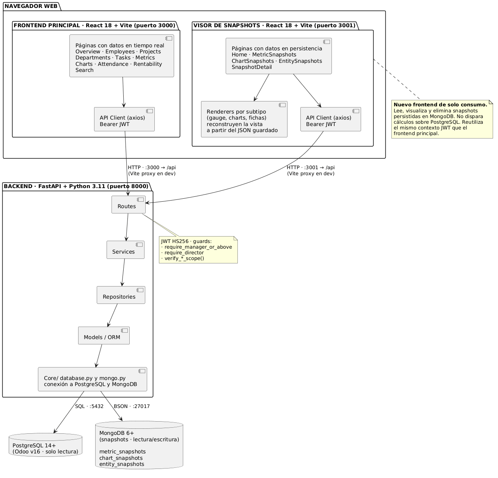

Este diagrama muestra la arquitectura física desplegada: el frontend principal y el visor se comunican con el mismo backend a través de HTTP; el backend accede a la base de datos del ERP en modo solo lectura y, adicionalmente, a la base documental para las colecciones de capturas en modo lectura/escritura. El backend se organiza en capas (rutas, servicios, repositorios y modelos) que siguen principios de separación de responsabilidades y una única razón para cambiar.

En desarrollo, cada frontend corre con su propio servidor Vite y un proxy inverso hacia `:8000/api`. En producción ambos se sirven como bundles estáticos detrás del mismo reverse proxy (Nginx / Caddy). El acceso a Odoo permanece en modo solo lectura mediante un usuario de base de datos con privilegios `SELECT` únicamente sobre las tablas relevantes; el acceso a MongoDB es de lectura/escritura restringido a las tres colecciones de snapshots.


### 5.2 Patrón arquitectónico

El sistema materializa una **arquitectura por capas** en el backend, complementada con dos aplicaciones independientes (frontend principal y visor de capturas) que consumen el mismo backend. Aunque la terminología MVC es utilizada como herramienta de análisis para clasificar las clases, la estructura de implementación va más allá del MVC clásico de tres niveles por razones de complejidad del dominio analítico.

| Concepto MVC | Materialización en la solución |
|---|---|
| **Modelo** | `models/` (ORM de Odoo) + `schemas/snapshot.py` (Pydantic sobre MongoDB) + `repositories/` (acceso a datos relacional y documental) |
| **Vista** | React SPA (principal y visor) + `schemas/` (contratos JSON) |
| **Controlador** | `routes/` (HTTP) + `services/` (lógica de negocio) |

La capa de servicios no existe en el MVC puro de tres capas. Se introduce porque los cálculos de métricas operativas requieren orquestar múltiples consultas y aplicar fórmulas complejas; concentrar esa lógica en los controladores produciría módulos de cientos de líneas con baja cohesión.

### 5.3 Stack tecnológico

| Capa | Tecnología | Justificación |
|---|---|---|
| Frontend principal | React 18 + Vite 5 (puerto 3000) | SPA reactiva; Recharts para gráficos, React Router para navegación |
| Visor de snapshots | React 18 + Vite 5 (puerto 3001) | SPA independiente de solo lectura; reutiliza el mismo `AuthContext` que el principal |
| Backend | FastAPI 0.109 + Python 3.11 | Framework asíncrono con validación automática (Pydantic) y documentación OpenAPI |
| ORM | SQLAlchemy 2.0 | Mapeo directo de tablas Odoo sin migraciones |
| Base operativa | PostgreSQL 14+ (Odoo v16) | BD existente del ERP; CTEs recursivas para jerarquía organizativa |
| Base de snapshots | MongoDB 6+ | Almacén documental para capturas históricas; `pymongo` como cliente. Tres colecciones con índices únicos sobre clave compuesta: `metric_snapshots`, `chart_snapshots`, `entity_snapshots` |
| Autenticación | JWT HS256 (python-jose) | Token stateless con scope embebido; passlib para hash Odoo |
| Comunicación | REST + JSON | Proxy Vite en desarrollo para ambos frontends; CORS configurado para producción |

### 5.4 Seguridad: JWT y RBAC

El control de acceso se resuelve en dos momentos:

1. **Login:** el servicio de autenticación calcula el rol del usuario (`director` / `responsable` / `empleado`) y su ámbito organizativo (`employee_ids`, `department_ids`, `project_ids`) consultando las jerarquías de Odoo. Este ámbito se embebe en el token JWT.

2. **Cada petición:** el middleware de autenticación decodifica el token, reconstruye el objeto `CurrentUser` y los guards (`require_manager_or_above`, `require_director`) bloquean el acceso según el rol. Los servicios aplican filtros de ámbito sobre las consultas usando los identificadores embebidos.

#### Dónde se verifica y aplica el scope

Hay tres capas distintas donde el scope del JWT actúa:

**Capa 1 — Guard de rol** (`core/auth.py`): `require_manager_or_above` / `require_director`. Bloquea por rol antes de que la petición llegue al servicio. Es lo primero que se ejecuta.

**Capa 2 — Verificación de acceso individual** (`utils/validation.py`): `verify_employee_scope`, `verify_project_scope`, `verify_department_scope`. Se llama desde la ruta o el servicio cuando el actor pide una entidad concreta por ID. Comprueba si ese ID está en la lista del JWT.

**Capa 3 — Filtrado de listados** (capa de servicio): Cuando el actor lista entidades sin especificar un ID, el servicio extrae `cu.employee_ids`, `cu.department_ids` o `cu.project_ids` del token y los pasa al repositorio como filtro.

**Este enfoque permite mantener un equilibrio entre seguridad y rendimiento, evitando recalcular el ámbito en cada petición y delegando la coherencia del mismo al momento de autenticación.**

**Justificación de la ausencia de filtrado por scope en los CU de snapshot (CU-18/19/20).** Las snapshots son lecturas inmutables de momentos pasados y no exponen información distinta a la que ya es visible en la capa operativa filtrada por scope. Además, las snapshots de rentabilidad (CU-13, CU-14) solo pueden ser generadas por el Director (Capa 1), por lo que un Responsable nunca podrá consultarlas en detalle salvo que hayan sido previamente creadas por un Director dentro de la misma organización. El sistema acepta esta exposición limitada como compromiso razonable frente a la complejidad de aplicar scope retroactivamente sobre documentos almacenados.


---

## 6. Diseño de Casos de Uso

Esta sección especifica el flujo detallado de los casos de uso más representativos, trazando la interacción a través de todas las capas hasta que se devuelve la respuesta final. En todos los casos se aplica el mismo patrón de control de acceso en tres capas: la ruta aplica el guard de rol (Capa 1), el servicio verifica el acceso a entidades concretas (Capa 2) y filtra los listados al ámbito del JWT (Capa 3), y el repositorio ejecuta la consulta sin conocer nada de roles ni permisos.

---

### 6.1 CU-02 — Listar empleados

El diseño de este caso de uso se documenta en el archivo [Diseño de CU-02](./utils/Diseño_CU02.md).

---

### 6.2 CU-03 — Ver resumen de empleado

El diseño de este caso de uso se documenta en el archivo [Diseño de CU-03](./utils/Diseño_CU03.md).

---

### 6.3 CU-04 — Listar departamentos

El diseño de este caso de uso se documenta en el archivo [Diseño de CU-04](./utils/Diseño_CU04.md).

---

### 6.4 CU-08 — Listar tareas

El diseño de este caso de uso se documenta en el archivo [Diseño de CU-08](./utils/Diseño_CU08.md).

---

### 6.5 CU-13 — Consultar rentabilidad financiera

El diseño de este caso de uso se documenta en el archivo [Diseño de CU-13](./utils/Diseño_CU13.md).

---

### 6.6 CU-17 — Guardar snapshot (upsert diario)

El diseño de este caso de uso se documenta en el archivo [Diseño de CU-17](./utils/Diseño_CU17.md).

---

### 6.7 CU-19 — Consultar detalle de snapshot

El diseño de este caso de uso se documenta en el archivo [Diseño de CU-19](./utils/Diseño_CU19.md).

---

### 6.8 CU-10 — Mostrar Catálogo de Métricas

El diseño de este caso de uso se documenta en el archivo [Diseño de CU-10](./utils/Diseño_CU10.md).

---

### 6.9 CU-22 — Consultar Productividad

El diseño de este caso de uso se documenta en el archivo [Diseño de CU-22](./utils/Diseño_CU22.md).

---

## 7. Diseño de Clases

Con 13 modelos ORM, 12 repositorios base, 13 repositorios de métricas, 13 servicios de métricas, 10 servicios de dominio, 10 routers, 17 páginas del frontend principal y 7 páginas del visor, intentar representar todas las dependencias en un único diagrama produce un resultado ilegible. La estrategia seguida aquí es **presentar la arquitectura en diagramas organizados de arriba a abajo**, siguiendo el flujo de dependencias desde la capa de presentación hasta los modelos de datos.

---

### 7.1 Frontend principal → Routes

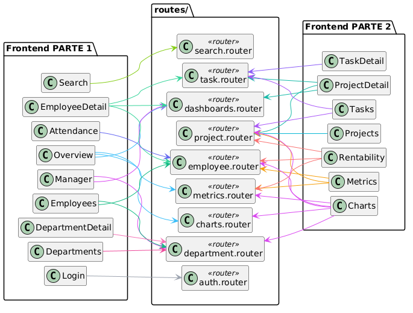

Las 17 páginas del frontend principal se reparten en dos paquetes (PARTE 1 y PARTE 2) a cada lado de los routers para evitar cruces de flechas. Cada página tiene un color propio para trazar visualmente sus dependencias.

Algunas páginas consumen múltiples routers: `Overview` combina `dashboards`, `charts` y `metrics`; `Charts` consume cinco routers; `EmployeeDetail` y `ProjectDetail` combinan su router principal con `dashboards` (KPIs) y `task` (pestañas de tareas). 

---

### 7.2 Visor de snapshots → Routes

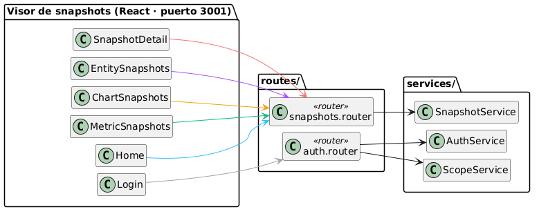

El visor (puerto 3001) tiene una estructura sencilla: todas sus páginas consumen exclusivamente `snapshots.router` para leer, listar y eliminar documentos de MongoDB. Solo Login utiliza `auth.router`. No se dispara ningún cálculo sobre PostgreSQL desde el visor.

---

### 7.3 Routes → Services

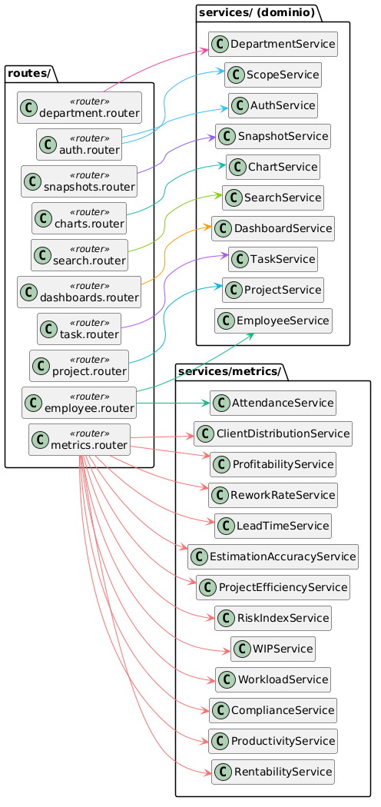

La mayoría de routers delegan en un único servicio de dominio. Dos excepciones: `employee.router` delega en `EmployeeService` y en `AttendanceService` (los endpoints de asistencia están bajo `/employees/attendance/*`); `metrics.router` delega en 12 servicios de métricas + `RentabilityService`, respetando OCP (añadir una métrica nueva = un endpoint, un servicio y un repositorio).

---

### 7.4 Servicios de dominio → Repositorios base

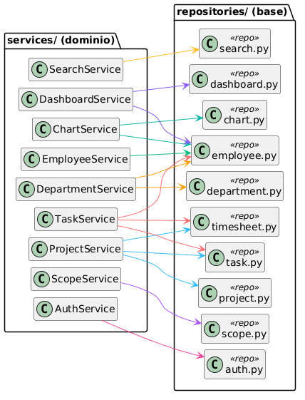

Aquí la correspondencia ya no es 1:1: un `ProjectService` depende de tres repositorios, y varios servicios comparten `employee.py` o `task.py`. Cada servicio recibe un color para trazar visualmente sus dependencias. `EmployeeService` accede además a `rentability.py` para devolver managers en el filtro de rentabilidad — única dependencia cruzada hacia un repositorio de métricas.

---

### 7.5 Servicios de métricas → Repositorios de métricas

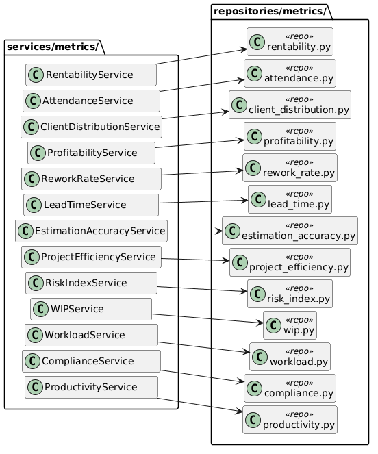

**Cada servicio consume exactamente un repositorio de métricas** (correspondencia 1:1). Algunos servicios tienen dependencias adicionales no dibujadas: `WIP`, `Workload`, `LeadTime`, `EstimationAccuracy`, `Attendance` y `Rework` importan funciones de `employee.py` para traducir `employee_id` → `user_id`; `ReworkRate` importa además `tracking.py`.

---

### 7.6 Repositorios base → Modelos

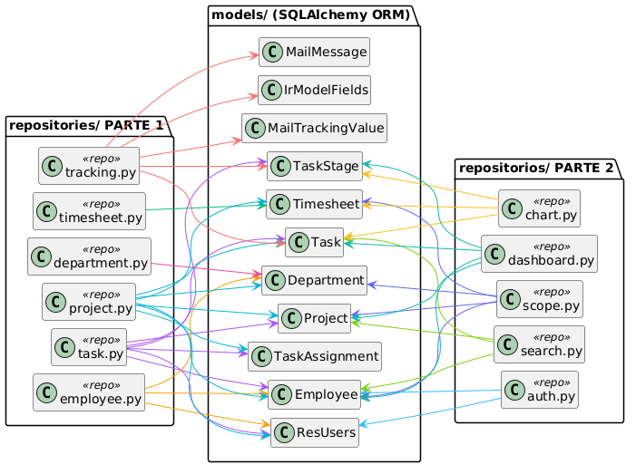

Los **12 repositorios base** son los proveedores de datos transversales. Cada uno recibe un color para distinguir de qué modelos depende. `task.py` y `timesheet.py` publican además subqueries reutilizables (`open/closed_stage_ids_subq`, `worked_hours_subq`) que consumen los repositorios de métricas, evitando duplicar la lógica de "etapas cerradas" y "horas imputadas". `snapshot.py` es el único repositorio que no accede a SQLAlchemy: opera sobre MongoDB.

---

### 7.7 Repositorios de métricas → Modelos

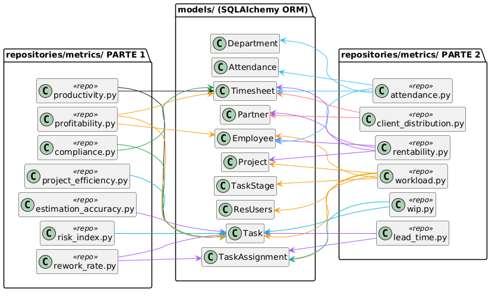

Los **13 repositorios especializados** de `app/repositories/metrics/` tienen una huella estrecha sobre el modelo ORM (el 80 % accede a 1–3 tablas directamente). `workload.py` y `rentability.py` son los más amplios por su naturaleza agregada. `attendance.py` es el único que accede a `hr_attendance`, aislando el módulo de fichajes. Ningún repositorio de métricas importa otro: la composición se deja a la capa de servicios.

---

### 7.8 Modelo de datos

Esta sección describe los datos que el sistema controla o accede: el **modelo relacional heredado** de Odoo (solo lectura) y el **modelo documental propio** para snapshots (MongoDB).

#### Modelo de datos del dominio operativo

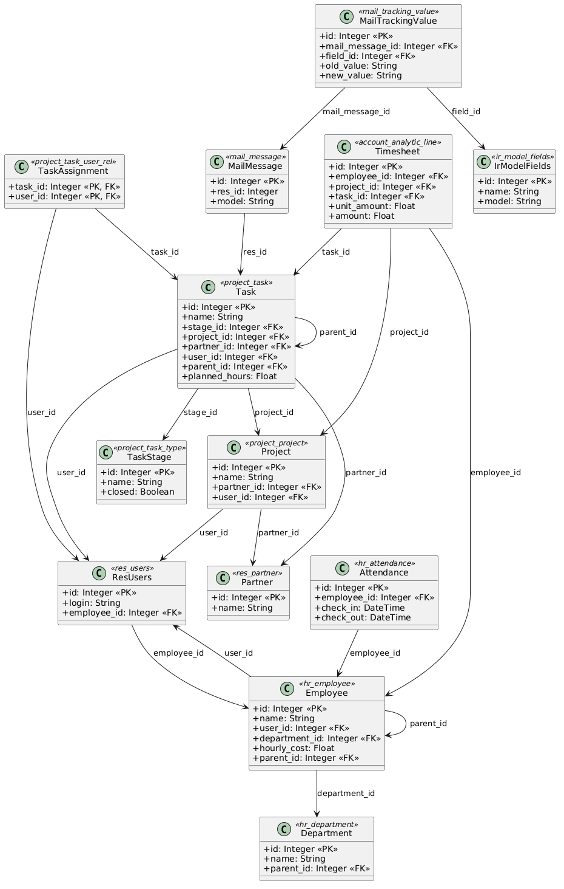

El acceso a Odoo se realiza con un usuario con privilegios `SELECT` exclusivamente. De las más de 1150 tablas del ERP, el sistema mapea **13 entidades ORM** mediante SQLAlchemy 2.0, siguiendo el criterio de mínima superficie de acceso.

#### Modelo de datos del subsistema de snapshots

El subsistema se implementa sobre MongoDB mediante **tres colecciones independientes** (`metric_snapshots`, `chart_snapshots`, `entity_snapshots`), diseñadas como documentos autocontenidos e inmutables.

##### Campos comunes a las tres colecciones

Todas las snapshots comparten la siguiente estructura base:

```json
{
  "_id": ObjectId,
  "snapshot_date": "2026-04-30",
  "data": { ... },
  "created_at": datetime,
  "updated_at": datetime,
  "created_by": { "user_id": 1, "employee_id": 42, "role": "director" },
  "updated_by": { "user_id": 1, "employee_id": 42, "role": "director" }
}
```

- **`snapshot_date`**: fecha del día en que se captura el estado.
- **`data`**: JSON completo con la vista calculada; constituye el contrato estable entre backend y visor.
- **`created_by` / `updated_by`**: subdocumento `SnapshotActor` embebido con `user_id`, `employee_id` y `role`, que permite auditoría sin joins al modelo relacional.

##### Campos específicos de métricas y gráficos

Las colecciones `metric_snapshots` y `chart_snapshots` añaden:

- **`metric_name`** / **`chart_name`**: identificador del tipo de snapshot (ej. `"productivity"`, `"task-distribution"`).
- **`params`**: diccionario con los parámetros utilizados en el cálculo (ej. `{ "employee_id": 42, "date_from": "2026-04-01" }`).
- **`params_hash`**: SHA-256 de los parámetros normalizados, que junto con el nombre y la fecha forman la clave compuesta única.

##### Campos específicos de entidades

La colección `entity_snapshots` no utiliza `params` ni `params_hash`. En su lugar:

- **`entity_type`**: tipo de entidad capturada (`"employee"`, `"project"`, `"department"`, `"task"`).
- **`entity_id`**: identificador numérico de la entidad en Odoo.

La clave compuesta es `(entity_type, entity_id, snapshot_date)`.

##### Claves compuestas e índices

Cada colección materializa la restricción de unicidad mediante un **índice único** en MongoDB:

| Colección | Clave compuesta |
|---|---|
| `metric_snapshots` | `(metric_name, params_hash, snapshot_date)` |
| `chart_snapshots` | `(chart_name, params_hash, snapshot_date)` |
| `entity_snapshots` | `(entity_type, entity_id, snapshot_date)` |

Esto garantiza **RNF-15 (una snapshot por tipo y día)** incluso en condiciones de concurrencia. El repositorio implementa un patrón *upsert controlado* y el índice actúa como última línea de consistencia.

##### Contrato con la capa de visualización

El visor (puerto 3001) no ejecuta lógica de cálculo: interpreta el campo `data` mediante renderers especializados (`MetricVisualizer`, `ChartVisualizer`, `EntityVisualizer`). Este desacoplamiento garantiza que una captura mantenga su representación original aunque los cálculos evolucionen.

---

### 7.9 Esquemas de validación

Los esquemas de validación se implementan mediante **Pydantic v2** en `app/schemas/`. Su función es doble: validación de entrada y estandarización de salida, desacoplando la capa HTTP de la lógica de negocio.

El sistema define tres categorías de esquemas:

**1. Esquemas de entidad** — representan entidades del ERP con `from_attributes=True` para conversión automática desde ORM:

```python
class EmployeeBase(BaseModel):
    id: int
    name: str
    department_name: Optional[str] = None
    model_config = {"from_attributes": True}
```

**2. Esquemas extendidos** — extienden la base para incluir información adicional según el contexto:

```python
class EmployeeDetail(EmployeeBase):
    department_id: Optional[int] = None
    job_title: Optional[str] = None
    hourly_cost: Optional[float] = None
    active: bool = True
```

**3. Esquemas de respuesta agregada** — para métricas y analytics donde los datos no corresponden a una entidad ORM:

```python
class ProductivityResponse(BaseModel):
    average_productivity: float
    total_tasks: int
    tasks: List[ProductivityTaskItem] = Field(default_factory=list)
```

La validación se complementa en dos niveles: **estructural** (Pydantic vía `response_model`) y **de dominio** (`utils.validation` con `verify_employee_exists`, `validate_date_range`, etc.).

---

## 8. Diseño de Paquetes

### 8.1 Estructura de paquetes

#### Backend
```
app/
├── core/
│   ├── config.py        → Configuración por entorno
│   ├── database.py      → Conexión a la base relacional del ERP (solo lectura)
│   ├── mongo.py         → Cliente de la base documental (lectura/escritura)
│   └── security.py      → Generación y validación de sesiones + guards de rol
├── models/              → Clases del dominio operativo (una por entidad del ERP)
├── schemas/             → Contratos de entrada/salida del backend
│   └── snapshot.py      → Esquemas de las capturas de métrica, gráfico y entidad
├── repositories/
│   ├── employee.py      → Acceso al dominio de empleados
│   ├── project.py       → Acceso al dominio de proyectos
│   ├── department.py    → Acceso al dominio de departamentos
│   ├── task.py          → Acceso al dominio de tareas
│   ├── tracking.py      → Acceso al dominio de partes de horas
│   ├── attendance.py    → Acceso al dominio de fichajes
│   ├── snapshot.py      → Acceso a las tres colecciones documentales
│   └── metrics/         → Sub-paquete: una función por métrica operativa
├── services/
│   ├── metric/          → Implementaciones por métrica (CU-22 a CU-32)
│   ├── dashboard.py     → Composición para los resúmenes de entidad
│   ├── chart.py         → Datos para los gráficos analíticos
│   ├── search.py        → Búsqueda global
│   ├── auth.py          → Autenticación y construcción del ámbito
│   └── snapshot.py      → Orquestación del subsistema de capturas
├── routes/
│   ├── auth.py
│   ├── resources/       → Endpoints de las entidades operativas
│   ├── metrics/         → Endpoints de las métricas operativas (CU-10, CU-22 a CU-32)
│   ├── charts/          → Endpoints de los gráficos analíticos
│   ├── dashboards/      → Endpoints de los resúmenes y de rentabilidad
│   └── snapshots.py     → Endpoints para guardar, listar, consultar y eliminar capturas
└── utils/               → Paginación, traducción de nombres multilingües y validaciones de ámbito
```

**`core/`** agrupa todo lo que es infraestructura transversal: configuración, generación y validación de sesiones, pool de conexiones a la base del ERP y cliente a la base documental, y guards de rol. Cambia solo cuando cambia la infraestructura, no el negocio. La adición del módulo de conexión documental respeta este criterio: aísla el cliente en un único punto, independiente del acceso a la base relacional.

**`models/`** contiene exclusivamente el mapeo sobre el dominio operativo del ERP. Ningún modelo ejecuta lógica; solo declara columnas y relaciones. No se añaden modelos para el subsistema de capturas porque la base documental no requiere tal mapeo: la serialización se delega a la capa de esquemas.

**`repositories/`** encapsula cada consulta como una función pura que recibe una sesión y devuelve datos crudos. El sub-paquete `repositories/metrics/` extiende esta idea con un submódulo por métrica (uno por cada CU del paquete P10), evitando que un único fichero acumule consultas heterogéneas. El repositorio de capturas es el único que no opera sobre la base relacional: ejecuta directamente operaciones de inserción, lectura, actualización, listado paginado y borrado sobre las tres colecciones documentales a través del cliente de infraestructura.

**`services/`** aplica las reglas de negocio sobre los datos recuperados por los repositorios. El sub-paquete `services/metrics/` sigue la misma granularidad que `repositories/metrics/`: una clase, una métrica, una razón de cambio. El servicio de capturas añade responsabilidades propias del subsistema: normalizar parámetros, calcular el resumen único que identifica a la captura, construir el autor a partir de la sesión del usuario, fijar la fecha y decidir entre insertar o actualizar (semántica de actualización diaria) según la existencia previa.

**`routes/`** actúa como capa de entrada HTTP. Las rutas no contienen lógica de negocio: validan parámetros, comprueban la autenticación y delegan en el servicio correspondiente. El sub-paquete `routes/metrics/` expone un endpoint por cada métrica operativa (CU-22 a CU-32) más el endpoint del catálogo (CU-10), siguiendo el principio OCP: añadir una nueva métrica implica añadir un único fichero nuevo sin modificar los existentes.

**`utils/`** recoge funciones reutilizables que no pertenecen a ningún dominio: paginación, extracción de nombres multilingües, ordenación de diccionarios y validaciones de rango de fechas.

#### Frontend
**Frontend principal (actúa sobre la base de datos de Odoo):**
```
src/
├── api/            → Un módulo por dominio (empleados, tareas, métricas, gráficos,
│                     rentabilidad, capturas, búsqueda, autenticación)
├── components/     → Componentes reutilizables (Card, Table, KpiCard, Sidebar,
│                     SaveSnapshotButton…)
├── context/        → Estado global de autenticación
├── hooks/          → Lógica reutilizable (useApi, useDebounce)
├── pages/          → Una página por recurso o funcionalidad
├── styles/         → Variables CSS globales y tokens de diseño
└── utils/          → Formateadores y helpers
```
Todas las páginas calculadas (detalle de métrica, gráficos, rentabilidad y las fichas de entidad) integran el botón de guardado de captura (`SaveSnapshotButton`), que llama al módulo de API correspondiente para disparar CU-17 desde el contexto actual de la vista.

**Frontend del visor (actúa sobre la base de datos de capturas en MongoDB):**
```
src/
├── api/
│   ├── auth.js             → Mismo contrato que el frontend principal
│   └── snapshots.js        → Lectura y borrado de las tres colecciones
├── components/             → Tabla paginada, filtros, DateBadgePicker, JsonViewer
├── context/                → Contexto de autenticación reutilizado
├── pages/
│   ├── Login.jsx
│   ├── Home.jsx            → Resumen global más últimas capturas guardadas
│   ├── MetricSnapshots.jsx → Listado de capturas de métricas (CU-18)
│   ├── ChartSnapshots.jsx  → Listado de capturas de gráficos (CU-18)
│   ├── EntitySnapshots.jsx → Listado de capturas de entidades (CU-18)
│   └── SnapshotDetail.jsx  → Detalle reconstruido y eliminación (CU-19, CU-20)
│       ├── MetricVisualizer  → Gauge, gráfico e indicadores según la métrica
│       ├── ChartVisualizer   → Gráfico interactivo según el tipo
│       └── EntityVisualizer  → Ficha con avatar, campos y barra de progreso
└── vite.config.js          → Puerto 3001, proxy al backend
```
El visor no duplica los componentes de cálculo del frontend principal: sus renderizadores operan exclusivamente sobre los datos guardados en la base documental, sin llamar a ningún endpoint de cálculo sobre el ERP. Este desacoplamiento entre cálculo y visualización garantiza que una captura mantenga su representación original aunque los cálculos del frontend principal evolucionen en el futuro.

### 8.2 Principios aplicados en la organización de paquetes

**Jerarquización por capas (Principio de jerarquización)**

Las dependencias entre paquetes son exclusivamente descendentes. Ningún import apunta hacia arriba. Las rutas no importan modelos ORM ni repositorios directamente. El subsistema de snapshots respeta el mismo criterio: `snapshots.router` importa `SnapshotService`, que a su vez importa `SnapshotRepository`, que a su vez importa el cliente de `core/mongo.py`.

**SRP — Una responsabilidad por módulo**

Cada fichero de `repositories/metrics/` tiene una única razón para cambiar: la estructura de la tabla Odoo relevante para esa métrica. Cada fichero de `services/metrics/` tiene también una única razón: la fórmula de cálculo de esa métrica, correspondiente al caso de uso del paquete P10 que implementa. `SnapshotService` tiene una única razón para cambiar: las reglas de persistencia (normalización, hash, upsert). El añadir una nueva métrica implica crear exactamente dos ficheros nuevos y un endpoint, sin tocar ningún módulo existente; añadir un nuevo subtipo de snapshot implica una nueva colección, un nuevo schema Pydantic y un nuevo renderer en el visor.

**OCP — Abierto para extensión**

El registro `_ITEM_BUILDERS` de `TaskService` permite añadir un nuevo tipo de ítem (por ejemplo, `"subtask"`) sin modificar el método `_build_items`: basta con añadir una entrada al diccionario y un método `_to_subtask()`. El bucle de construcción no contiene ningún `if/elif`. De forma análoga, el visor selecciona el renderer de CU-19 por clave de subtipo, sin ramificar en `if/elif`: añadir un nuevo renderer no requiere modificar el código existente.

**ISP — Interfaces pequeñas y específicas**

Cada servicio de métricas importa únicamente las funciones del submódulo concreto que necesita (`from app.repositories.metrics.wip import count_open_assigned_tasks`), no el paquete completo. En los frontends, cada página importa solo su módulo de API (`employees.js`, `metrics.js`, `snapshots.js`, etc.).

**DIP — Inversión de dependencias**

Los servicios (módulos de alto nivel) no dependen de los modelos ORM ni del cliente MongoDB directamente (módulos de bajo nivel). Acceden a los datos exclusivamente a través de las funciones de repositorio, que actúan como abstracción. Cero imports `from app.models` en `routes/` o `services/`; cero imports de `pymongo` fuera de `core/mongo.py` y `repositories/snapshot.py`.

**DRY — No te repitas**

Las subqueries `open_stage_ids_subq()`, `closed_stage_ids_subq()` y `worked_hours_subq()` están definidas una sola vez en `task.py` y `timesheet.py` respectivamente. Todos los repositorios de métricas las importan y reutilizan. Las constantes de dominio (umbrales, etiquetas, ventanas temporales) están centralizadas en `core/constants.py`. La normalización de parámetros y el cálculo de `params_hash` están definidos una única vez en `SnapshotService`, y son reutilizados por los tres métodos `save_metric`, `save_chart` y `save_entity`.

**Cohesión funcional**

Cada repositorio agrupa únicamente consultas de un mismo dominio de datos. No existe ningún módulo con funciones heterogéneas: `task.py` solo consulta tareas, `employee.py` solo consulta empleados, `rentability.py` solo consulta datos financieros, `snapshot.py` solo opera sobre MongoDB.

**Bajo acoplamiento**

Los dos únicos casos de dependencia cruzada entre repositorios del mismo nivel (`repositories/metrics/` → `repositories/task.py` y `repositories/timesheet.py`) son de **acoplamiento por datos**: se comparten subqueries puras sin estado ni efectos secundarios. Este es el nivel más bajo de la escala de acoplamiento. `snapshot.py` no tiene ninguna dependencia cruzada con otros repositorios: su aislamiento es total.

### 8.3 Métricas de calidad

| Principio | Indicador | Valor | Estado |
|---|---|---|---|
| Jerarquización | Imports ascendentes (violaciones de capa) | 0 | ✅ |
| SRP | Módulos de repositorio con más de un dominio | 0 | ✅ |
| OCP | Bifurcaciones if/elif en `_build_items` | 0 | ✅ |
| DIP | Imports directos de Models en Routes | 0 | ✅ |
| DIP | Imports de `pymongo` fuera de `core/mongo.py` y `repositories/snapshot.py` | 0 | ✅ |
| ISP | Servicios que importan el módulo de repo completo | 0 | ✅ |
| DRY | Subqueries duplicadas entre repositorios | 0 | ✅ |
| Cohesión funcional | Repos con funciones de múltiples dominios | 0 | ✅ |
| Bajo acoplamiento | Dependencias cruzadas entre repos (acoplamiento por datos) | 2 justificadas | ✅ |

---
## 9. Prototipos de Interfaz
 
Los prototipos presentados en esta sección fueron elaborados en la **Disciplina de Requisitos (Capítulo 2)** como parte del modelado de casos de uso. Se incluyen aquí como referencia visual para el diseño de la interfaz, dado que la implementación real del frontend se ajusta fielmente a ellos.
 
---
 
### Pantalla de inicio — `/`
 
Panel de bienvenida que actúa como punto de entrada al sistema tras completar CU-01. Muestra un resumen ejecutivo con alertas activas, indicadores globales y accesos rápidos a las secciones principales.
 
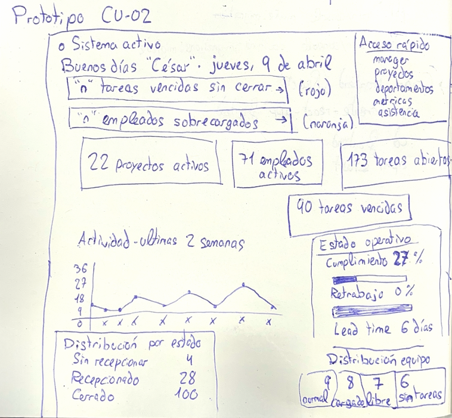
 
---
 
### Pantalla de manager — `/manager`
 
Panel de supervisión global para responsables que presenta cinco tarjetas numéricas clicables (total, sobrecargado, normal, subcargado, sin tareas), gráfico de barras de distribución por estado, panel de empleados más cargados y — al hacer clic en una tarjeta — listado paginado de empleados filtrados con su porcentaje de carga y horas pendientes.
 

 
---
 
### Prototipo CU-01 – Autenticarse
 
Formulario de inicio de sesión con campos de usuario y contraseña, indicación de acceso restringido y mensajes de error contextuales.
 
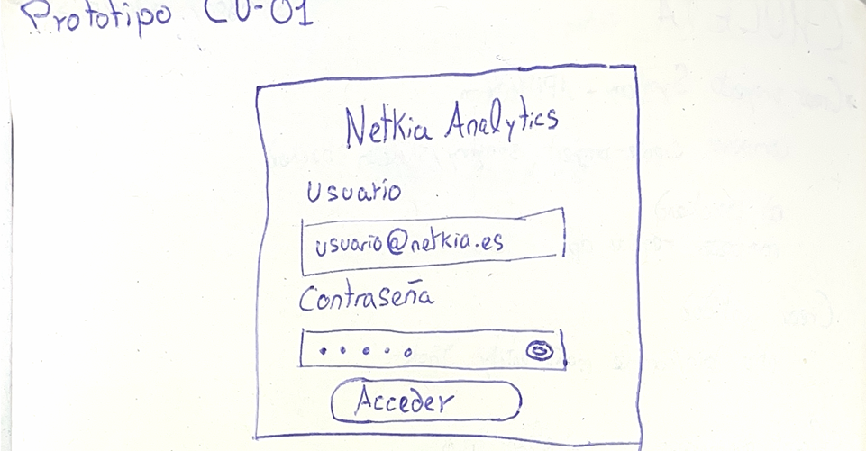
 
---
 
### Prototipo CU-02 – Listar Empleados
 
Tabla paginada con barra de búsqueda por nombre, selector de departamento y opción de mostrar solo activos. Cada fila es navegable al resumen del empleado.
 
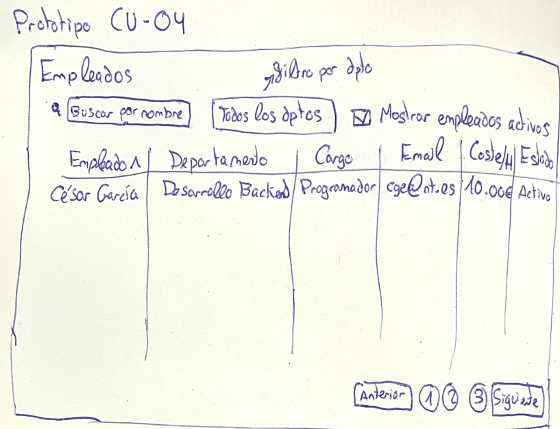
 
**Decisiones de diseño implementadas:**
- El selector de departamento activa la verificación de scope en `EmployeeService` (Capa 2).
- Las cabeceras de columna son clicables para cambiar el criterio de ordenación server-side.

---
 
### Prototipo CU-03 – Resumen de Empleado

 
Panel individual con cabecera de perfil, cuatro KPI cards (carga, vencidas, WIP, productividad), tarjetas de tareas asignadas hoy y vencidas sin cerrar, y tabla de tareas paginada con pestañas.
 
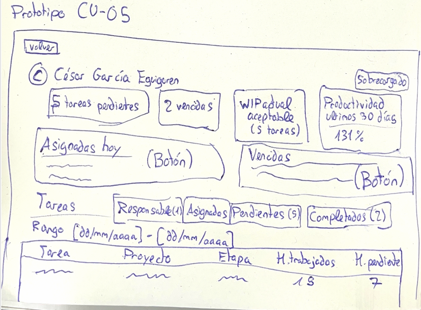
 
**Decisiones de diseño implementadas:**
- Las pestañas de tareas cargan bajo demanda invocando `GET /tasks/filter`.
- Las tarjetas de alerta son clicables y navegan a la vista de tareas con filtros preseleccionados.

---
 
### Prototipo CU-04 – Listar Departamentos
 
Cuadrícula de tarjetas con el nombre del departamento y el responsable asignado. Cada tarjeta navega al resumen del departamento.
 
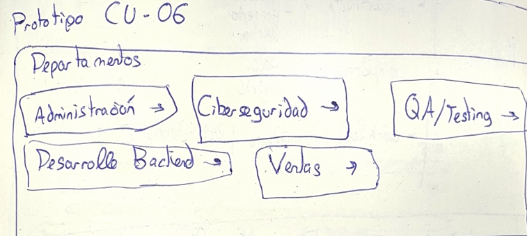
 
---
 
### Prototipo CU-05 – Resumen de Departamento
 
Panel de departamento con indicadores de distribución de carga, alerta para empleados sobrecargados y dos pestañas de visualización (carga de trabajo y empleados).
 
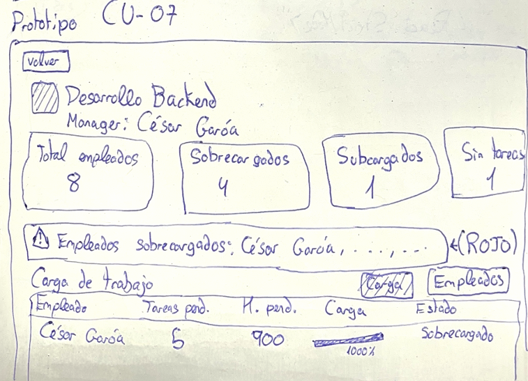
 
---
 
### Prototipo CU-06 – Listar Proyectos
 
Cuadrícula de tarjetas con nombre del proyecto, cliente asociado y código. Cada tarjeta navega al resumen del proyecto.
 
---
 
### Prototipo CU-07 – Resumen de Proyecto
 
Panel de proyecto con indicadores de eficiencia, riesgo y rentabilidad, gráfico comparativo de horas estimadas vs. reales y pestañas de tareas y equipo.
 
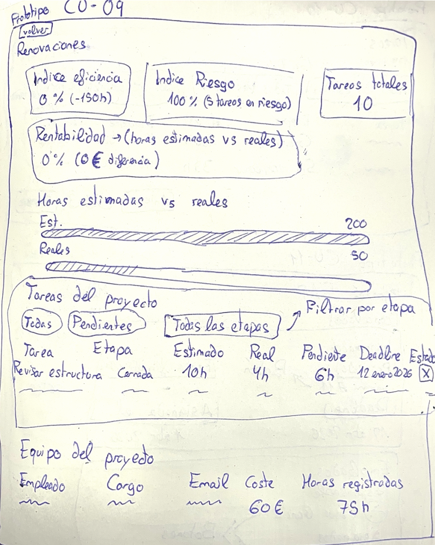
 
---
 
### Prototipo CU-08 – Listar Tareas
 
Tabla paginada con barra de filtros combinables: estado, etapa exacta (mutuamente excluyente con estado), proyecto, rango de fechas de deadline y opción de mostrar solo tareas padre.
 
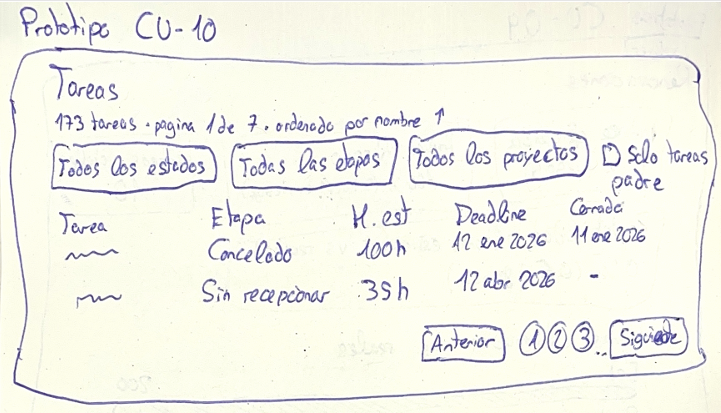
 
**Decisiones de diseño implementadas:**
- El selector de etapa tiene prioridad sobre el de estado cuando ambos están activos.
- Las cabeceras de columna son clicables para cambiar el criterio de ordenación server-side.
---
 
### Prototipo CU-09 – Detalle de Tarea
 
Ficha de tarea con secciones de información general, personas asignadas, horas con barra de progreso y lista de subtareas.
 
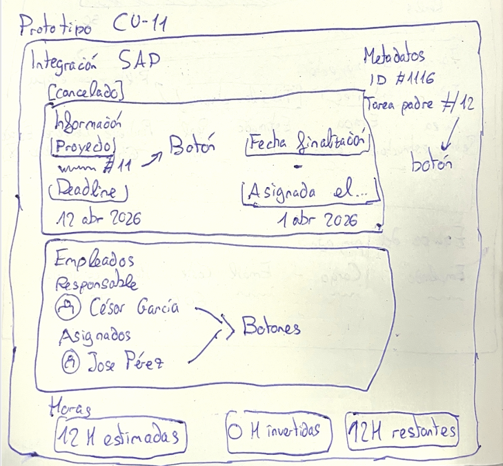
 
---
 
### Prototipo CU-10 – Mostrar Catálogo de Métricas
 
Página de métricas con cuadrícula de tarjetas agrupadas por categoría. Al seleccionar una tarjeta, el sistema invoca el caso de uso correspondiente del paquete P10 (CU-22 a CU-32) y muestra el panel de detalle con parámetros, gráficos y KPIs específicos de esa métrica. Panel de filtros expandible en la parte superior del detalle.
 
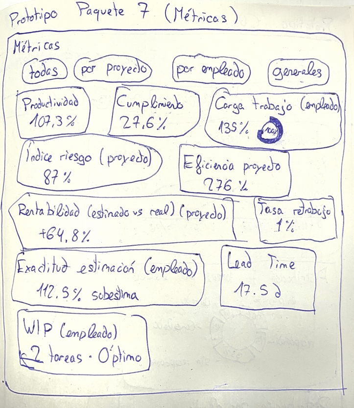
 
**Decisiones de diseño implementadas:**
- Las métricas que requieren parámetros (empleado, proyecto) muestran un estado vacío hasta que se rellenan.
- El panel de detalle es sticky para no perder de vista los KPIs al hacer scroll en la cuadrícula.
- Todas las vistas de detalle de métrica incluyen el botón "Guardar snapshot" que dispara CU-17.

---
 
### Prototipo CU-11 – Gráficos Analíticos
 
Página de gráficos con barra de filtros y cuadrícula de visualizaciones: evolución temporal de tareas, distribución por estado y horas por cliente.
 
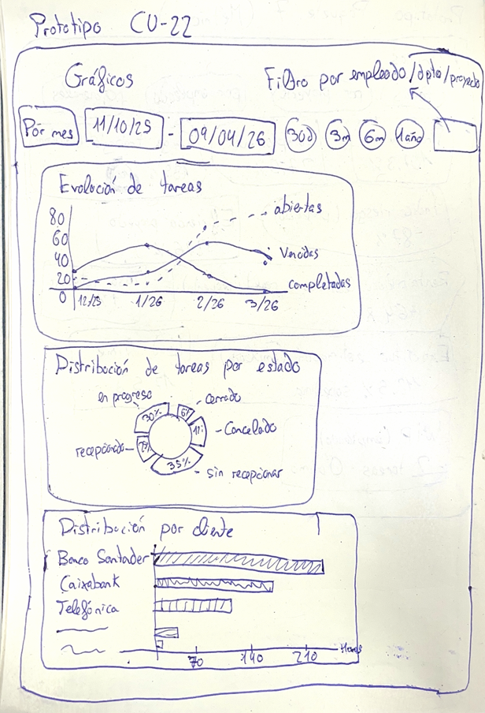
 
---
 
### Prototipo CU-12 – Asistencia vs Imputaciones
 
Página de asistencia con selector de modo de vista (equipo global / por responsable), filtros de fecha y departamento, indicadores globales de cobertura, gráfico comparativo y tabla de empleados con semáforo de cobertura.
 
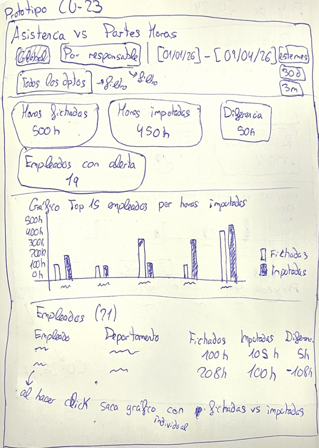
 
---
 
### Prototipo CU-13 – Rentabilidad Financiera
 
Página exclusiva del Director con filtros de fecha y modo de análisis (global / por proyecto / por responsable), KPIs financieros, gráfico comparativo de ingresos vs. gastos y pestañas de desglose por proyecto y por cliente.
 
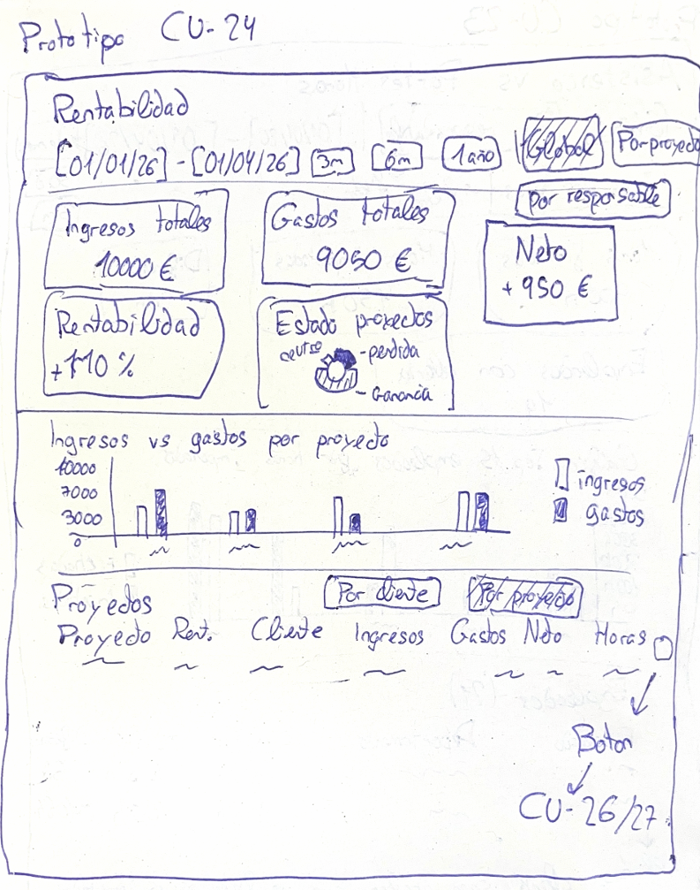
 
**Decisiones de diseño implementadas:**
- El acceso devuelve una pantalla de acceso restringido para cualquier rol distinto de Director (HTTP 403 en backend + redirección en frontend).
- El drill-down de líneas analíticas se activa bajo demanda, sin cargar los datos hasta que el usuario lo solicita explícitamente.

---
 
### Prototipo CU-14 – Líneas Analíticas
 
Panel de desglose accesible desde CU-13 con dos tablas paralelas de ingresos y gastos individuales, parametrizado por ámbito (proyecto o cliente). La misma vista sirve para ambos casos de drill-down.
 
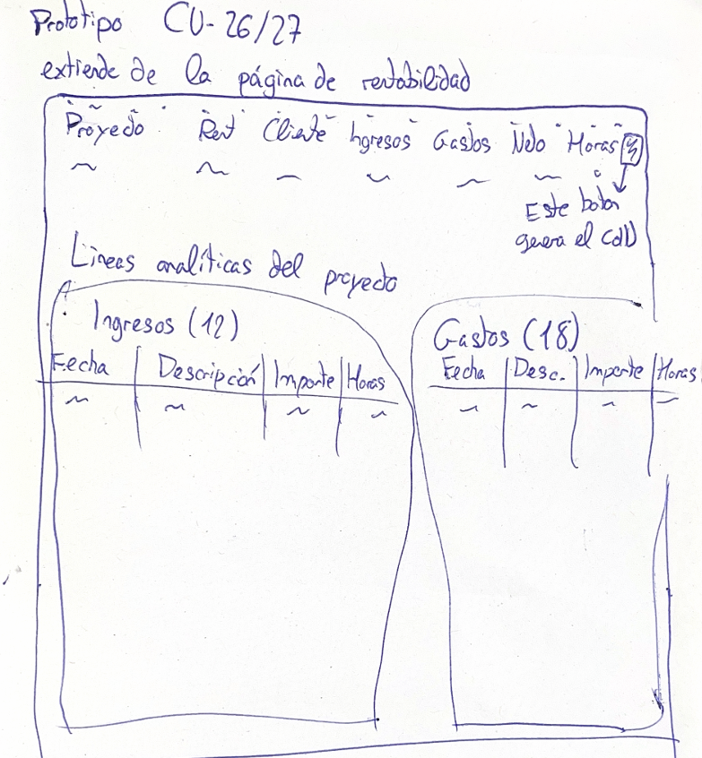
 
---
 
### Prototipo CU-15 – Búsqueda Global
 
Página de búsqueda con campo prominente, botones de filtro por tipo de entidad (tareas, proyectos, empleados) y resultados en forma de tarjetas navegables.
 
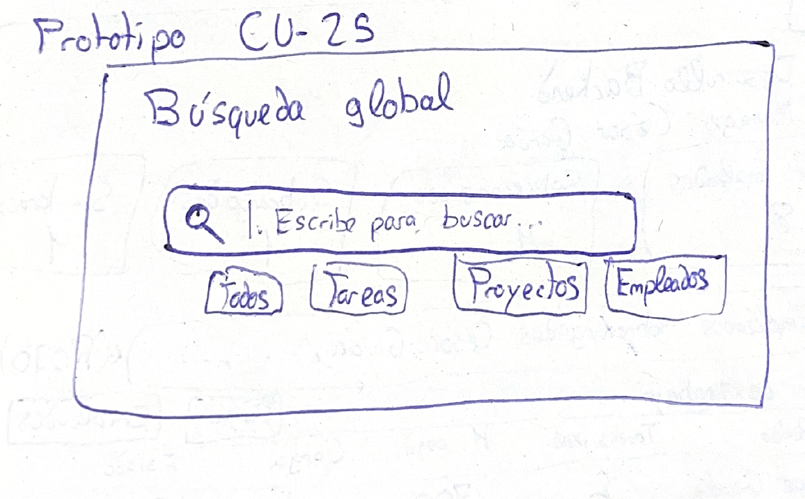

---

### Prototipo CU-18 – Listado de Snapshots por Colección

Vista en forma de tabla paginada que permite explorar todos los snapshots almacenados filtrados por tipo de colección (métricas, gráficos o entidades).

Incluye filtros combinables por:

- Tipo de snapshot
- Rango de fechas
- Usuario que lo generó

Cada fila permite acceder al detalle del snapshot o eliminarlo (según permisos).

**Decisiones de diseño implementadas:**
- Paginación server-side para evitar sobrecarga de datos.
- Filtros persistentes en la URL para navegación compartida.
- Ordenación por fecha de creación descendente por defecto.

#### Vista – Entidades

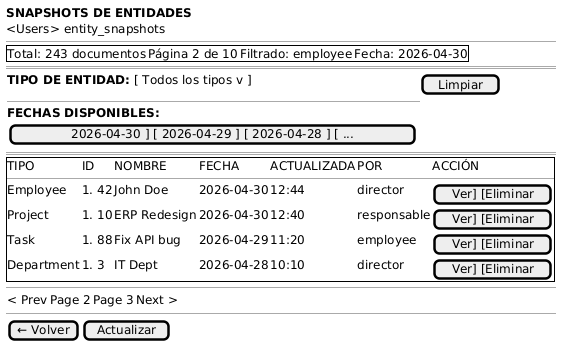


#### Vista – Métricas

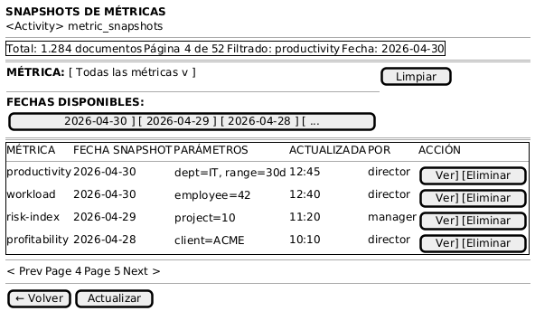


#### Vista – Gráficos

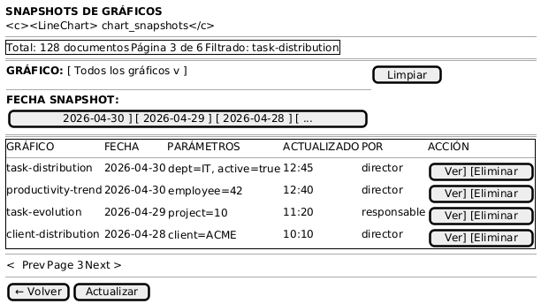


### Prototipo CU-19 – Detalle de Snapshot

Vista de detalle que reconstruye la visualización original de un snapshot específico a partir de los datos almacenados en MongoDB. Permite consultar la información exacta guardada en el momento de la captura, independientemente de cambios posteriores en los cálculos o visualizaciones del frontend principal.

El detalle se renderiza mediante componentes especializados según el tipo de snapshot:
- `MetricVisualizer` → KPIs, gauges, series temporales
- `ChartVisualizer` → gráficos interactivos
- `EntityVisualizer` → fichas de entidad con atributos estructurados

Ejemplo de detalle de snapshot de tarea:
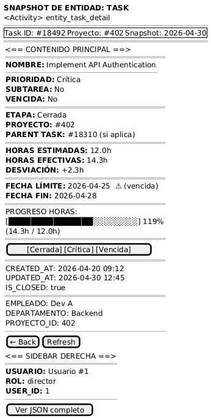

### Prototipos CU-16, 17 y 20 – Cerrar Sesión, Guardar, Eliminar Snapshot

**CU-16 – Cerrar sesión:** botón de logout accesible desde cualquier vista, que invalida la sesión en el backend y redirige a la pantalla de inicio de sesión.

**CU-17 – Guardar snapshot:** botón presente en todas las vistas calculadas del frontend principal, que dispara la creación o actualización de una snapshot en MongoDB con el estado actual de la vista.

**CU-20 – Eliminar snapshot:** botón de eliminación presente en el detalle de cada snapshot (CU-19), que permite eliminar la snapshot actual si el usuario tiene permisos (solo el autor o el Director pueden eliminar).