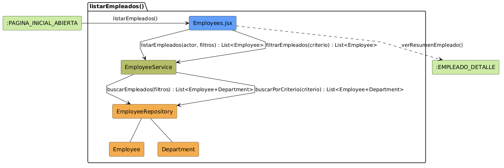

# Análisis de CU-02 — Listar empleados

## Diagrama de colaboración

## Clases de análisis identificadas

### Vista (Boundary) — `Employees.jsx`

Responsabilidades:

- Recibir la solicitud de apertura del listado de empleados desde el actor.
- Capturar los criterios de filtrado del actor: nombre, departamento, estado activo, criterio de ordenación y página.
- Solicitar al Control la lista paginada de empleados aplicando los criterios indicados.
- Presentar al actor el listado resultante con los datos de cada empleado: nombre, departamento, cargo, email, coste por hora y estado.
- Gestionar la navegación hacia el detalle de un empleado concreto.

Colaboraciones:

- **Entrada:** recibe la solicitud del actor (Director o Responsable) autenticado.
- **Control:** solicita `listarEmpleados(actor, filtros)` a `EmployeeService`.
- **Salida:** presenta la lista paginada al actor y navega a :EMPLEADO_DETALLE mediante el CU-03 `verResumenEmpleado()`.

---

### Control — `EmployeeService`

Responsabilidades:

- Determinar el ámbito de la consulta según el rol del actor: si es Responsable, restringir la consulta al conjunto de empleados bajo su gestión; si es Director, no aplicar restricción alguna.
- Verificar que el departamento indicado como filtro existe y pertenece al ámbito del actor.
- Obtener del repositorio la lista de empleados filtrada y ordenada.
- Aplicar paginación sobre el resultado y devolverlo a la Vista.

Colaboraciones:

- **Vista:** responde a `listarEmpleados(actor, filtros)`.
- **Entidad:** delega en `EmployeeRepository.buscarEmpleados(filtros)`.

---

### Entidad — `EmployeeRepository`

Estereotipo: Entidad

Responsabilidades:

- Construir y ejecutar la consulta de empleados aplicando todos los filtros y el criterio de ordenación indicados por el Control.
- Incorporar el nombre de departamento de cada empleado sin necesidad de una segunda consulta independiente.
- Devolver el resultado al Control para su paginación.

Colaboraciones:

- **Control:** responde a `EmployeeService`.
- **Entidad:** gestiona instancias de `Employee` y `Department`.

### Entidad — `Employee`

Estereotipo: Entidad

Responsabilidades:

- Representar la información de un empleado individual tal como existe en el sistema ERP.
- Encapsular nombre, cargo, email, teléfono, coste por hora, estado activo y departamento de pertenencia.

Colaboraciones:

- **Repositorio:** es gestionado por `EmployeeRepository`.

### Entidad — `Department`

Estereotipo: Entidad

Responsabilidades:

- Proporcionar el nombre del departamento al que pertenece cada empleado como dato complementario de la consulta principal.

Colaboraciones:

- **Repositorio:** es gestionado por `EmployeeRepository` como dato complementario de `Employee`.

---

## Flujo de colaboración principal

**Secuencia: listar empleados**

1. **Inicio:** el actor autenticado abre la sección de empleados → `Employees.jsx` recibe la solicitud.
2. **Solicitud inicial:** `Employees.jsx` → `EmployeeService.listarEmpleados(actor, filtros)`.
3. **Resolución de ámbito:** `EmployeeService` determina el conjunto de empleados accesible según el rol del actor.
4. **Verificación de filtro:** si el actor ha indicado un departamento, `EmployeeService` verifica su existencia y accesibilidad.
5. **Consulta:** `EmployeeService` → `EmployeeRepository.buscarEmpleados(filtrosEfectivos)`.
6. **Enriquecimiento:** `EmployeeRepository` incorpora el nombre de `Department` sin consulta adicional y devuelve la lista.
7. **Paginación:** `EmployeeService` aplica la paginación y devuelve el resultado a `Employees.jsx`.
8. **Presentación:** `Employees.jsx` muestra el listado al actor.
9. **Navegación:** si el actor selecciona un empleado, `Employees.jsx` navega a `verResumenEmpleado()`.

---

## Correspondencia con requisitos

| Requisito del caso de uso | Clase responsable | Colaboración |
|---|---|---|
| Presentar lista paginada de empleados | `Employees.jsx` | Solicita `listarEmpleados` a `EmployeeService` |
| Filtrar por nombre, departamento, estado | `Employees.jsx` | Captura criterios y los traslada al Control |
| Restricción de ámbito por rol del actor | `EmployeeService` | Aplica restricción según si el actor es Responsable o Director |
| Verificar que el departamento filtrado es accesible | `EmployeeService` | Verifica existencia y ámbito antes de delegar en el repositorio |
| Ordenación por columna | `EmployeeRepository` | Aplica el criterio de ordenación en la consulta |
| Encapsular datos del empleado | `Employee` | Representa la información del empleado en el dominio |
| Nombre de departamento sin consulta adicional | `Department` | Incorporado por `EmployeeRepository` como dato complementario |