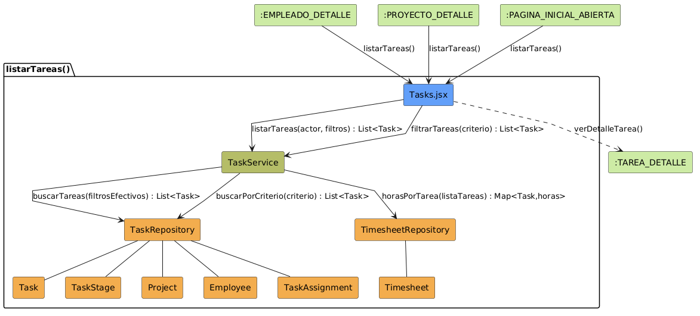

# Análisis de CU-08 — Listar tareas

## Diagrama de colaboración

## Clases de análisis identificadas

### Vista (Boundary) — `Tasks.jsx`

Responsabilidades:

- Recibir la solicitud de listado de tareas, tanto por iniciativa directa del actor como por navegación desde otra vista con filtros preestablecidos.
- Capturar los criterios de filtrado del actor: estado de la tarea, etapa concreta, proyecto, departamento, empleado, rango de fechas, inclusión de subtareas y texto de búsqueda.
- Gestionar la prioridad entre el filtro de etapa concreta y el filtro de estado genérico: cuando el actor selecciona una etapa específica, el selector de estado queda desactivado.
- Solicitar al Control la lista paginada de tareas con los criterios indicados y la ordenación seleccionada.
- Presentar al actor el listado resultante, adaptando las columnas visibles al modo de filtrado activo.
- Gestionar la navegación hacia el detalle de una tarea concreta.

Colaboraciones:

- **Entrada:** recibe la solicitud del actor, o navegación directa desde el detalle de empleado, el detalle de proyecto con filtros predefinidos o la vista inicial.
- **Control:** solicita `listarTareas(actor, filtros)` a `TaskService`.
- **Salida:** presenta la lista paginada al actor y navega a :TAREA_DETALLE mediante el CU-09 `verDetalleTarea()`.

---

### Control — `TaskService`

Responsabilidades:

- Resolver el ámbito efectivo de proyectos según el rol del actor: si es Responsable y no filtra por empleado, restringir automáticamente a los proyectos de su ámbito; si es Director, usar el proyecto indicado directamente.
- Verificar que el proyecto indicado como filtro pertenece al ámbito del actor.
- Verificar la existencia del empleado y del departamento indicados como filtros, y que el empleado pertenece al ámbito del actor.
- Delegar en el repositorio de tareas la construcción y ejecución de la consulta compuesta.
- Obtener las horas trabajadas de todas las tareas de la página resultante en una única consulta al repositorio de horas.
- Seleccionar el tipo de resultado adecuado según la combinación de filtros activos: tarea pendiente, tarea completada, tarea asignada o tarea genérica.

Colaboraciones:

- **Vista:** responde a `listarTareas(actor, filtros)`.
- **Entidad:** delega en `TaskRepository.buscarTareas(filtros)` y en `TimesheetRepository.horasPorTarea(tareas)`.

---

### Entidad — `TaskRepository`

Estereotipo: Entidad

Responsabilidades:

- Construir la consulta de tareas de forma incremental incorporando todos los filtros especificados por el Control: estado, etapa, proyecto, empleado asignado, departamento, rango de fechas y exclusión de subtareas.
- Aplicar el criterio de ordenación indicado sobre el resultado.
- Devolver el resultado paginado al Control.

Colaboraciones:

- **Control:** responde a `TaskService`.
- **Entidad:** gestiona instancias de `Task`, `TaskStage`, `Project`, `Employee` y `TaskAssignment`.

### Entidad — `TimesheetRepository`

Estereotipo: Entidad

Responsabilidades:

- Obtener el total de horas trabajadas para un conjunto de tareas en una única consulta, agrupando por tarea.
- Devolver un mapa de identificador de tarea a horas trabajadas para que el Control pueda enriquecer cada resultado sin consultas adicionales.

Colaboraciones:

- **Control:** responde a `TaskService`.
- **Entidad:** gestiona instancias de `Timesheet`.

### Entidades modelo — `Task`, `TaskStage`, `Project`, `Employee`, `TaskAssignment`, `Timesheet`

Estereotipo: Entidad

Responsabilidades:

- `Task`: representa una tarea con horas planificadas, fecha límite, fecha de cierre y estado de apertura o cierre.
- `TaskStage`: clasifica las tareas como abiertas o cerradas y proporciona el nombre de etapa visible al actor.
- `Project`: proporciona el nombre del proyecto al que pertenece cada tarea.
- `Employee`: permite filtrar tareas por el empleado que las tiene asignadas.
- `TaskAssignment`: representa la relación de asignación entre una tarea y un usuario, necesaria para filtrar por empleado.
- `Timesheet`: registra las horas imputadas por un empleado a una tarea; es la fuente de las horas trabajadas reales.

Colaboraciones:

- **Repositorios:** `Task`, `TaskStage`, `Project`, `Employee` y `TaskAssignment` son gestionados por `TaskRepository`; `Timesheet` es gestionado por `TimesheetRepository`.

---

## Flujo de colaboración principal

**Secuencia: listar tareas**

1. **Inicio:** el actor abre el listado de tareas directamente o llega desde el detalle de un empleado o proyecto con filtros predefinidos → `Tasks.jsx` recibe la solicitud.
2. **Solicitud:** `Tasks.jsx` → `TaskService.listarTareas(actor, filtros)`.
3. **Resolución de ámbito:** `TaskService` determina los proyectos accesibles según el rol del actor y los filtros indicados.
4. **Verificación de filtros:** `TaskService` verifica la existencia y accesibilidad del empleado, departamento y proyecto indicados.
5. **Consulta de tareas:** `TaskService` → `TaskRepository.buscarTareas(filtrosEfectivos)`, que construye la consulta compuesta y devuelve el resultado paginado.
6. **Consulta de horas:** `TaskService` → `TimesheetRepository.horasPorTarea(listaTareas)`, que devuelve el mapa de horas en una única consulta.
7. **Enriquecimiento:** `TaskService` combina la lista de tareas con el mapa de horas y selecciona el tipo de resultado adecuado.
8. **Presentación:** `Tasks.jsx` muestra el listado al actor con las columnas adaptadas al modo activo.
9. **Navegación:** si el actor selecciona una tarea, `Tasks.jsx` navega a `verDetalleTarea()`.

---

## Correspondencia con requisitos

| Requisito del caso de uso | Clase responsable | Colaboración |
|---|---|---|
| Filtrar por estado abierto, cerrado o vencido | `TaskRepository` | Distingue tareas por el estado de su etapa y por fecha límite |
| Filtrar por etapa concreta | `TaskRepository` | Aplica el criterio de etapa exacta en la consulta |
| Filtrar por empleado asignado | `TaskRepository` | Navega la relación de asignación entre tareas y usuarios |
| Filtrar solo tareas raíz, sin subtareas | `TaskRepository` | Excluye tareas que tengan tarea padre |
| Restricción de ámbito de proyectos por rol | `TaskService` | Determina los proyectos accesibles antes de construir la consulta |
| Verificar acceso al empleado y departamento filtrados | `TaskService` | Comprueba existencia y ámbito antes de delegar en el repositorio |
| Horas trabajadas sin consultas adicionales por tarea | `TimesheetRepository` | Devuelve todas las horas de la página en una única consulta agrupada |
| Presentación adaptada al modo de filtrado activo | `TaskService` | Selecciona el tipo de resultado según la combinación de filtros |