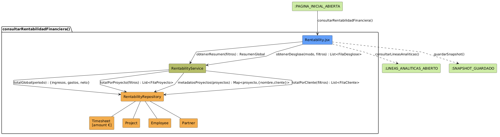

# Análisis de CU-13 — Consultar rentabilidad financiera

## Diagrama de colaboración

## Clases de análisis identificadas

### Vista (Boundary) — `Rentability.jsx`

Responsabilidades:

- Presentar el panel de rentabilidad financiera exclusivamente al Director; cualquier otro actor recibe una respuesta de acceso denegado antes de que se ejecute ninguna lógica de negocio.
- Gestionar seis modos de visualización: resumen global, desglose por proyecto, desglose por cliente, desglose por responsable, líneas analíticas de un proyecto concreto y líneas analíticas de un cliente concreto.
- Capturar los parámetros de filtrado del actor: rango de fechas, proyecto específico y responsable de área.
- Solicitar al Control los datos correspondientes al modo de visualización activo.
- Presentar los resultados mediante tablas de rentabilidad y gráficos de barras con ingresos y gastos comparados.

Colaboraciones:

- **Entrada:** recibe la solicitud del Director autenticado desde el menú principal.
- **Control:** solicita `obtenerRentabilidad(modo, filtros)` a `RentabilityService`.
- **Salida:** permite `guardarSnapshot()` o navegar a :LINEAS_ANALITICAS_ABIERTAS mediante `consultarLineasAnaliticas()`.

---

### Control — `RentabilityService`

Responsabilidades:

- Garantizar que el acceso a la rentabilidad financiera queda restringido al rol Director; cualquier otro rol queda bloqueado antes de ejecutar ninguna consulta.
- Gestionar los seis modos de consulta financiera: resumen global, por proyecto, por cliente, por responsable, líneas de proyecto y líneas de cliente.
- Calcular el porcentaje de rentabilidad de cada proyecto como cociente entre el resultado neto y los ingresos totales, gestionando el caso en que los ingresos sean cero.
- Determinar el estado financiero de cada proyecto: con ganancia si el porcentaje supera el umbral establecido, neutro si es positivo pero no lo supera, y con pérdida si es negativo.
- Agregar los resultados por proyecto para obtener el resumen global o los desgloses por cliente o responsable.

Colaboraciones:

- **Vista:** responde a `obtenerRentabilidad(modo, filtros)`.
- **Entidad:** delega en `RentabilityRepository` las consultas específicas de cada modo.

---

### Entidad — `RentabilityRepository`

Estereotipo: Entidad

Responsabilidades:

- Obtener los totales globales de ingresos, gastos, resultado neto y horas registradas para el período indicado.
- Obtener los totales de ingresos, gastos, resultado neto y horas agrupados por proyecto, con los filtros de proyecto y responsable aplicados.
- Obtener los metadatos de un conjunto de proyectos (nombre y cliente asociado) en una única consulta.
- Obtener el listado de líneas analíticas individuales de un proyecto concreto o de un cliente concreto con sus importes y horas.

Colaboraciones:

- **Control:** responde a `RentabilityService`.
- **Entidad:** gestiona instancias de `Timesheet`, `Project`, `Employee` y `Partner`.

### Entidad — `Timesheet`

Estereotipo: Entidad

Responsabilidades:

- Registrar cada línea analítica del ERP con dos campos de naturaleza distinta: el importe económico (positivo para ingresos, negativo para gastos) y la cantidad de horas imputadas. En este caso de uso se opera exclusivamente sobre el importe económico.

Colaboraciones:

- **Repositorio:** es gestionado por `RentabilityRepository`.

### Entidad — `Project`

Estereotipo: Entidad

Responsabilidades:

- Proporcionar el nombre del proyecto y el cliente al que pertenece.

Colaboraciones:

- **Repositorio:** es gestionado por `RentabilityRepository`.

### Entidad — `Employee`

Estereotipo: Entidad

Responsabilidades:

- Proporcionar el nombre del responsable de área asociado a cada grupo de líneas analíticas.

Colaboraciones:

- **Repositorio:** es gestionado por `RentabilityRepository`.

### Entidad — `Partner`

Estereotipo: Entidad

Responsabilidades:

- Proporcionar el nombre del cliente asociado a cada proyecto.

Colaboraciones:

- **Repositorio:** es gestionado por `RentabilityRepository`.

---

## Flujo de colaboración principal

**Secuencia: consultar rentabilidad financiera**

1. **Inicio:** el Director abre la sección de rentabilidad → `Rentability.jsx` recibe la solicitud.
2. **Verificación de rol:** `RentabilityService` comprueba que el actor tiene rol Director antes de ejecutar ninguna consulta; cualquier otro actor recibe acceso denegado.
3. **Solicitud de resumen global:** `Rentability.jsx` → `RentabilityService.obtenerRentabilidad(global, filtros)` → `RentabilityRepository.totalGlobal(periodo)` → devuelve ingresos, gastos y neto totales.
4. **Solicitud de desglose por proyecto:** `RentabilityService` → `RentabilityRepository.totalPorProyecto(filtros)` → devuelve lista de filas por proyecto.
5. **Enriquecimiento de metadatos:** `RentabilityService` → `RentabilityRepository.metadatosProyectos(proyectos)` → devuelve nombres y clientes en una única consulta.
6. **Cálculo de estados:** `RentabilityService` calcula el porcentaje de rentabilidad de cada proyecto y determina su estado financiero.
7. **Presentación:** `Rentability.jsx` muestra las tablas y gráficos al Director en el modo activo.
8. **Cambio de modo:** si el Director selecciona un modo distinto, se repite desde el paso 3 con la consulta correspondiente.
9. **Navegación:** el Director puede navegar a `consultarLineasAnaliticas()` para ver el detalle de un proyecto o cliente, o a `guardarSnapshot()` para capturar el estado actual.

---

## Correspondencia con requisitos

| Requisito del caso de uso | Clase responsable | Colaboración |
|---|---|---|
| Acceso exclusivo al Director | `RentabilityService` | Comprueba el rol del actor antes de ejecutar cualquier consulta |
| Calcular rentabilidad global del período | `RentabilityService` | Delega en `RentabilityRepository.totalGlobal` |
| Desglosar rentabilidad por proyecto | `RentabilityService` | Agrega resultados de `RentabilityRepository.totalPorProyecto` |
| Desglosar rentabilidad por cliente | `RentabilityService` | Agrupa los resultados por proyecto según el cliente asociado |
| Desglosar rentabilidad por responsable | `RentabilityService` | Filtra los resultados por el responsable indicado |
| Determinar estado financiero de cada proyecto | `RentabilityService` | Aplica umbrales de ganancia, neutro y pérdida sobre el porcentaje |
| Ver líneas analíticas de un proyecto | `RentabilityRepository` | Recupera las líneas individuales del proyecto indicado |
| Ver líneas analíticas de un cliente | `RentabilityRepository` | Recupera las líneas de todos los proyectos del cliente indicado |
| Separar ingresos y gastos en la presentación | `Rentability.jsx` | Clasifica las líneas según el signo del importe |