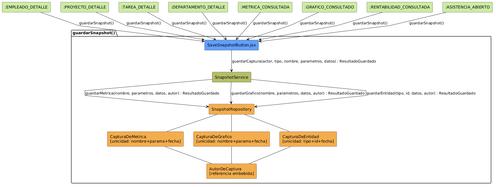

# Análisis de CU-17 — Guardar snapshot

## Diagrama de colaboración

## Clases de análisis identificadas

### Vista (Boundary) — `SaveSnapshotButton.jsx`

Responsabilidades:

- Presentar el botón de guardado de captura integrado en cualquier vista que muestre datos calculados: detalle de empleado, detalle de proyecto, métricas operativas, gráficos y rentabilidad financiera.
- Capturar la acción del actor de guardar el estado actual de los datos visualizados.
- Indicar visualmente el resultado del intento de guardado: confirmación de nueva captura creada, confirmación de captura actualizada para ese día o error inesperado.
- Deshabilitar el botón durante el proceso de guardado para evitar envíos duplicados.

Colaboraciones:

- **Entrada:** recibe la acción de guardar desde el actor estando en cualquiera de los estados calculados del sistema.
- **Control:** solicita `guardarCaptura(actor, tipo, nombre, parametros, datos)` a `SnapshotService`.
- **Salida:** muestra un mensaje de confirmación (guardado o actualización) o error según el resultado del guardado.

---

### Control — `SnapshotService`

Responsabilidades:

- Determinar el tipo de captura según el origen de la solicitud: captura de métrica, captura de gráfico o captura de entidad.
- Calcular el hash de los parámetros de la captura junto con la fecha actual para garantizar la unicidad diaria en el nivel de Control, antes de intentar la escritura.
- Delegar en el repositorio el guardado del documento correspondiente al tipo de captura.
- Interpretar el resultado del repositorio y devolver a la Vista si se ha creado una nueva captura o si se ha actualizado una equivalente para ese día.

Colaboraciones:

- **Vista:** responde a `guardarCaptura(actor, tipo, nombre, parametros, datos)`.
- **Entidad:** delega en `SnapshotRepository` el guardado según el tipo de captura.

---

### Entidad — `SnapshotRepository`

Estereotipo: Entidad

Responsabilidades:

- Guardar una captura de métrica en la colección `CapturaDeMetrica`, con el nombre de la métrica, los parámetros, los datos calculados, la fecha y el autor.
- Guardar una captura de gráfico en la colección `CapturaDeGrafico`, con el nombre del gráfico, los parámetros, los datos de la serie, la fecha y el autor.
- Guardar una captura de entidad en la colección `CapturaDeEntidad`, con el tipo de entidad, el identificador, los datos del objeto y la fecha y el autor.
- Garantizar la unicidad diaria a nivel de base de datos mediante un índice único sobre nombre, parámetros y fecha en cada colección.
- Implementar una operación de tipo upsert: si ya existe una captura equivalente para ese día, actualizar sus datos (data, updated_at, updated_by); en caso contrario, crear un nuevo documento.

Colaboraciones:

- **Control:** responde a `SnapshotService`.
- **Entidad:** gestiona instancias de `CapturaDeMetrica`, `CapturaDeGrafico`, `CapturaDeEntidad` y `AutorDeCaptura`.

### Entidad — `CapturaDeMetrica`

Estereotipo: Entidad

Responsabilidades:

- Representar el documento MongoDB de una captura de valor métrico: nombre de la métrica, parámetros de cálculo, valor numérico o estructura de datos calculada, fecha de captura y referencia al autor.

Colaboraciones:

- **Repositorio:** es gestionado por `SnapshotRepository`.
- **Entidad relacionada:** contiene una referencia embebida a `AutorDeCaptura`.

### Entidad — `CapturaDeGrafico`

Estereotipo: Entidad

Responsabilidades:

- Representar el documento MongoDB de una captura de serie de datos para gráfico: nombre del gráfico, parámetros de filtrado, datos de la serie (etiquetas y valores), fecha de captura y referencia al autor.

Colaboraciones:

- **Repositorio:** es gestionado por `SnapshotRepository`.
- **Entidad relacionada:** contiene una referencia embebida a `AutorDeCaptura`.

### Entidad — `CapturaDeEntidad`

Estereotipo: Entidad

Responsabilidades:

- Representar el documento MongoDB de una captura del estado de un objeto de dominio: tipo de entidad, identificador, datos del objeto serializado, fecha de captura y referencia al autor.

Colaboraciones:

- **Repositorio:** es gestionado por `SnapshotRepository`.
- **Entidad relacionada:** contiene una referencia embebida a `AutorDeCaptura`.

### Entidad — `AutorDeCaptura`

Estereotipo: Entidad

Responsabilidades:

- Representar la referencia embebida al actor que realizó la captura: identificador del usuario, nombre y rol en el momento del guardado.

Colaboraciones:

- **Entidades contenedoras:** es embebido por `CapturaDeMetrica`, `CapturaDeGrafico` y `CapturaDeEntidad`.

---

## Flujo de colaboración principal

**Secuencia: guardar snapshot**

1. **Inicio:** el actor pulsa el botón de guardado desde cualquier vista con datos calculados → `SaveSnapshotButton.jsx` recibe la acción.
2. **Bloqueo de la UI:** `SaveSnapshotButton.jsx` deshabilita el botón para evitar envíos duplicados durante el proceso.
3. **Solicitud de guardado:** `SaveSnapshotButton.jsx` → `SnapshotService.guardarCaptura(actor, tipo, nombre, parametros, datos)`.
4. **Cálculo de unicidad:** `SnapshotService` calcula el hash compuesto de parámetros y fecha actual para detectar capturas equivalentes antes de la escritura.
5. **Delegación en repositorio:** `SnapshotService` → `SnapshotRepository.guardarMetrica|Grafico|Entidad(nombre, parametros, datos, autor)` según el tipo de captura.
6. **Upsert en base de datos:** `SnapshotRepository` intenta la escritura; si ya existe un documento con el mismo nombre, parámetros y fecha, el índice único de MongoDB lo detecta y lo actualiza.
7. **Interpretación del resultado:** `SnapshotService` determina si se ha creado una nueva captura o si se ha actualizado una existente para ese día.
8. **Respuesta a la Vista:** `SnapshotService` devuelve el resultado a `SaveSnapshotButton.jsx`.
9. **Presentación del resultado:** `SaveSnapshotButton.jsx` muestra confirmación de nueva captura o de captura actualizada.
10. **Navegación opcional:** el actor puede navegar a `consultarDetalleSnapshot()` para inspeccionar la captura guardada.

---

## Correspondencia con requisitos

| Requisito del caso de uso | Clase responsable | Colaboración |
|---|---|---|
| Guardar captura de una métrica operativa | `SnapshotService` | Delega en `SnapshotRepository.guardarMetrica` |
| Guardar captura de una serie de datos de gráfico | `SnapshotService` | Delega en `SnapshotRepository.guardarGrafico` |
| Guardar captura del estado de una entidad | `SnapshotService` | Delega en `SnapshotRepository.guardarEntidad` |
| Mantener un único snapshot por combinación de parámetros y día | `SnapshotService` + `SnapshotRepository` | Hash de parámetros en Control e índice único en MongoDB, operación upsert |
| Registrar el autor de cada captura | `AutorDeCaptura` | Embebido en cada documento de captura con id, nombre y rol |
| Indicar al actor si la captura es nueva o ha sido actualizada | `SaveSnapshotButton.jsx` | Presenta el resultado devuelto por `SnapshotService` |
| Evitar envíos duplicados por doble clic | `SaveSnapshotButton.jsx` | Deshabilita el botón durante el proceso de guardado |
