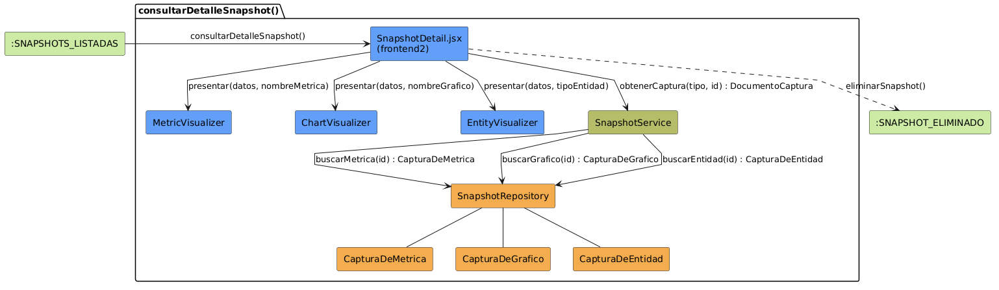

# Análisis de CU-19 — Consultar detalle de snapshot

## Diagrama de colaboración

## Clases de análisis identificadas

### Vista (Boundary) — `SnapshotDetail.jsx`

Responsabilidades:

- Recibir la solicitud de apertura del detalle de una captura concreta, identificada por tipo e identificador único.
- Solicitar al Control el documento de captura completo.
- Seleccionar y montar el visualizador adecuado según el tipo de captura: `MetricVisualizer` para métricas, `ChartVisualizer` para gráficos y `EntityVisualizer` para entidades.
- Presentar los metadatos de la captura: fecha, autor, nombre y parámetros con los que fue generada.
- Gestionar la acción de eliminación de la captura.

Colaboraciones:

- **Entrada:** recibe la solicitud del actor tras navegar desde el listado de snapshots.
- **Control:** solicita `obtenerCaptura(tipo, id)` a `SnapshotService`.
- **Subvistas:** delega la presentación de los datos en `MetricVisualizer`, `ChartVisualizer` o `EntityVisualizer` según el tipo.
- **Salida:** permite `eliminarSnapshot()`.

### Vista (Boundary) — `MetricVisualizer`

Responsabilidades:

- Recibir los datos de una captura de métrica ya recuperada y renderizarla como panel de indicadores o valor numérico con su contexto de cálculo.
- Operar exclusivamente sobre los datos guardados; no realiza ningún recálculo ni consulta al sistema de datos operativo.

Colaboraciones:

- **Vista contenedora:** recibe los datos de `SnapshotDetail.jsx`.

### Vista (Boundary) — `ChartVisualizer`

Responsabilidades:

- Recibir los datos de una captura de gráfico ya recuperada y renderizarla como gráfico de barras, líneas o sectores según la estructura de datos guardada.
- Operar exclusivamente sobre los datos guardados; no realiza ningún recálculo ni consulta al sistema de datos operativo.

Colaboraciones:

- **Vista contenedora:** recibe los datos de `SnapshotDetail.jsx`.

### Vista (Boundary) — `EntityVisualizer`

Responsabilidades:

- Recibir los datos de una captura de entidad ya recuperada y renderizarla como ficha de objeto con sus atributos y valores en el momento de la captura.
- Operar exclusivamente sobre los datos guardados; no realiza ningún recálculo ni consulta al sistema de datos operativo.

Colaboraciones:

- **Vista contenedora:** recibe los datos de `SnapshotDetail.jsx`.

---

### Control — `SnapshotService`

Responsabilidades:

- Validar el formato del identificador recibido antes de ejecutar ninguna consulta.
- Determinar la colección MongoDB de destino según el tipo de captura indicado.
- Delegar en el repositorio la recuperación del documento.
- Gestionar el caso en que el documento no exista o el identificador sea inválido, devolviendo un error de recurso no encontrado a la Vista.

Colaboraciones:

- **Vista:** responde a `obtenerCaptura(tipo, id)`.
- **Entidad:** delega en `SnapshotRepository.buscarMetrica|Grafico|Entidad(id)`.

---

### Entidad — `SnapshotRepository`

Estereotipo: Entidad

Responsabilidades:

- Localizar un documento de captura de métrica en la colección `CapturaDeMetrica` a partir de su identificador.
- Localizar un documento de captura de gráfico en la colección `CapturaDeGrafico` a partir de su identificador.
- Localizar un documento de captura de entidad en la colección `CapturaDeEntidad` a partir de su identificador.
- Devolver el documento completo al Control o indicar su ausencia si no se encuentra.

Colaboraciones:

- **Control:** responde a `SnapshotService`.
- **Entidad:** gestiona instancias de `CapturaDeMetrica`, `CapturaDeGrafico` y `CapturaDeEntidad`.

### Entidad — `CapturaDeMetrica`

Estereotipo: Entidad

Responsabilidades:

- Representar el documento MongoDB de una captura de valor métrico con su nombre, parámetros, datos calculados, fecha y autor embebido.

Colaboraciones:

- **Repositorio:** es gestionado por `SnapshotRepository`.

### Entidad — `CapturaDeGrafico`

Estereotipo: Entidad

Responsabilidades:

- Representar el documento MongoDB de una captura de serie de datos para gráfico con su nombre, parámetros, datos de la serie, fecha y autor embebido.

Colaboraciones:

- **Repositorio:** es gestionado por `SnapshotRepository`.

### Entidad — `CapturaDeEntidad`

Estereotipo: Entidad

Responsabilidades:

- Representar el documento MongoDB de una captura del estado de un objeto de dominio con su tipo, identificador, datos serializados, fecha y autor embebido.

Colaboraciones:

- **Repositorio:** es gestionado por `SnapshotRepository`.

---

## Flujo de colaboración principal

**Secuencia: consultar detalle de snapshot**

1. **Inicio:** el actor selecciona una captura desde el listado de snapshots → `SnapshotDetail.jsx` recibe la solicitud con tipo e identificador.
2. **Solicitud de documento:** `SnapshotDetail.jsx` → `SnapshotService.obtenerCaptura(tipo, id)`.
3. **Validación del identificador:** `SnapshotService` verifica que el identificador tiene el formato correcto antes de consultar la base de datos.
4. **Consulta al repositorio:** `SnapshotService` → `SnapshotRepository.buscarMetrica|Grafico|Entidad(id)` según el tipo de captura.
5. **Recuperación del documento:** `SnapshotRepository` localiza el documento en la colección correspondiente y lo devuelve al Control.
6. **Gestión de ausencia:** si el documento no existe, `SnapshotService` devuelve un error de recurso no encontrado y `SnapshotDetail.jsx` presenta el mensaje adecuado al actor.
7. **Selección de visualizador:** `SnapshotDetail.jsx` determina el visualizador adecuado según el tipo del documento recibido.
8. **Presentación de metadatos:** `SnapshotDetail.jsx` muestra la fecha, el autor, el nombre y los parámetros de la captura.
9. **Renderizado de datos:** el visualizador seleccionado (`MetricVisualizer`, `ChartVisualizer` o `EntityVisualizer`) presenta los datos guardados sin realizar ningún recálculo.
10. **Navegación opcional:** el actor puede iniciar `eliminarSnapshot()` si desea eliminar la captura visualizada.

---

## Correspondencia con requisitos

| Requisito del caso de uso | Clase responsable | Colaboración |
|---|---|---|
| Recuperar una captura por su identificador único | `SnapshotService` | Delega en `SnapshotRepository.buscar*` tras validar el identificador |
| Validar el formato del identificador | `SnapshotService` | Comprueba el formato antes de consultar el repositorio |
| Gestionar captura inexistente | `SnapshotService` | Notifica error de recurso no encontrado si el documento no existe |
| Presentar metadatos de la captura | `SnapshotDetail.jsx` | Extrae y muestra fecha, autor, nombre y parámetros del documento |
| Seleccionar el visualizador según el tipo | `SnapshotDetail.jsx` | Monta `MetricVisualizer`, `ChartVisualizer` o `EntityVisualizer` |
| Mostrar métricas sin recalcular | `MetricVisualizer` | Opera exclusivamente sobre los datos guardados del documento |
| Mostrar gráficos sin recalcular | `ChartVisualizer` | Opera exclusivamente sobre los datos guardados del documento |
| Mostrar entidades sin recalcular | `EntityVisualizer` | Opera exclusivamente sobre los datos guardados del documento |
| Permitir eliminar la captura visualizada | `SnapshotDetail.jsx` | Gestiona la navegación a `eliminarSnapshot()` |