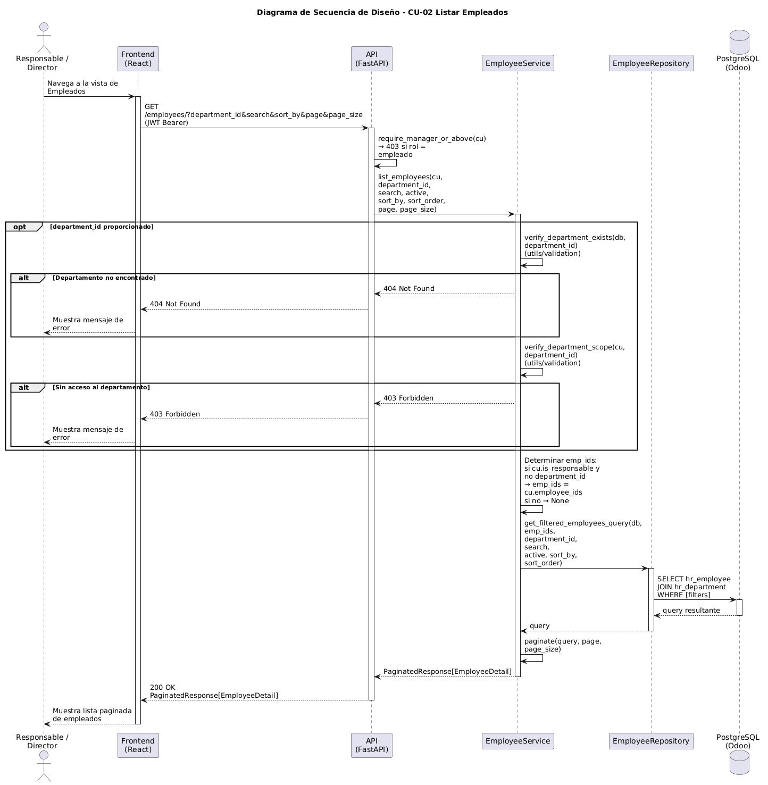

# Diseño de CU-02 — Listar empleados

**Actor:** Director o Responsable
**Precondición:** el actor está autenticado.

| Paso | Capa | Clase / Función | Qué ocurre |
|---|---|---|---|
| 1 | Frontend | `Employees.jsx` → `useApi` | Envía `GET /employees/` con filtros opcionales: `department_id`, `search`, `active`, `sort_by`, `sort_order`, `page`, `page_size` |
| 2 | Routes | `employee.router` → `require_manager_or_above` | Decodifica el JWT y rechaza con 403 si el rol es `empleado`. Inyecta `CurrentUser` con `role`, `employee_ids` y `department_ids` |
| 3 | Services | `EmployeeService.list_employees(cu, ...)` | Si se proporciona `department_id`, llama a `verify_department_scope(cu, department_id)` y lanza 403 si el responsable no gestiona ese departamento (**Capa 2**) |
| 4 | Services | | Calcula `emp_ids`: si el actor es responsable y no hay `department_id` concreto, `emp_ids = cu.employee_ids`; si es director, `emp_ids = None` (**Capa 3**) |
| 5 | Repositories | `employee.py → get_filtered_employees_query()` | Construye la query con `WHERE id IN (:emp_ids)` si hay scope, más filtros de departamento, búsqueda por nombre y ordenación |
| 6 | Utils | `pagination.py → paginate()` | Ejecuta `COUNT(*)` para el total y aplica `OFFSET`/`LIMIT` según página |
| 7 | Routes | `employee.router` | Devuelve `200 OK` + `PaginatedResponse[EmployeeDetail]` |

**Datos de salida:** `PaginatedResponse[EmployeeDetail]` con `id`, `name`, `department_name`, `job_title`, `work_email`, `hourly_cost` y `active` por cada empleado visible para el actor.
