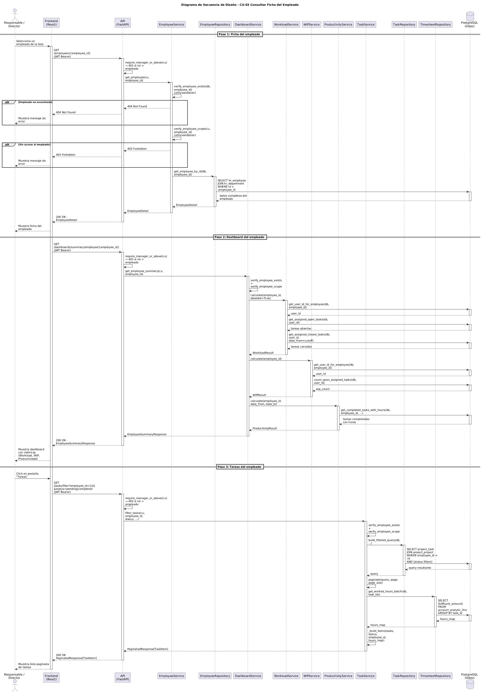

# Diseño de CU-03 — Ver resumen de empleado

**Actor:** Director o Responsable
**Precondición:** el actor está autenticado; el `employee_id` pertenece al scope del actor.

| Paso | Capa | Clase / Función | Qué ocurre |
|---|---|---|---|
| 1 | Frontend | `EmployeeDetail.jsx` → `useApi` | Envía `GET /employees/{id}` para obtener la ficha básica del empleado |
| 2 | Routes | `employee.router` → `require_manager_or_above` | Decodifica el JWT y rechaza con 403 si el rol es `empleado`. Inyecta `CurrentUser` |
| 3 | Services | `EmployeeService.get_employee(cu, employee_id)` | Llama a `verify_employee_scope(cu, employee_id)`: 403 si el responsable no tiene ese empleado en `cu.employee_ids` (**Capa 2**) |
| 4 | Repositories | `employee.py → get_employee_by_id()` | `SELECT hr_employee JOIN hr_department WHERE id = :id` |
| 5 | Frontend | `EmployeeDetail.jsx` → `useApi` | Envía `GET /dashboards/summary/employee/{id}` para cargar los KPIs |
| 6 | Routes | `dashboards.router` → `require_manager_or_above` | Decodifica el JWT. Delega al servicio |
| 7 | Services | `DashboardService.get_employee_summary(cu, id)` | Vuelve a llamar a `verify_employee_scope` para impedir el acceso directo al dashboard (**Capa 2**) |
| 8 | Services | `WorkloadService.calculate(employee_id)` | Consulta tareas abiertas y cerradas en los últimos 30 días. Calcula `workload_percentage` y `pending_hours` |
| 9 | Services | `WIPService.calculate(employee_id)` | Cuenta tareas abiertas asignadas y clasifica: `optimo`, `aceptable` o `sobrecargado` |
| 10 | Services | `ProductivityService.calculate(employee_id)` | Calcula el ratio `planned / actual × 100` para tareas cerradas en los últimos 30 días |
| 11 | Repositories | `workload.py`, `wip.py`, `productivity.py` | Ejecutan queries sobre `project_task`, `project_task_user_rel` y `account_analytic_line` |
| 12 | Services | `DashboardService` | Ensambla `EmployeeSummaryResponse` con los tres cálculos y construye `quick_stats` |
| 13 | Routes | `dashboards.router` | Devuelve `200 OK` + JSON |
| 14 | Frontend | `EmployeeDetail.jsx` | Renderiza KpiCards de carga, WIP y productividad |
| 15 | Frontend | Pestañas de tareas | Cada pestaña lanza `GET /tasks/filter` bajo demanda, reutilizando CU-08 |

**Datos de salida:** `EmployeeSummaryResponse` con `workload`, `wip`, `productivity_last_30_days` y `quick_stats`.
