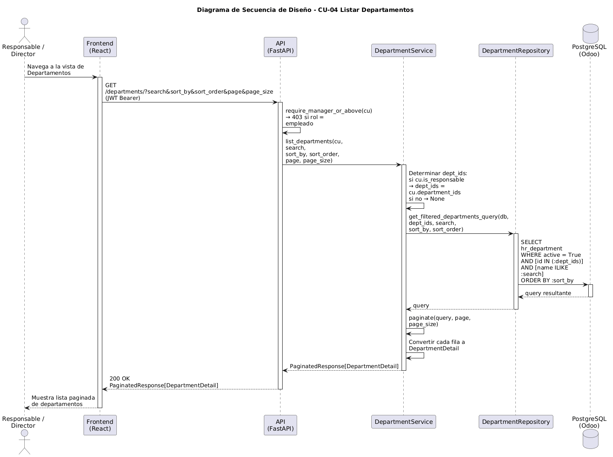

# Diseño de CU-04 — Listar departamentos

**Actor:** Director o Responsable
**Precondición:** el actor está autenticado.

| Paso | Capa | Clase / Función | Qué ocurre |
|---|---|---|---|
| 1 | Frontend | `Departments.jsx` → `useApi` | Envía `GET /departments/` con filtros opcionales: `search`, `sort_by`, `sort_order`, `page`, `page_size` |
| 2 | Routes | `department.router` → `require_manager_or_above` | Decodifica el JWT y rechaza con 403 si el rol es `empleado`. Inyecta `CurrentUser` |
| 3 | Services | `DepartmentService.list_departments(cu, ...)` | Calcula `dept_ids`: si el actor es responsable, `dept_ids = cu.department_ids`; si es director, `dept_ids = None` (**Capa 3**). No hay Capa 2 porque no se pide un departamento concreto |
| 4 | Repositories | `department.py → get_filtered_departments_query()` | Construye la query con `WHERE id IN (:dept_ids)` si hay scope, más filtro de búsqueda y ordenación |
| 5 | Utils | `pagination.py → paginate()` | Ejecuta `COUNT(*)` y aplica `OFFSET`/`LIMIT` |
| 6 | Services | `DepartmentService` | Convierte cada fila en `DepartmentDetail` |
| 7 | Routes | `department.router` | Devuelve `200 OK` + `PaginatedResponse[DepartmentDetail]` |

**Datos de salida:** `PaginatedResponse[DepartmentDetail]` con los departamentos visibles para el actor.
