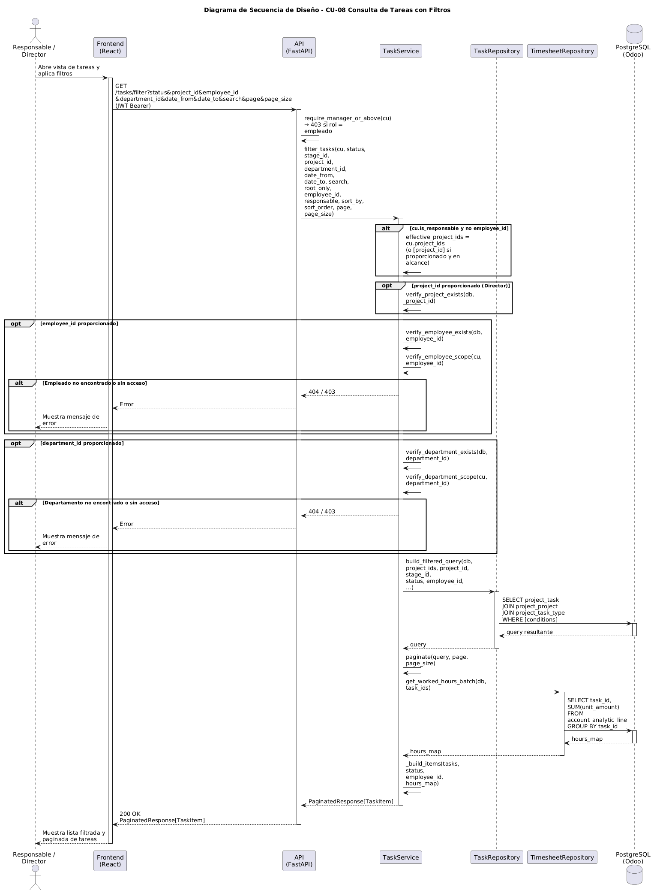

# Diseño de CU-08 — Listar tareas

**Actor:** Director o Responsable
**Precondición:** el actor está autenticado.

| Paso | Capa | Clase / Función | Qué ocurre |
|---|---|---|---|
| 1 | Frontend | `Tasks.jsx` | Lee parámetros de la URL y envía `GET /tasks/filter` con filtros combinados |
| 2 | Routes | `task.router` → `require_manager_or_above` | Decodifica el JWT y rechaza con 403 si el rol es `empleado`. Inyecta `CurrentUser` |
| 3 | Services | `TaskService.filter_tasks(cu, ...)` | Si se proporciona `employee_id`, llama a `verify_employee_scope` → 403 si no está en `cu.employee_ids`. Si se proporciona `project_id`, llama a `verify_project_scope` (**Capa 2**) |
| 4 | Services | | Calcula `effective_project_ids`: si el actor es responsable y no hay filtro concreto, `effective_project_ids = cu.project_ids` (**Capa 3**) |
| 5 | Repositories | `task.py → build_filtered_query()` | Construye la query con `WHERE project_id IN (:scope_ids)` si hay scope, más filtros de estado, fechas, empleado y ordenación |
| 6 | Utils | `pagination.py → paginate()` | Ejecuta `COUNT(*)` y aplica `OFFSET`/`LIMIT` |
| 7 | Repositories | `timesheet.py → get_worked_hours_batch()` | Calcula horas trabajadas por tarea en una query agrupada sobre `account_analytic_line` |
| 8 | Services | `TaskService._build_items()` | Selecciona el constructor según el modo: `_to_pending`, `_to_completed`, `_to_assigned` o `_to_default` |
| 9 | Routes | `task.router` | Devuelve `200 OK` + `PaginatedResponse` con ítems tipados |

**Datos de salida:** `PaginatedResponse` — respuesta paginada con `items`, `total`, `page`, `page_size` y `total_pages`. El tipo de cada ítem depende de los filtros activos:

**Campos comunes** (heredados de `TaskWithContext`):

| Campo | Tipo | Descripción |
|---|---|---|
| `id` | `int` | Identificador de la tarea |
| `name` | `str` | Nombre de la tarea |
| `project_id` | `int?` | ID del proyecto |
| `project_name` | `str?` | Nombre del proyecto |
| `stage_name` | `str?` | Nombre de la etapa actual |
| `planned_hours` | `float?` | Horas planificadas |
| `date_deadline` | `date?` | Fecha límite |

**`PendingTaskItem`** (cuando `status=pending` + `employee_id`): añade `worked_hours`, `pending_hours`, `date_assign` e `is_overdue`.

**`CompletedTaskItem`** (cuando `status=completed` + `employee_id`): añade `actual_hours`, `productivity`, `completion_date`, `date_assign` y `on_time`.

**`AssignedTaskItem`** (cuando `employee_id` sin status específico): añade `worked_hours`, `actual_hours`, `pending_hours`, `productivity`, `date_assign`, `date_end` e `is_overdue`.

**`TaskResponse`** (sin `employee_id`): añade `effective_hours`, `date_assign`, `date_end`, `is_closed` y `subtasks`.

**Decisión de diseño:** el mismo endpoint `GET /tasks/filter` es reutilizado tanto por la página global de tareas como por las pestañas de `EmployeeDetail` (CU-03).
