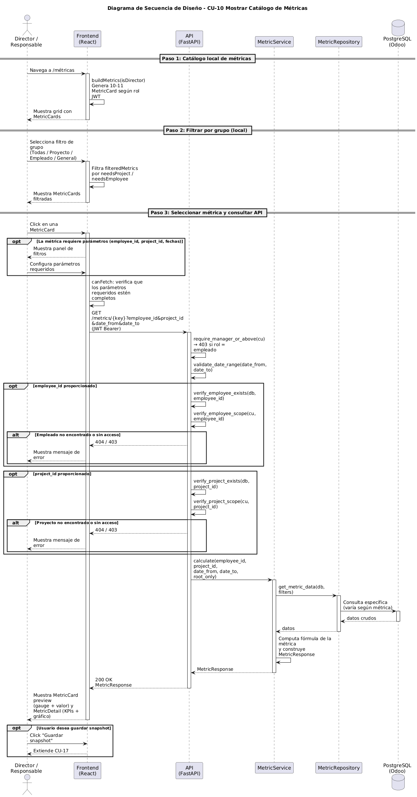

# Diseño de CU-10 — Mostrar Catálogo de Métricas

**Actor:** Director o Responsable
**Precondición:** el actor está autenticado (CU-01 completado).

| Paso | Capa | Clase / Función | Qué ocurre |
|---|---|---|---|
| 1 | Frontend | `Metrics.jsx` → `buildMetrics(isDirector)` | El actor accede a `/metrics`. La página construye el array local de métricas disponibles: 10 métricas para Responsable, 11 para Director (incluye `client-distribution`). Cada entrada declara `key`, `label`, `icon`, `color`, flags de parámetros (`needsEmployee`, `needsProject`, `needsDates`), función `preview()` y función `renderDetail()` |
| 2 | Frontend | `Metrics.jsx` → cuadrícula de `MetricCard` | Renderiza la cuadrícula con layout `repeat(auto-fill, minmax(220px, 1fr))` y panel de detalle vacío. Muestra botones de filtro por categoría: "Todas", "Por proyecto", "Por empleado", "Generales" |
| 3 | Frontend | `Metrics.jsx` → `filteredMetrics` | Si el actor cambia de grupo, filtra: `project` → métricas con `needsProject`; `employee` → con `needsEmployee`; `general` → sin dependencias; `all` → todas |
| 4 | Frontend | `Metrics.jsx` | El actor selecciona una tarjeta → `setSelected(metric.key)`. Si requiere parámetros, muestra selectores de empleado, proyecto y/o fechas. La variable `canFetch` bloquea hasta que todos los parámetros obligatorios estén completos |
| 5 | Frontend | `api/metrics.js` → `apiMap[selected](params)` | Lanza petición `GET /metrics/{tipo}?params` con `Authorization: Bearer JWT` |
| 6 | Routes | `metrics.router` → guard de rol | Decodifica JWT mediante `require_manager_or_above` o `require_director` para métricas exclusivas. Inyecta `CurrentUser` |
| 7 | Routes | `metrics.router` → validación | Si hay parámetros de entidad, ejecuta `verify_*_exists` → 404 y `verify_*_scope` → 403 si está fuera del ámbito (**Capa 2**). Si hay fechas, valida rango |
| 8 | Services | `{Metric}Service.calculate(...)` | Instancia el servicio de métrica correspondiente. Delega la consulta al repositorio, aplica la fórmula y devuelve la respuesta tipada |
| 9 | Repositories | `repositories/metrics/{metric}.py` | Ejecuta queries sobre modelos ORM, reutilizando subqueries de `task.py` y `timesheet.py` |
| 10 | Routes | `metrics.router` | Devuelve `200 OK` + JSON con la respuesta tipada |
| 11 | Frontend | `Metrics.jsx` → `MetricDetail` | Cachea el resultado. Renderiza panel de detalle con cabecera, KPIs y gráficos usando `metric.renderDetail(data)`. Actualiza preview de la tarjeta |

**Datos de salida:** no hay esquema propio de CU-10. El catálogo se construye localmente en el frontend. Cuando el actor selecciona una métrica, los datos corresponden al esquema del caso de uso individual invocado (CU-22 a CU-32).
