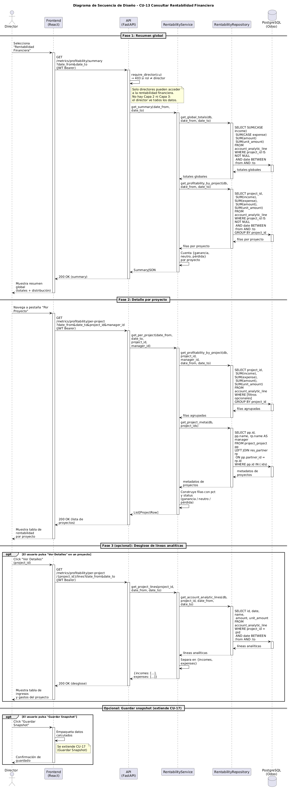

# Diseño de CU-13 — Consultar rentabilidad financiera

**Actor:** Director
**Precondición:** el actor está autenticado con rol `director`.

| Paso | Capa | Clase / Función | Qué ocurre |
|---|---|---|---|
| 1 | Frontend | `Rentability.jsx` → `useApi` | Envía `GET /metrics/profitability/summary?date_from=X&date_to=Y` |
| 2 | Routes | `metrics.router` → `require_director` | Decodifica el JWT y rechaza con 403 si el rol no es `director`. No hay Capa 2 ni Capa 3: dato global exclusivo del director |
| 3 | Services | `RentabilityService.get_summary(date_from, date_to)` | Orquesta dos consultas: totales globales y desglose por proyecto |
| 4 | Repositories | `rentability.py → get_global_totals()` | `SELECT SUM(amount) ... FROM account_analytic_line WHERE date BETWEEN :from AND :to` |
| 5 | Repositories | `rentability.py → get_profitability_by_project()` | Misma tabla agrupada por `project_id` |
| 6 | Repositories | `rentability.py → get_project_meta()` | `SELECT project_project JOIN res_partner` para nombre de proyecto y cliente |
| 7 | Services | `RentabilityService` | Calcula `profitability_pct = net / income × 100` y clasifica: `ganancia`, `neutro` o `perdida` |
| 8 | Routes | `metrics.router` | Devuelve `200 OK` + JSON con resumen global y conteo por estado |
| 9 | Frontend | `Rentability.jsx` | Renderiza KPIs financieros, gráfico de barras y tarta por estado |

**Datos de salida:** `{ income, expense, net, total_hours, profitability_pct, status, projects_summary }`

Al pulsar "Ver detalles" el frontend dispara `CU-14 Consultar Líneas Analíticas` parametrizado por `scope ∈ {proyecto, cliente}`.
