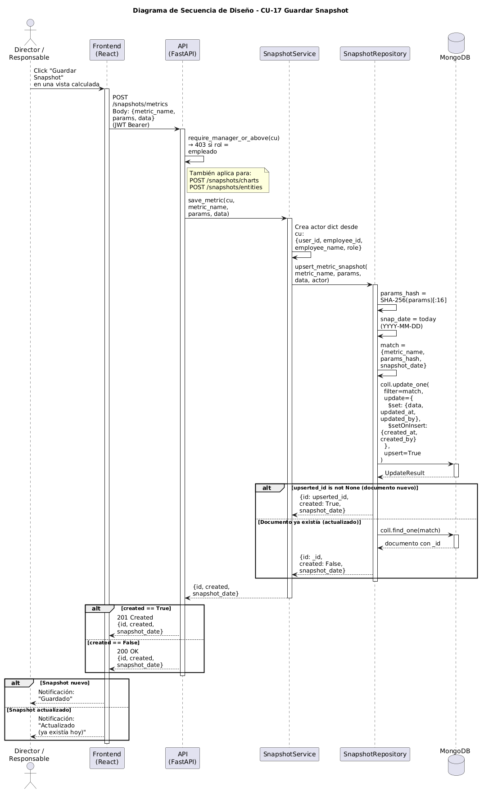

# Diseño de CU-17 — Guardar snapshot (upsert diario)

**Actor:** Director o Responsable
**Precondición:** el actor está en una vista calculada con un resultado ya mostrado en pantalla.

Este caso de uso absorbe la semántica de actualización: si ya existe una snapshot con la misma clave compuesta `(tipo, params_hash, snapshot_date)`, la operación la sobrescribe.

| Paso | Capa | Clase / Función | Qué ocurre |
|---|---|---|---|
| 1 | Frontend | `SaveSnapshotButton` | El actor pulsa "Guardar snapshot" sobre la vista calculada |
| 2 | Frontend | `api/snapshots.js → save(type, payload)` | Construye el payload y envía `POST /snapshots/{metrics\|charts\|entities}` con JWT |
| 3 | Routes | `snapshots.router` → `require_manager_or_above` | Decodifica el JWT, rechaza con 401/403 si el rol es `empleado` |
| 4 | Services | `SnapshotService.save_{metric\|chart\|entity}(payload, cu)` | Normaliza `params` mediante ordenación alfabética y serialización canónica |
| 5 | Services | | Calcula `params_hash = SHA-256(params_normalizados)` |
| 6 | Services | | Fija `snapshot_date = datetime.utcnow().date()` |
| 7 | Services | | Construye `SnapshotActor` con datos del JWT |
| 8 | Repositories | `snapshot.py → find_one(tipo, clave)` | Busca si ya existe un documento con esa clave compuesta |
| 9 | Repositories | `snapshot.py → update_one` o `insert_one` | Si existe → sobrescribe. Si no → inserta documento nuevo |
| 10 | Services | | Devuelve `{id, created: True\|False}` |
| 11 | Routes | `snapshots.router` | Devuelve `200 OK` + JSON |
| 12 | Frontend | `SaveSnapshotButton` | Muestra notificación "Snapshot creada" o "Snapshot actualizada" |

**Datos de salida:** `{id, created: boolean}`.

**Decisión de diseño:** la política de upsert está anclada a **índices únicos sobre la clave compuesta** en cada colección MongoDB (RNF-15). El `find_one` previo evita el error; el índice actúa como red de seguridad definitiva.
