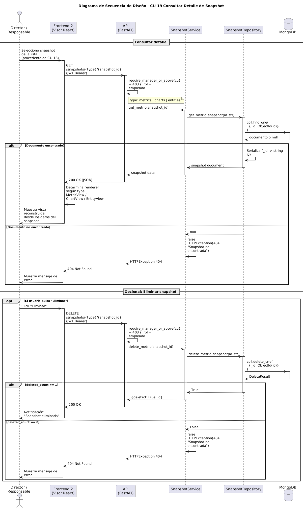

# Diseño de CU-19 — Consultar detalle de snapshot

**Actor:** Director o Responsable
**Precondición:** el actor está autenticado en el visor y ha seleccionado una snapshot.

| Paso | Capa | Clase / Función | Qué ocurre |
|---|---|---|---|
| 1 | Frontend (visor) | `SnapshotDetail.jsx` | Recibe `{type, id}` como parámetros de ruta |
| 2 | Frontend (visor) | `api/snapshots.js → get(type, id)` | Envía `GET /snapshots/{type}/{id}` con JWT |
| 3 | Routes | `snapshots.router` → `require_manager_or_above` | Valida el JWT. Delega al servicio sin aplicar scope |
| 4 | Services | `SnapshotService.get_by_id(type, id)` | Delega directamente en el repositorio |
| 5 | Repositories | `snapshot.py → find_by_id(type, id)` | `findOne({_id: ObjectId(id)})` sobre la colección correspondiente |
| 6 | Routes | `snapshots.router` | Devuelve `200 OK` con el documento o `404 Not Found` |
| 7 | Frontend (visor) | `SnapshotDetail.jsx` | Elige el renderer: `MetricView`, `ChartView` o `EntityView` |
| 8 | Frontend (visor) | Renderer seleccionado | Reconstruye la vista a partir del campo `data` del documento |
| 9 | Frontend (visor) | `SnapshotDetail.jsx` | Muestra metadatos, parámetros, panel JSON y botón "Eliminar" (CU-20) |

**Datos de salida:** documento completo de la snapshot y la vista reconstruida en pantalla.

**Decisión de diseño:** el visor reconstruye la visualización exactamente como se guardó. No se dispara cálculo alguno sobre PostgreSQL. El desacoplamiento entre cálculo y visualización garantiza que el visor siga funcionando aunque la lógica del frontend principal evolucione.
