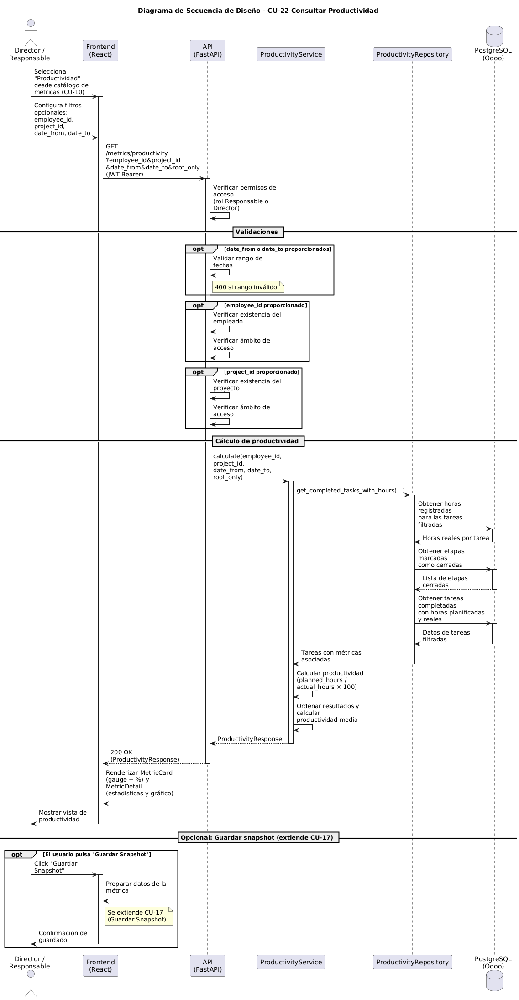

# Diseño de CU-22 — Consultar Productividad

**Actor:** Director o Responsable
**Precondición:** el actor está autenticado; ha accedido a CU-10 y ha seleccionado la métrica *Productividad* del catálogo.

| Paso | Capa | Clase / Función | Qué ocurre |
|---|---|---|---|
| 1 | Frontend | `Metrics.jsx` → `MetricCard` | El actor selecciona la tarjeta "Productividad" (`key: 'productivity'`). La métrica tiene `needsEmployee: false`, `needsProject: false` y `needsDates: true`, por lo que `canFetch = true`. Se muestra el panel de parámetros de fechas (opcionales) |
| 2 | Frontend | `Metrics.jsx` → `buildParamsForMetric(metric)` | Construye el objeto de parámetros opcionales: `employee_id`, `project_id`, `date_from` y `date_to`. Ninguno es obligatorio |
| 3 | Frontend | `api/metrics.js` → `getProductivity(params)` | Envía `GET /metrics/productivity?employee_id=X&project_id=Y&date_from=Z&date_to=W` con `Authorization: Bearer JWT` |
| 4 | Routes | `metrics.router` → `get_productivity()` | Decodifica el JWT mediante `require_manager_or_above`. Rechaza con 403 si el rol es `empleado`. Inyecta `CurrentUser` |
| 5 | Routes | `metrics.router` | Valida fechas (400 si `date_from > date_to`). Verifica `employee_id` → 404 / 403 si existe pero fuera del ámbito (**Capa 2**). Verifica `project_id` → 404 / 403 (**Capa 2**) |
| 6 | Services | `ProductivityService.calculate(employee_id, project_id, date_from, date_to)` | Delega en `get_completed_tasks_with_hours()` del repositorio |
| 7 | Repositories | `metrics/productivity.py` → subconsulta | Construye subquery sobre `Timesheet`: agrupa por `task_id`, suma `unit_amount` como `actual_hours`. Filtra por `employee_id` (si se proporciona) y rango de fechas |
| 8 | Repositories | `metrics/productivity.py` → query principal | Query sobre `Task`: `OUTER JOIN` con subconsulta de horas. Filtra `active = True`, `is_closed = True`, `stage_id IN closed_stage_ids_subq(db)`, `planned_hours > 0`. Aplica filtros de `project_id` |
| 9 | Repositories | `task.py` → `closed_stage_ids_subq(db)` | Subquery reutilizable que devuelve IDs de etapas cerradas. Compartida por todos los repositorios de métricas |
| 10 | Services | `ProductivityService` | Itera tareas: para cada una con `actual_hours > 0`, calcula `productivity_pct = (planned_hours / actual_hours) × 100` |
| 11 | Services | | Ordena por productividad DESC. Calcula `average_productivity = Σpct / count(valid)` (2 decimales). Si no hay tareas válidas, devuelve 0 |
| 12 | Services | | Devuelve `ProductivityResponse(average_productivity, total_tasks, tasks)` |
| 13 | Routes | `metrics.router` | Devuelve `200 OK` + JSON |
| 14 | Frontend | `Metrics.jsx` → `MetricCard` | Actualiza preview: gauge con productividad media (capeada a 100%), coloreada por umbral: verde ≥ 90%, ámbar ≥ 70%, rojo < 70%. Subtítulo: `"{total_tasks} tareas analizadas"` |
| 15 | Frontend | `MetricDetail` → `metric.renderDetail(data)` | Muestra panel: dos KPI cards (productividad y total), gráfico de barras horizontal con top 8 tareas por `productivity_pct`, cada barra coloreada por umbral. Cabecera con `SaveSnapshotButton` |

**Datos de salida:** `ProductivityResponse`:

| Campo | Tipo | Descripción |
|---|---|---|
| `average_productivity` | `float` | Media de productividad (%) sobre las tareas válidas |
| `total_tasks` | `int` | Número de tareas con horas reales > 0 |
| `tasks` | `List[ProductivityTaskItem]` | Detalle por tarea, ordenado por productividad DESC |

Cada `ProductivityTaskItem` contiene:

| Campo | Tipo | Descripción |
|---|---|---|
| `task_id` | `int` | Identificador de la tarea |
| `task_name` | `str` | Nombre de la tarea |
| `planned_hours` | `float` | Horas planificadas |
| `actual_hours` | `float` | Horas reales trabajadas |
| `parent_id` | `int?` | ID de la tarea padre (si es subtarea) |
| `productivity_pct` | `float` | Productividad individual (`planned / actual × 100`) |
