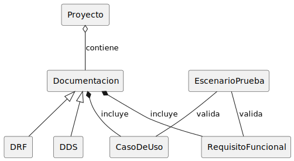

# Modelo de Dominio

Un `Proyecto` contiene una o varias `Documentaciones`, que son el punto de partida del sistema. La documentación puede ser de dos tipos: `DRF` (requisitos funcionales) o `DDS` (diseño del sistema).

Dentro de la `Documentación` se incluyen los `Casos de Uso` y los `Requisitos Funcionales`, que describen cómo debe comportarse el sistema y qué funcionalidades debe tener.

A partir de estos elementos se generan los `Escenarios de Prueba`, que sirven para comprobar que los `casos de uso` y los `requisitos` se cumplen correctamente.

