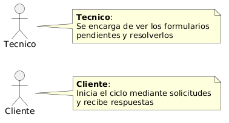
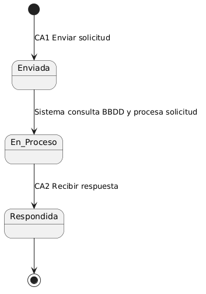
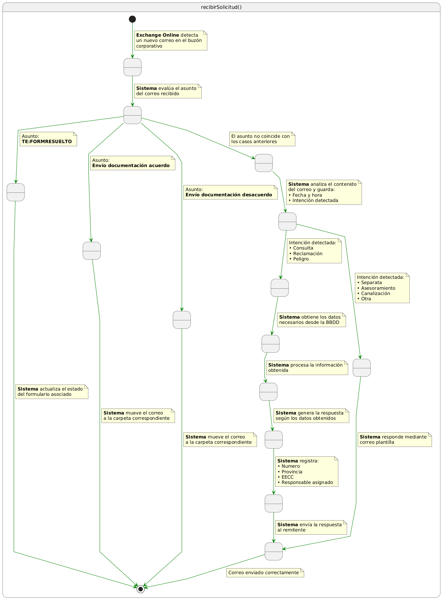
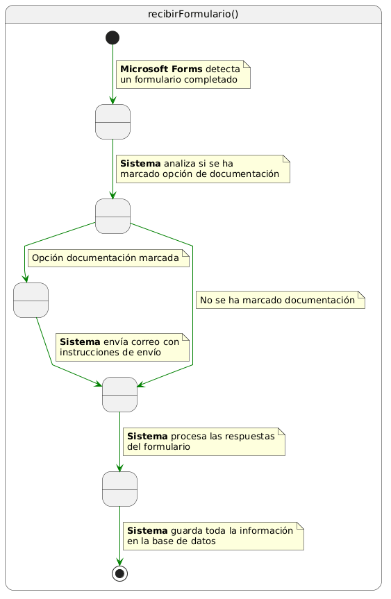
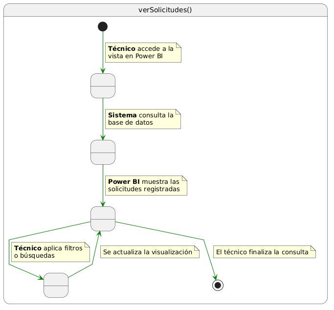
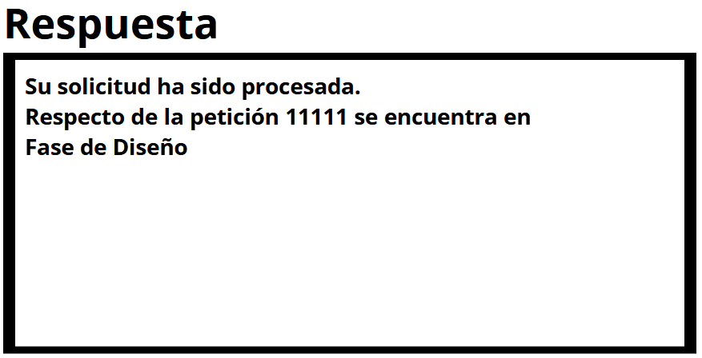

# Disciplina de Requisitos
## Actores
| Diagrama | Código Fuente |
|----------|---------------|
||[Ver Código de Actores](./Actores/codigo/Actores.puml)

El Técnico constituye el único actor humano del sistema, ya que es quien accede a la información procesada, consulta los formularios pendientes y realiza la actualización del estado de las solicitudes. Su interacción es directa y necesaria para la gestión operativa del sistema.

Por otro lado, se consideran actores externos los servicios que generan los eventos que desencadenan la ejecución de los flujos automatizados. En este sentido, el servicio de correo Exchange Online actúa como origen de eventos cuando se recibe un nuevo mensaje, activando el flujo principal del sistema.

De forma análoga, Microsoft Forms se identifica como actor externo al generar eventos cuando un formulario es completado, lo que da lugar a la ejecución de flujos secundarios.

## Casos De Uso Por Actor

| Diagrama  | Código |
|---------|---------|
||[Ver código](./CdU/codigo/CdU_Exchange.puml)|
||[Ver código](./CdU/codigo/CdU_Forms.puml)|
||[Ver código](./CdU/codigo/CdU_Tecnico.puml)|

## Relación Casos de Uso con Requisitos Funcionales

| Caso de Uso           | Requisitos Funcionales relacionados                                                                                                                               |
| --------------------- | ----------------------------------------------------------------------------------------------------------------------------------------------------------------- |
| CA1 Recibir solicitud | RF1 Integrarse con el buzón de correo corporativo, RF2 Recibir solicitud, RF3 Procesar solicitud recibida, RF4 Generar respuesta automática, RF5 Enviar respuesta |
| CA2 Recibir formulario   | RF6 Incorporar sistema de ampliación de detalle, RF7 Integrarse con sistema de formularios, RF8 Recibir detalle                                                   |
| CA3 Ver solicitudes   | RF9 Registrar información recibida, RF10 Ver solicitudes, RF11 Actualizar estado                                                                                  |

## Flujo de Procesos por Entidad

### Solicitud

| Diagrama | Código |
|---------|---------|
||[Ver código](./FlujoEntidades/codigo/Flujo_Solicitud.puml)|

El flujo de la entidad Solicitud comienza con la recepción de un correo electrónico en el buzón corporativo, gestionado mediante Exchange Online. Este evento activa el sistema de automatización, que inicia el procesamiento de la solicitud.

En primer lugar, el sistema analiza el asunto del correo con el objetivo de clasificar la solicitud según una serie de reglas predefinidas. En función del contenido del asunto, se contemplan cuatro posibles escenarios. Si el asunto indica que un formulario ha sido resuelto (“TE:FORMRESUELTO”), el sistema procede a actualizar el estado del formulario correspondiente. Si el correo corresponde al envío de documentación de acuerdo o desacuerdo, el sistema clasifica el mensaje y lo mueve automáticamente a la carpeta correspondiente para su gestión documental.

En caso de que el asunto no coincida con ninguno de los escenarios anteriores, la solicitud pasa a una fase de análisis más detallado. En esta etapa, el sistema identifica la intención del mensaje, clasificándola en categorías como consulta, reclamación o situaciones de posible riesgo asociadas a un identificador numérico.

Si la intención identificada es válida, el sistema realiza una consulta a las bases de datos disponibles para obtener la información necesaria. A partir de los datos recuperados, se lleva a cabo el procesamiento de la solicitud y se genera una respuesta automática adaptada al contexto. Posteriormente, el sistema registra la información relevante de la solicitud, incluyendo los datos procesados y el responsable asignado, y finalmente envía la respuesta al remitente.

Por el contrario, si la intención de la solicitud no se corresponde con ninguno de los casos contemplados, el sistema responde mediante el envío de un correo basado en una plantilla predefinida, garantizando así una respuesta consistente.

De este modo, el flujo de la entidad Solicitud combina una lógica basada en reglas para el tratamiento inicial con un procesamiento más avanzado en los casos necesarios, asegurando una gestión automatizada, estructurada y completa de todas las solicitudes recibidas.

### Formulario

| Diagrama | Código |
|---------|---------|
||[Ver código](./FlujoEntidades/codigo/Flujo_Formulario.puml)

El flujo de la entidad Formulario se inicia con la ejecución del caso de uso CA2 Recibir formulario, momento en el cual el sistema recibe la información introducida por el usuario a través del formulario.

Una vez recibidos los datos, el sistema realiza una evaluación específica para determinar si se ha seleccionado alguna opción relacionada con el envío de documentación. En caso afirmativo, se desencadena una acción adicional consistente en el envío automático de un correo electrónico con las instrucciones necesarias para remitir dicha documentación.

Es importante destacar que esta acción no altera el flujo principal del proceso. Independientemente de si se ha solicitado el envío de documentación o no, el sistema continúa con el procesamiento de los datos del formulario. En esta fase, se tratan las respuestas proporcionadas y se prepara la información para su almacenamiento.

Finalmente, el sistema registra todos los datos del formulario en la base de datos, garantizando su disponibilidad para consultas posteriores y su integración en la gestión global de solicitudes.

De este modo, el flujo de la entidad Formulario combina un procesamiento uniforme de la información con la ejecución de acciones adicionales condicionadas, asegurando una gestión eficiente y estructurada de los datos recibidos.

## Diagramas de Contexto  

| Diagrama | Código |
|---------|---------|
||[Ver código](./DdC/codigo/DdC_Tecnico.puml)|

El presente diagrama muestra la interacción entre el Técnico y la Vista Power BI, que actúa como interfaz de consulta de la información procesada por el sistema.

El técnico no interactúa directamente con el sistema de automatización, sino que accede a los datos a través de una vista desarrollada en Power BI, donde se presentan las solicitudes registradas y su estado.

Esta vista permite al técnico consultar de forma estructurada la información almacenada, facilitando el seguimiento y análisis de las solicitudes gestionadas. De este modo, Power BI actúa como una capa intermedia de visualización, desacoplando la gestión de datos del acceso por parte del usuario.

En consecuencia, la interacción del técnico se limita a la consulta de información, sin intervenir directamente en los procesos automatizados del sistema.

| Diagrama | Código |
|---------|---------|
||[Ver código](./DdC/codigo/DdC_Exchange.puml)|

Este diagrama representa la interacción entre Exchange Online y el sistema de automatización. Exchange Online actúa como servicio externo de correo corporativo y es el origen del evento que inicia el flujo principal. Cuando se recibe un nuevo correo en el buzón configurado, el sistema detecta la solicitud y comienza su procesamiento automático.

| Diagrama | Código |
|---------|---------|
||[Ver código](./DdC/codigo/DdC_Forms.puml)|

Este diagrama muestra la relación entre Microsoft Forms y el sistema. Microsoft Forms actúa como servicio externo encargado de recoger información adicional mediante formularios. Cuando un formulario es completado, el sistema recibe los datos introducidos y continúa con su procesamiento y registro en la base de datos.

## Priorizar Casos de Uso 

| ID  | Caso de uso        | Prioridad | Justificación                                                                                                                     |
| --- | ------------------ | --------- | --------------------------------------------------------------------------------------------------------------------------------- |
| CA1 | Recibir solicitud  | Alta      | Es el punto de entrada del sistema, ya que inicia el flujo principal a partir de los correos recibidos en el buzón corporativo.   |
| CA2 | Recibir formulario | Media     | Permite ampliar la información de las solicitudes mediante formularios, siendo un proceso complementario al flujo principal.      |
| CA3 | Ver solicitudes    | Media     | Facilita la consulta de la información procesada a través de la vista en Power BI, permitiendo el seguimiento de las solicitudes. |

## Detallar Casos de Uso

### Caso de Uso - Recibir Solicitud

| Diagrama | Código |
|---------|---------|
||[Ver código](./Detallar_CdU/codigo/RecibirSolicitud.puml)|

El caso de uso CA1 Recibir solicitud describe el proceso completo mediante el cual el sistema gestiona un correo entrante desde su recepción hasta el envío de una respuesta o la ejecución de una acción automática.

El flujo se inicia cuando el servicio de correo Exchange Online detecta la llegada de un nuevo mensaje en el buzón corporativo, lo que activa el sistema de automatización.

En primer lugar, el sistema evalúa el asunto del correo con el objetivo de identificar si corresponde a alguno de los casos predefinidos. Si el asunto indica que un formulario ha sido resuelto (“TE:FORMRESUELTO”), el sistema procede a actualizar el estado del formulario asociado. En los casos en los que el correo contiene documentación de acuerdo o desacuerdo, el sistema clasifica automáticamente el mensaje y lo mueve a la carpeta correspondiente para su gestión documental, finalizando así el flujo sin necesidad de procesamiento adicional.

Si el asunto no coincide con ninguno de estos casos, el sistema inicia una fase de análisis del contenido del correo. En esta etapa, se identifica la intención del mensaje y, de forma simultánea, se registra en la base de datos información básica como la fecha, la hora y la intención detectada, garantizando la trazabilidad del proceso desde sus primeras fases.

A continuación, el flujo se bifurca en función de la intención identificada. Si esta corresponde a una consulta, reclamación o situación de posible riesgo asociada a un identificador válido, el sistema realiza una consulta a las bases de datos para obtener la información necesaria. Con los datos recuperados, se lleva a cabo el procesamiento de la solicitud y la generación de una respuesta adaptada al contexto. Posteriormente, el sistema registra la información completa de la solicitud, incluyendo los datos procesados y el responsable asignado, y finalmente envía la respuesta al remitente.

Por el contrario, si la intención detectada no se corresponde con los casos contemplados, el sistema genera y envía automáticamente una respuesta basada en una plantilla predefinida, asegurando así una comunicación coherente y evitando solicitudes sin tratamiento.

En ambos escenarios, el flujo concluye con el envío de un correo electrónico al usuario, garantizando que toda solicitud recibida obtiene una respuesta o una acción asociada. De este modo, el sistema combina una lógica basada en reglas con capacidades de análisis, permitiendo una gestión automatizada, estructurada y completa de las solicitudes entrantes.

**Criterios de Aceptación**
+ El sistema debe activarse automáticamente cuando se recibe un nuevo correo en el buzón corporativo.
+ El sistema debe identificar el tipo de solicitud en función del asunto del correo recibido.
+ El sistema debe ejecutar acciones automáticas (actualización de formulario o movimiento de correo) cuando el asunto coincide con los casos predefinidos.
+ El sistema debe analizar el contenido del correo cuando el asunto no coincide con los casos establecidos.
+ El sistema debe identificar la intención de la solicitud a partir del contenido del mensaje.
+ El sistema debe registrar en la base de datos la fecha, hora e intención detectada de la solicitud.
+ El sistema debe consultar la base de datos cuando la solicitud requiera información adicional para su resolución.
+ El sistema debe generar una respuesta adecuada en función de los datos obtenidos.
+ El sistema debe enviar una respuesta mediante correo plantilla cuando la intención no corresponda a los casos contemplados.
+ El sistema debe registrar la información procesada de la solicitud antes de enviar la respuesta.

### Caso de Uso - Recibir Formulario

| Diagrama | Código |
|---------|---------|
||[Ver código](./Detallar_CdU/codigo/RecibirFormulario.puml)|

El caso de uso CA2 Recibir formulario describe el proceso mediante el cual el sistema gestiona la información adicional proporcionada por el usuario a través de un formulario.

El flujo se inicia cuando el servicio Microsoft Forms detecta que un formulario ha sido completado, lo que activa automáticamente el sistema de automatización.

En primer lugar, el sistema analiza la información recibida para comprobar si se ha seleccionado alguna opción relacionada con el envío de documentación. En caso afirmativo, se ejecuta una acción adicional consistente en el envío automático de un correo electrónico con las instrucciones necesarias para remitir dicha documentación.

Independientemente de esta condición, el sistema continúa con el procesamiento de los datos del formulario. En esta fase, se analizan las respuestas proporcionadas y se preparan para su almacenamiento.

Finalmente, toda la información recibida es registrada en la base de datos, garantizando su disponibilidad para su consulta y su integración en la gestión global de solicitudes.

De este modo, el sistema permite enriquecer la información de las solicitudes iniciales, manteniendo un flujo uniforme de procesamiento y asegurando la correcta gestión de los datos.

**Criterios de Aceptación**
+ El sistema debe activarse automáticamente cuando se completa un formulario.
+ El sistema debe recibir y procesar los datos introducidos en el formulario.
+ El sistema debe identificar si se ha marcado la opción de envío de documentación.
+ El sistema debe enviar un correo con instrucciones cuando la opción de documentación esté marcada.
+ El sistema debe procesar las respuestas del formulario independientemente de la opción de documentación.
+ El sistema debe almacenar toda la información del formulario en la base de datos.
+ El sistema debe garantizar que los datos quedan disponibles para su consulta posterior.

### Caso de Uso - Ver Solicitudes
| Diagrama | Código |
|---------|---------|
||[Ver código](./Detallar_CdU/codigo/VerSolicitudes.puml)|

## Prototipar Casos de Uso 

### Caso de Uso - Enviar Solicitud

### Caso de Uso - Recibir Respuesta

### Caso de Uso - Ver Solicitudes Pendientes

### Caso de Uso - Actualizar Estado

### Caso de Uso - Completar Formulario

## Estructurar la Descripción de los Casos de Uso

### CA1 – Enviar solicitud

- **Actor:** Cliente  

- **Descripción:**  
El cliente genera y envía una solicitud al sistema para comunicar una necesidad o incidencia.

- **Precondiciones:**  
- El cliente dispone de la información necesaria para redactar la solicitud.  

- **Postcondiciones:**  
- La solicitud queda registrada en el sistema.  

- **Flujo principal:**  
1. El cliente redacta la solicitud.  
2. El cliente revisa la información introducida.  
3. El cliente envía la solicitud.  
4. El sistema registra la solicitud.  

- **Flujos alternativos:**  
- 2a. El cliente detecta errores → modifica la solicitud antes de enviarla.  

- **Criterios de aceptación:**  
- La solicitud contiene información mínima obligatoria.  
- El sistema confirma la recepción de la solicitud.  

### CA2 – Recibir respuesta

- **Actor:** Cliente  

- **Descripción:**  
El cliente recibe la respuesta generada por el sistema tras el procesamiento de su solicitud.

- **Precondiciones:**  
- Existe una solicitud previamente enviada.  

- **Postcondiciones:**  
- El cliente dispone de una respuesta asociada a su solicitud.  

- **Flujo principal:**  
1. El sistema procesa la solicitud.  
2. El sistema genera una respuesta.  
3. El sistema envía la respuesta al cliente.  
4. El cliente recibe y visualiza la respuesta.  

- **Flujos alternativos:**  
- 1a. La información es insuficiente → el sistema solicita información adicional.  

- **Criterios de aceptación:**  
- La respuesta es generada correctamente.  
- El cliente puede visualizar la respuesta.  

### CA3 – Ver solicitudes pendientes

- **Actor:** Técnico  

- **Descripción:**  
El técnico consulta las solicitudes o formularios pendientes para su gestión.

- **Precondiciones:**  
- Existen solicitudes o formularios pendientes en el sistema.  

- **Postcondiciones:**  
- El técnico visualiza la información necesaria para su gestión.  

- **Flujo principal:**  
1. El técnico accede a la vista de datos.  
2. El sistema recupera las solicitudes pendientes.  
3. El sistema muestra la información al técnico.  

- **Flujos alternativos:**  
- 2a. Error en la carga de datos → el sistema muestra un mensaje de error.  

- **Criterios de aceptación:**  
- Solo se muestran solicitudes no resueltas.  
- La información es accesible y está actualizada.  

### CA4 – Actualizar estado

- **Actor:** Técnico  

- **Descripción:**  
El técnico actualiza el estado de un formulario o solicitud en el sistema.

- **Precondiciones:**  
- Existe una solicitud o formulario pendiente.  

- **Postcondiciones:**  
- El estado queda actualizado correctamente o no se modifica si no procede.  

- **Flujo principal:**  
1. El técnico selecciona una solicitud o formulario.  
2. El técnico marca como resuelto.  
3. El sistema verifica si existe formulario asociado.  
4. El sistema actualiza el estado.  

- **Flujos alternativos:**  
- 3a. No existe formulario → el sistema no realiza cambios.  

- **Criterios de aceptación:**  
- El estado se actualiza correctamente si se cumplen las condiciones.  
- El sistema valida la existencia del formulario.  

### CA5 – Completar formulario

- **Actor:** Cliente  

- **Descripción:**  
El cliente completa un formulario para aportar información adicional a una solicitud.

- **Precondiciones:**  
- El sistema ha solicitado información adicional.  

- **Postcondiciones:**  
- La información adicional queda registrada en el sistema.  

- **Flujo principal:**  
1. El cliente accede al formulario.  
2. El cliente completa los campos requeridos.  
3. El cliente revisa la información.  
4. El cliente envía el formulario.  
5. El sistema registra la información.  

- **Flujos alternativos:**  
- 3a. El cliente detecta errores → modifica la información antes de enviarla.  

- **Criterios de aceptación:**  
- Los campos obligatorios están cumplimentados.  
- El formulario se registra correctamente.  