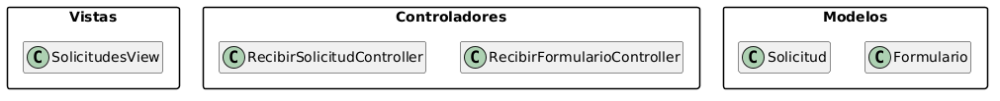
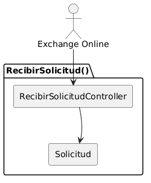
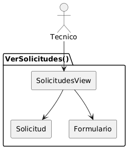
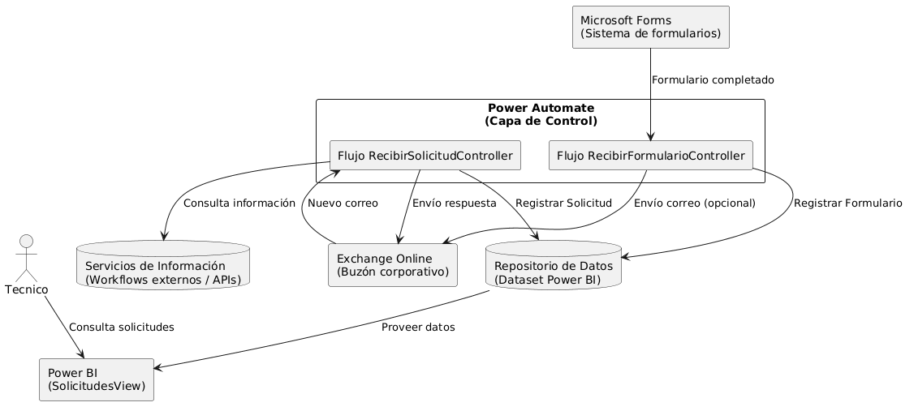
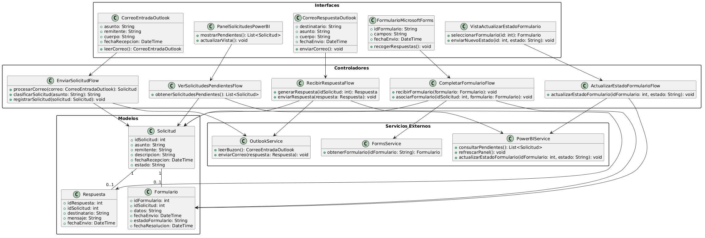
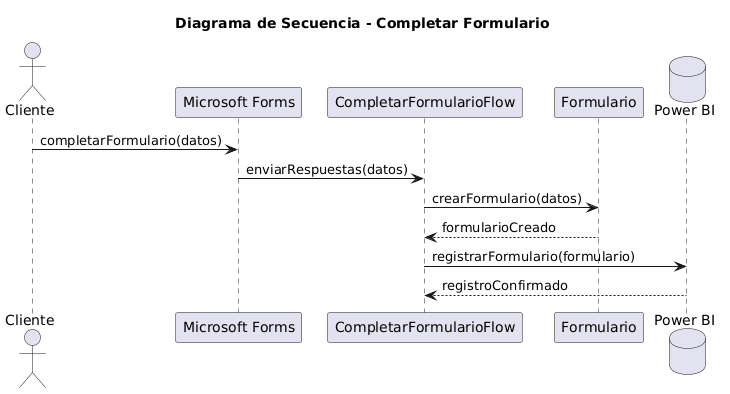

# Análisis y Diseño 

## Introducción

En este capítulo se aborda el análisis y diseño del sistema a partir de los requisitos y casos de uso definidos previamente. En primer lugar, se realiza el análisis mediante la identificación de las clases y sus relaciones siguiendo el patrón arquitectónico Modelo-Vista-Controlador (MVC), así como la elaboración de diagramas de clases y de colaboración. A continuación, se presenta la transición hacia el diseño, donde se concreta la solución tecnológica adoptada y se detallan las clases con un enfoque implementable. Finalmente, se incluyen los diagramas de clases de diseño y los diagramas de secuencia que describen el comportamiento del sistema de forma más precisa.

## Análisis

El sistema se basa en un enfoque de automatización orientada a eventos, en el que la mayor parte de los procesos se ejecutan sin intervención directa del usuario. El sistema gestiona solicitudes recibidas a través del correo electrónico, permite su ampliación mediante formularios y ofrece una capa de visualización para su consulta.

A partir de los diagramas de contexto definidos previamente, se identifican los siguientes actores:

Exchange Online, que actúa como origen del flujo principal al generar eventos cuando se recibe un correo en el buzón corporativo.
Microsoft Forms, que genera eventos cuando un formulario es completado, permitiendo ampliar la información de las solicitudes.
Técnico, que consulta la información procesada a través de una vista en Power BI.

A diferencia de sistemas tradicionales, el cliente no se considera actor directo, ya que su interacción se realiza a través de servicios intermedios (correo y formularios), sin comunicación directa con la solución.

A partir de estas interacciones, se construye el análisis del sistema siguiendo la estructura MVC. Sin embargo, es importante destacar que la aplicación de este patrón presenta particularidades en este proyecto: los casos de uso principales (recepción de solicitudes y formularios) no disponen de interfaz de usuario, por lo que las clases vista no están presentes en estos procesos. En su lugar, la capa de visualización se concentra exclusivamente en el caso de uso de consulta, implementado mediante Power BI.

En consecuencia, el sistema se organiza en torno a una capa de control que gestiona los flujos automatizados, una capa de modelo que representa las entidades del dominio (como solicitudes y detalles asociados), y una capa de vista limitada a la visualización de datos para el técnico.

### Identificación de clases de análisis

| Diagrama | Código Fuente |
|----------|---------------|
||[Ver Código](./MVC/codigo/MVC.puml)

### Identificación de clases de análisis

### Identificación de clases de análisis

En el paquete de **Vistas** se define la clase *SolicitudesView*, que representa la única interfaz de usuario del sistema. Esta vista está implementada mediante Power BI y permite al técnico consultar las solicitudes procesadas. Dado que el sistema se basa en automatización, no existen otras interfaces de interacción directa con el usuario.

En la capa de **Controladores** se incluyen las clases *RecibirSolicitudController*, *RecibirFormularioController* y *VerSolicitudesController*. Estas clases representan la lógica de control asociada a los distintos casos de uso identificados. A diferencia de sistemas tradicionales, estos controladores no responden a acciones directas del usuario, sino a eventos externos. En concreto, los dos primeros gestionan flujos automáticos activados por servicios externos, mientras que el tercero gestiona la interacción del técnico con la vista de consulta.

En el paquete de **Modelos** se encuentran las clases *Solicitud* y *Formulario*, que representan las entidades principales del dominio. La clase *Solicitud* constituye el elemento central del sistema, ya que recoge la información asociada a cada petición recibida. La clase *Formulario* permite almacenar la información adicional proporcionada por el usuario mediante formularios, complementando así los datos de la solicitud.

### Diagramas de Colaboración

#### Recibir Solicitud

| Diagrama | Código Fuente |
|----------|---------------|
||[Ver Código](./DdC/codigo/RecibirSolicitud.puml)

En este caso, el actor **Exchange Online** actúa como origen del evento, enviando la solicitud al sistema cuando se recibe un nuevo correo en el buzón corporativo. Este evento es capturado por la clase **RecibirSolicitudController**, que constituye el elemento encargado de gestionar la lógica del proceso.

El controlador actúa como intermediario entre el actor externo y el modelo, delegando en la clase **Solicitud** la gestión de la información asociada a la petición. De este modo, el modelo se encarga de representar y almacenar los datos relevantes del dominio.

Cabe destacar que, a diferencia de otros casos de uso, no existe una clase vista asociada, ya que el proceso se ejecuta de forma automática sin intervención directa del usuario.

En conjunto, el diagrama refleja una interacción simple y coherente con un sistema orientado a eventos, donde el controlador centraliza la lógica y el modelo gestiona los datos, manteniendo la separación de responsabilidades propia del patrón MVC.

#### Recibir Formulario

| Diagrama | Código Fuente |
|----------|---------------|
||[Ver Código](./DdC/codigo/RecibirFormulario.puml)

En este caso, el actor **Microsoft Forms** actúa como origen del evento, enviando los datos al sistema cuando un formulario es completado. Este evento es recibido por la clase **RecibirFormularioController**, que se encarga de gestionar el proceso asociado.

El controlador actúa como intermediario entre el actor externo y el modelo, delegando en la clase **Formulario** la gestión de la información recibida. Esta clase representa los datos introducidos en el formulario y permite su almacenamiento dentro del sistema.

Al igual que en el caso de uso anterior, no existe una clase vista asociada, ya que el proceso se ejecuta automáticamente sin interacción directa del usuario.

#### Ver Solicitudes

| Diagrama | Código Fuente |
|----------|---------------|
||[Ver Código](./DdC/codigo/VerSolicitudes.puml)

En este caso, el actor **Técnico** interactúa directamente con la clase *SolicitudesView*, que representa la vista implementada en Power BI. Esta vista permite acceder a la información almacenada en el sistema de forma estructurada.

A diferencia de otros casos de uso, no existe una clase controladora intermedia, ya que la herramienta de visualización accede directamente a los datos. De este modo, la vista se conecta directamente con las clases del modelo *Solicitud* y *Formulario*, que contienen la información necesaria para su representación.

La clase *Solicitud* recoge los datos principales asociados a cada petición, mientras que la clase *Formulario* contiene la información adicional proporcionada por el usuario. Ambas entidades son utilizadas por la vista para construir la visualización completa de las solicitudes.

## Decisión Tecnológica

| Diagrama | Código Fuente |
|----------|---------------|
||[Ver Código](./DecisionTecnologica/codigo/Decision_Tecnologica.puml)

El sistema se estructura en torno a una capa de control implementada mediante Power Automate, donde se definen dos flujos principales: **RecibirSolicitudController** y **RecibirFormularioController**. Estos flujos se activan de forma automática a partir de eventos externos y constituyen el núcleo de la lógica del sistema.

Por un lado, **Exchange Online** actúa como punto de entrada para las solicitudes. Cuando se recibe un nuevo correo en el buzón corporativo, se activa el flujo *RecibirSolicitudController*, que procesa la información, consulta en caso necesario los **servicios de información externos** (como APIs o workflows auxiliares) y registra los datos relevantes en el **repositorio de datos**. Además, el sistema genera y envía una respuesta al remitente a través del propio servicio de correo.

Por otro lado, **Microsoft Forms** permite la recogida de información adicional mediante formularios. Cuando un formulario es completado, se activa el flujo *RecibirFormularioController*, que procesa los datos recibidos, puede enviar un correo adicional si procede y registra la información en el repositorio de datos.

El **repositorio de datos**, implementado como dataset de Power BI, actúa como almacenamiento central del sistema, donde se guardan las entidades principales, como solicitudes y formularios.

Finalmente, **Power BI** proporciona la capa de visualización a través de la vista *SolicitudesView*, permitiendo al técnico consultar la información almacenada. El técnico interactúa directamente con esta herramienta, que accede al repositorio de datos sin necesidad de una capa intermedia.

De este modo, la arquitectura separa claramente la captura de eventos, el procesamiento automático, la integración con servicios externos, el almacenamiento de la información y su posterior visualización, garantizando una solución modular y coherente con un sistema orientado a eventos.

## Diseño 

### Diagrama de Clases de Diseño
| Diagrama | Código Fuente |
|----------|---------------|
||[Ver Código](./DdC_Diseno/codigo/Diagrama_Clases_Diseno.puml)

### Diagramas de Secuencia por Caso de Uso 

#### Enviar Solicitud
| Diagrama | Código Fuente |
|----------|---------------|
||[Ver Código](./DdS/codigo/EnviarSolicitud.puml)

#### Recibir Respuesta
| Diagrama | Código Fuente |
|----------|---------------|
||[Ver Código](./DdS/codigo/RecibirRespuesta.puml)

#### Ver Solicitudes Pendientes
| Diagrama | Código Fuente |
|----------|---------------|
||[Ver Código](./DdS/codigo/VerSolicitudesPendientes.puml)

#### Actualizar Estado
| Diagrama | Código Fuente |
|----------|---------------|
||[Ver Código](./DdS/codigo/ActualizarEstado.puml)

#### Completar Formulario
| Diagrama | Código Fuente |
|----------|---------------|
||[Ver Código](./DdS/codigo/CompletarFormulario.puml)